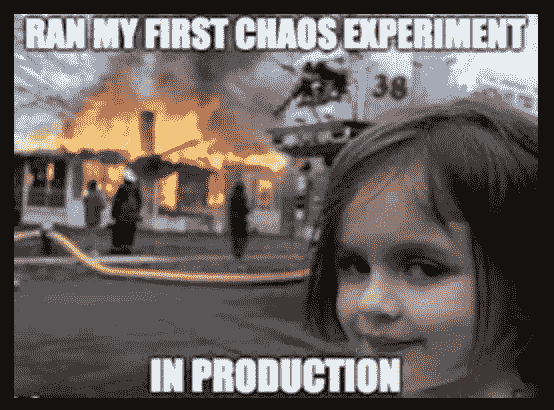

# 如何在软件应用中设计卓越的操作

> 原文：<https://medium.com/codex/how-to-design-for-operational-excellence-in-software-application-d268132d34e3?source=collection_archive---------2----------------------->

您是否设想您的软件应用程序是干净的、经过测试的、高效的、受到良好监控的、需要的操作工作量可以忽略不计，并且提供最佳的客户体验？

好消息！

我已经收集了一些随着时间的推移而积累的最佳操作实践和经验，可以用来确保您的软件正常运行，您的客户得到照顾，您的团队及时解决缺陷:

# 弹性最佳实践

弹性是系统从故障中恢复并保持服务持久性的能力，以便系统在出现故障时仍能继续工作。

1.  识别最关键的 API，并为其预留容量，即使部分 API 出现故障，也能保持服务正常运行
2.  通过在流程、主机或服务级别聚合重试次数来防止重试风暴
3.  设置依赖关系调用的超时，使得每个调用的总和低于服务的总延迟 SLA
4.  拥有基于杠杆的机制，允许在停机期间关闭功能并将负载限制到依赖项，以限制故障的传播
5.  常规测试故障:混乱、压力、浸泡测试

*   混乱测试:通过连续地、随机地从依赖关系中注入故障来测试系统
*   压力测试:测试超出正常操作点的系统，评估极端条件下的系统极限
*   浸泡测试:在大量负载下长时间测试系统，以发现性能问题和资源泄漏，如内存、线程池等。

# 可靠性最佳实践

可靠性是指系统在给定的环境中，在规定的时间内，在预定数量的输入情况下，执行无故障操作的能力，假设硬件和输入无错误。

1.  为解决已知的运行经验和设计问题制定路线图
2.  设计服务至少可扩展 2 倍
3.  设计冗余以避免单点故障
4.  抑制异常的高音量和高延迟呼叫者
5.  设置服务使用趋势的指标
6.  定期执行日志记录，因为糟糕的日志记录会填满您的磁盘，并导致系统在降级时做更多的工作
7.  通过变更管理机制管理部署风险，确保不会同时部署所有区域
8.  自动化部署、验证和回滚以实现一致性

# 扩展最佳实践

可扩展性是系统根据用户需求增加容量和功能的潜力。

1.  偏向于微服务设计策略，其中每个服务执行一个业务功能，以便易于削减或替换，从而更好地处理故障
2.  考虑为小型服务使用无服务器或基于容器的基础设施，以减少为其规划扩展的工作量
3.  为每项服务配置早期警报，以防异常违规，从而为修复赢得时间
4.  借助 AWS 中 CloudTune for EC2 等扩展规划工具实现运营扩展自动化
5.  拥有针对资源利用率和性能指标(如可用性、延迟、错误、故障等方面的 SLA)的自动化警报和仪表板。
6.  在每个部署版本中自动运行负载测试

> 记住，一刀切！

并非所有系统都是按照相同的客户期望或可用性标准构建的。卓越运营是一个持续改进的过程，旨在为客户构建高可用性系统，并减少开发人员管理服务的工作量。

> 感谢您的阅读！如果您觉得这很有帮助，以下是您可以采取的一些后续步骤:

1.  给我点掌声！
2.  关注我关于 ***卓越运营设计*** 系列的下一部分！
3.  在[LinkedIn](https://www.linkedin.com/in/kanika-modi/)&[Twitter](https://twitter.com/iamkanikamodi)上与我联系，获取更多科技博客！