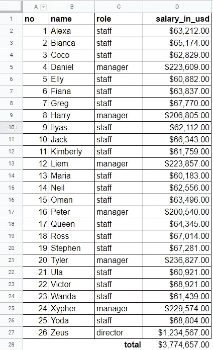
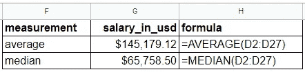
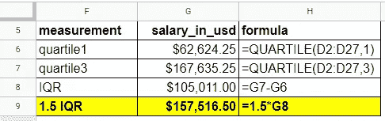
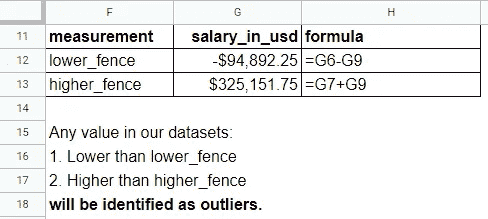
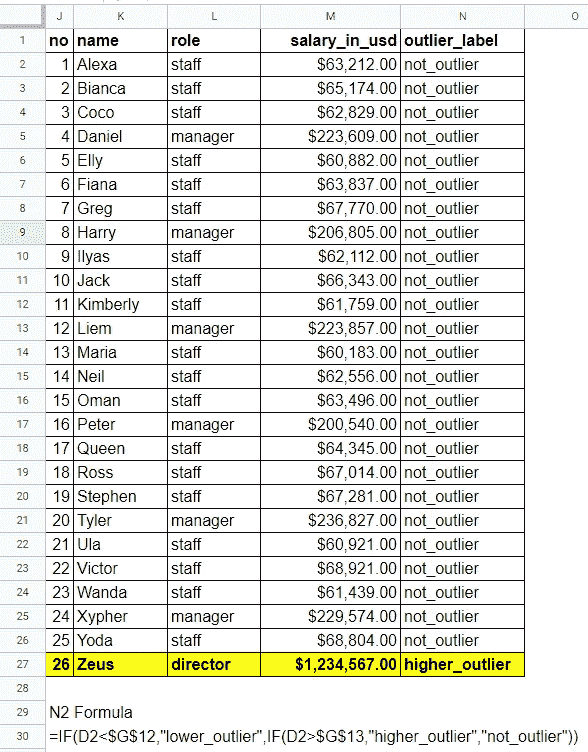
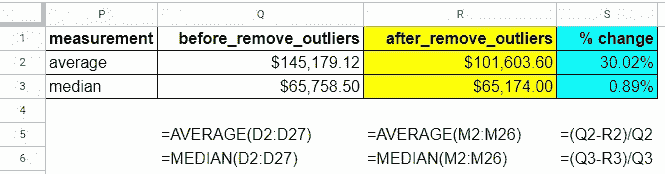
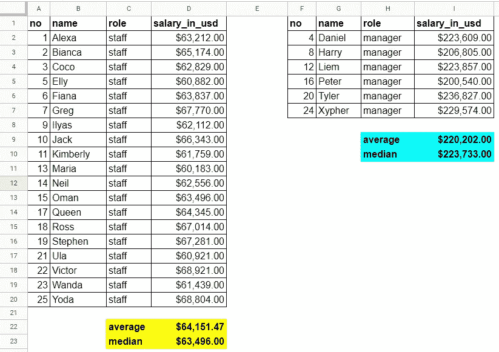

# 如何使用四分位距(IQR)检测异常值，以及找到异常值后该做什么？

> 原文：<https://medium.com/codex/how-to-detect-outliers-using-interquartile-range-iqr-and-what-to-do-after-finding-them-b2d6936605ed?source=collection_archive---------7----------------------->

在现实世界中，我们的数据并不像网上一些人在数据分析教程中承诺的那样整齐。通常，我们会发现一些距离其中心太远的数据点，称为离群值。在本帖中，我们将尝试使用 IQR 方法来检测样本数据集中的异常值，并讨论找到异常值后该做什么。听起来对你来说足够有趣？:D

像往常一样，我们将使用 Google Sheets，这样我们可以很容易地理解一般概念，并且您可以使用您喜欢的工具来实现这些方法，比如 R、Python 或任何其他工具。

> 在统计学中，**异常值**是与其他观察值显著不同的数据点。— [维基百科](https://en.wikipedia.org/wiki/Outlier)

让我们来看看样本数据集，我们将使用它作为离群点检测的材料[这里是](https://docs.google.com/spreadsheets/d/1rFhuXOsQ7CP0ZZl0fc_vDGQ6Btj2OPN-ssBcQSyVxz0/edit?usp=sharing)。这个样本数据中的所有名字都是随机的。如果你在这里找到了你的名字，并不意味着我告诉了所有人你现在的薪水。

图一。数据由 26 名雇员组成，带有一年的工资数字。

假设我们在人事部门工作。我们想知道这家公司的平均工资是多少。我们应该怎么做才能得到“正确”的数字？让我们尝试直接从第`salary_in_usd`列计算平均值和中值。

图二。数据由上述数据集中的平均值和中值组成。

正如我们所看到的，平均值和中值之间的差异相当大，平均值是中值的两倍多。当我们的数据集有异常值时，通常会发生这种情况。 就数学计算而言，上面的平均值是正确的，因为 145，179.12 美元 x 26 名员工等于公司支付的工资总和，3，774，657 美元。但就公司支付的普通工资值而言，这是不正确的，我们应该使用中间值，而不是 65，758.50 美元。

# 四分位数间距(IQR)

我们可以使用 IQR 来检测异常值，IQR 是 Q3 和 Q1 之间的范围。我们将使用 1.5 IQR 来排除我们安全假设为异常值的数据点，异常值的定义如下:

> IQR = Q3 - Q1
> Q3 是四分位数 3(百分位数 75)，Q1 是四分位数 1(百分位数 25)。

图 3。数据包括 Q1、Q3、IQR 和 1.5 IQR。

在我们得到 1.5 IQR 的值之后，我们应该在使用这种方法决定哪些数据点被识别为异常值之前进行最后的计算。非常简单，我们只需要得到一个`lower_fence`和`higher_fence`，它们可以这样计算:

> lower _ fence = Q1–1.5 iqr
> higher _ fence = Q3+1.5 iqr

图 4。数据由 lower_fence 和 higher_fence 组成，用于检测异常值。

> 使用上图中提到的标准，我们可以很容易地判定导演 Zeus 的`salary_in_usd`值是一个异常值。

很简单，对吧？在这种情况下，我们只有 26 行数据，这就是为什么我们可以很容易地确定只有主管 Zeus 是异常值。假设我们的数据集中有 500，000 行，我们必须自动检测，我们可以使用类似的函数，但您可以尝试即兴发挥，以满足我们的独特需求。

图 5。数据由使用 lower_fence 和 higher_fence 的异常值检测组成。

现在，我们知道主管 Zeus 的薪金值是一个异常值，我们可以尝试重新计算平均值和中值，排除该值。

图 6。数据由剔除异常值前后的比较组成。

这看起来比我们以前的平均值好多了。但是，我们仍然可以看到平均值和中值之间的差异很大，65，000 美元和 101，000 美元，即使在我们去除了异常值之后。 ***当这样的事情发生时，意味着我们的数据有了聚类。*** 是什么意思？我们不能不先对数据进行聚类就直接计算平均值和中值。

我想你们已经意识到我们的数据集中有一个变量`role`。也许它影响了我们的平均值和中值。让我们把数据集分成`staff_only`和`manager_only`。请在此查看数据[。](https://docs.google.com/spreadsheets/d/1rFhuXOsQ7CP0ZZl0fc_vDGQ6Btj2OPN-ssBcQSyVxz0/edit#gid=825192888&range=A1:I23)

图 7。数据由仅员工和仅经理的平均值和中值组成。

现在我们正在谈话。每个“群”的平均值和中间值没有太大的差异，我们可以假设使用上面的平均数作为公司支付给员工的美元平均工资是安全的。

> 对于职位为“`staff’`的员工，薪酬约为 6.4 万美元，`manager'`约为 22 万美元。总的来说，该公司为每位员工支付了 10.1 万美元。听起来很公平！

# **总结**

1.  离群点检测是数据清理的一部分，在开始做数据分析之前，我们必须将它作为一个常规。
2.  检测异常值的最简单方法之一是使用 IQR 得到`lower_fence`和`higher_fence`来排除异常值。
3.  如果我们仍然发现平均值和中值之间有任何显著差异，这意味着我们的数据中有聚类，如果我们根据聚类分割数据以获得更准确的信息或见解，效果会更好。
4.  对于如何检测异常值的其他参考，有许多方法可能更准确，这取决于数据集的特征。
5.  只有当数据集不太大时，上述所有步骤才有可能在 Google Sheets 中完成。当我们面对更大规模的数据集时，我们必须尝试使用编程语言(如 R、Python 或其他能够满足数据集规模的工具)来计算它们。
6.  在这种情况下，我们仅通过使用理由**排除了主管 Zeus 的工资值，“这是一个异常值，它使平均值显著正向倾斜，这就是为什么我们必须删除它”**。在某些情况下，我们无法做到这一点，因为并非每个离群值都是坏数据点。让我们试着另找时间谈论它。

我希望这篇文章对您有用，并让您有兴趣自己尝试一下，这样您就可以自己获得经验，并在现实世界的案例中实现这种异常值检测方法。像往常一样，如果你对我有任何意见或批评，请不要犹豫回复这篇文章，或者通过我的 LinkedIn 个人资料联系我。感谢你阅读这篇文章！