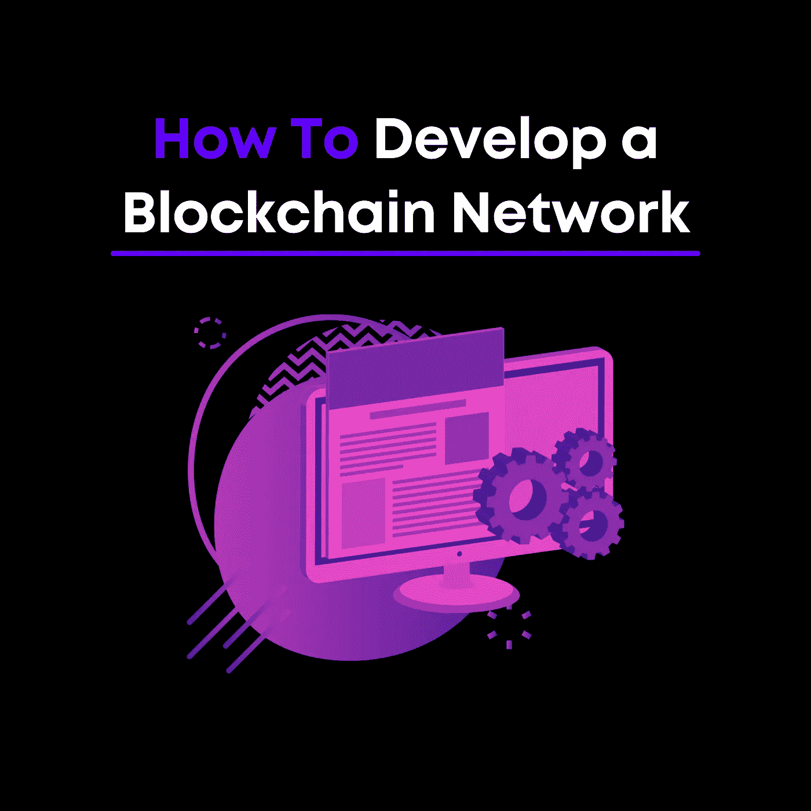

# 如何开发区块链网络

> 原文：<https://medium.com/codex/how-to-develop-a-blockchain-network-197bb864e1cd?source=collection_archive---------27----------------------->

今天，我们将看看如何在 dApp(去中心化应用)上创建一个区块链网络。本文的目标是为您提供建立一个正常运行的区块链网络所需的基本设置，该网络将允许您开始交易加密货币。

**1。确定目标**

创建一份使命陈述

讨论期望的好处

你会使用已经完成的代码吗？还是需要从头开始？

**2。选择合适的平台**

您需要确定创建区块链网络所需的工具

从零开始需要细致的研究，可能需要几年的时间才能开发完成，所以在现有的区块链平台上构建一个 dApp 来满足您的需求。

如何选择合适的平台？考虑共识机制、你需要解决的问题等因素。

**3。头脑风暴会议**

在您找到适合您业务需求的合适平台后，您应该探索您还需要哪些功能。你需要什么样的链外或链内系统，它们将如何与你的区块链网络互动？你会在一个有权限或无权限的区块链网络上运行它吗？

弄清楚你需要哪些前端编程语言以及服务器和外部数据库。

**4。概念验证**

这个阶段关注的是你将如何证明你的应用程序的有效性和敏捷性。

它包括两种设计:理论构建和设计原型。理论构建解释了用于创建虚拟网络的编程理论。设计原型是网络的可视化演示，应包括草图、模型、测试产品和软件架构。

只有在你的客户认可你的概念证明后，你才能继续视觉和技术设计。

**5。视觉/技术设计**

对于视觉设计，概述完成正常工作的网络所需的基本解决方案的路线图，并为每个组件起草用户界面模型。对于技术设计，起草将与 UI 集成并运行后端的 API

申请。

**6。开发**

为特定用例集成 API。

正式测试(前 alpha 版本)

Alpha 版本:开发人员使用白盒技术测试应用程序。

测试版:应用程序有完整的功能集，同时仍在努力修复一些小错误。测试版将由你的组织之外的人来测试它的用户友好性。

发布候选版本:准备发布的高级测试版本。

然后，应用程序进入生产阶段，为交付/发布做准备。

在测试网络上部署应用程序，以确保其可行性。

在它被供应和批准之后，应用程序可以被托管在主链上。如果是使用链外和链上业务实体的混合解决方案，应该部署在云服务器和 app store 上。

即使在应用程序最终推出后，它也需要由一组专业人员进行监督，以确保它在未来对网络进行更新/升级时继续工作。

**7。奖金部分:营销**

我们不要忘记，你可以拥有世界上最好的软件，但是没有合适的人来使用它，它会导致你的创作停滞不前。从开发人员的角度来看，营销可以被视为一项不太重要的技能。但是环顾四周，营销是围绕着你的职业生涯的。从制作个人专业网站到获得工作。营销你自己和你制造的产品都归结于你的执行和战略。

在我们之前的一篇文章中，我们分解了 [3 个发布前营销策略，用于你的下一个科技项目](/codex/3-pre-launch-marketing-strategies-to-use-for-your-next-tech-project-7b5dc918e37f)。如果你想成为一名高端开发人员，在多个领域提升自己的技能，那就去看看吧。

有关更多信息:

【https://www.leewayhertz.com/blockchain-development/ 

[https://101blockchains.com/create-a-blockchain/](https://101blockchains.com/create-a-blockchain/)

[https://addevice.io/blog/how-to-build-a-blockchain-app/](https://addevice.io/blog/how-to-build-a-blockchain-app/)

**什么是 Prajix？**

对你来说，掌握编码世界的最好方法是把这个世界放在你的指尖。我们的使命是让世界各地的开发者通过在线协作来彻底改变我们希望拥有的未来。

我们允许开发人员在我们的平台上创建或加入项目想法，他们可以在我们的协作室中找到志同道合的个人进行团队合作。

我们正努力将全世界最有价值的程序员、编码员和开发人员的网络建设到一个地方，创建一个技术发电站，帮助全球的个人和社区。

如果你对此感兴趣或者想了解更多，请访问我们的网站:[https://www.prajix.com](https://www.prajix.com)