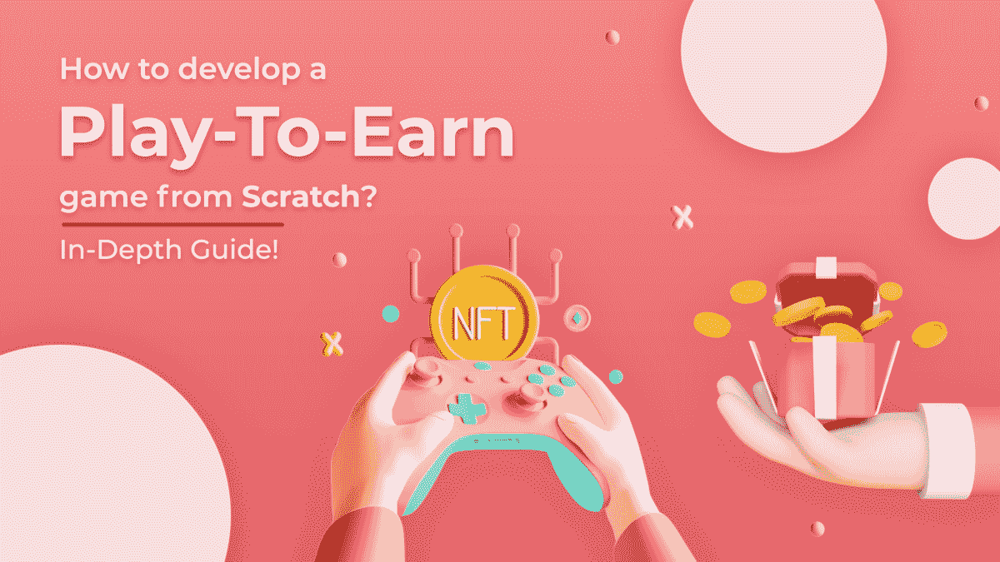
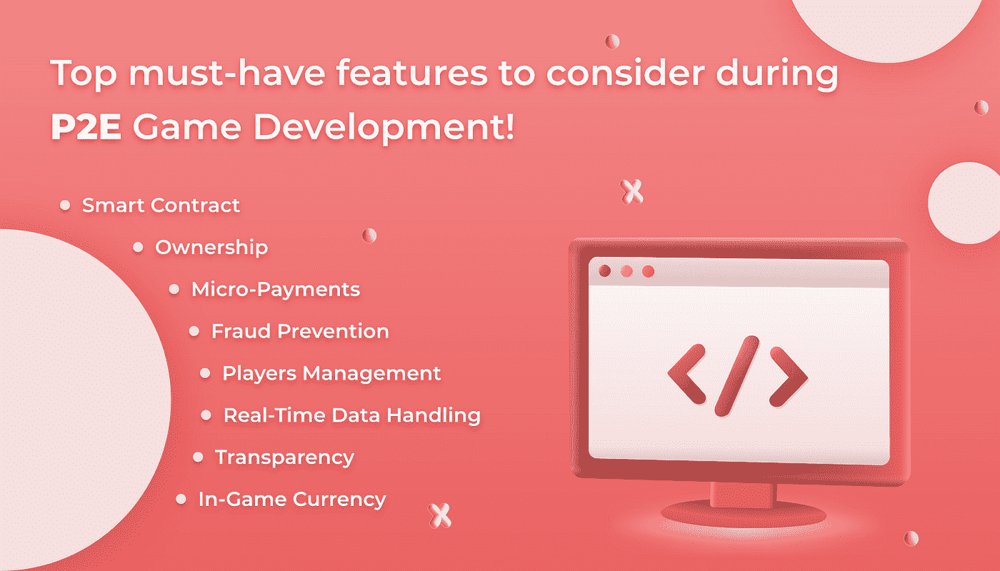
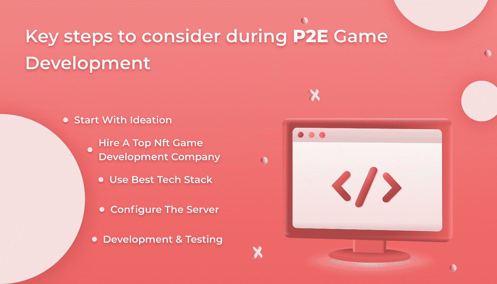
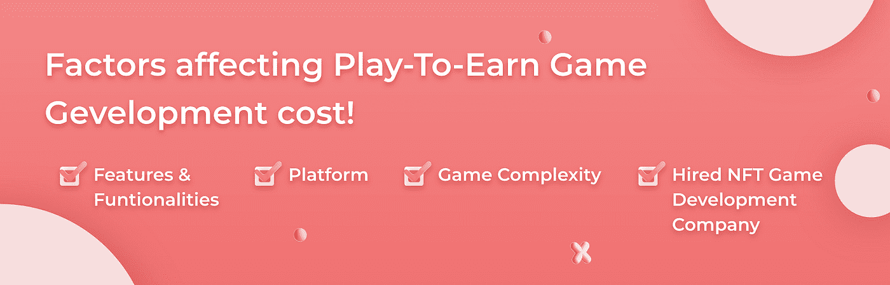

# 如何从零开始开发一款玩到赚的游戏？深度指南！

> 原文：<https://medium.com/codex/how-to-develop-a-play-to-earn-game-from-scratch-in-depth-guide-eefe84c3b7f7?source=collection_archive---------10----------------------->

博彩业以前所未有的速度扩张。

据[**Statista**](https://www.statista.com/statistics/292056/video-game-market-value-worldwide/)**预计，到 2025 年，博彩业的年收入将达到 2688 亿美元。**

**一个名为 GameFi 的新的去中心化游戏行业，在线游戏和去中心化金融(Defi)相结合，已经被区块链科技成为可能。GameFi 的发展从根本上改变了我们玩游戏的方式和原因。由于新的“玩到赚”模式的出现，博彩业发生了巨大的变化。**

**“玩即赚”的 NFT 游戏引起了广泛关注。企业可以建立他们自己的定制游戏，如 Axie Infinity 等，并对 NFT 的游戏产业产生重大影响。该平台整合了各种游戏资产和 NFT 收藏品，促进了赚钱的前景。**

**但是到底什么是 [**玩赚游戏**](https://www.quytech.com/blog/play-to-earn-game-like-zedrun/looking-forward-to-develop-a-play-to-earn-game-like-zedrun-min-1/) **？**以及如何围绕他们开发一款成功的 P2E 游戏？让我们来了解一下！**

**在这个博客中，你会找到你需要知道的关于 P2E 游戏开发的一切，比如好处、特点、步骤、盈利模式等等。**

**所以，废话不多说，让我们从，**

# **什么是玩赚游戏？**

**基于区块链技术的新游戏范式被称为“玩赚”(P2E)。玩赚游戏——也被称为 P2E 游戏或只是加密游戏——将 NFT 和加密货币融入到他们的游戏中。**

**P2E 游戏让玩家通过完成任务、持有和交易游戏中的物品(如虚拟土地、皮肤或武器)或增强游戏环境来赚钱。**

****即玩即赚** [**NFT 游戏**](https://www.quytech.com/blockchain-development/nft-game-development.php) 的全球市场预计将从 2021 年的 7.55 亿美元增长到 2028 年的 36.184 亿美元，从 2022 年到 2028 年的 CAGR 为 21.3%。**

# **“玩即赚”游戏是如何完美运作的？**

**区块链技术在游戏中得到利用，以支持他们的生态系统，最重要的是，让玩家能够获得游戏中的货币，这种货币在游戏外具有价值。加密货币、去中心化市场和非金融交易使这成为可能。**

**由于区块链记录了每一笔交易，游戏中数字资产的所有权和真实性总能得到确认。此外，区块链技术的使用促进了游戏内资产在各种游戏和平台之间的转移，为用户提供了无限的机会来将他们的收藏货币化。**

# **在 P2E 游戏开发过程中需要考虑的必备功能！**

****

**最重要的 NFT 游戏平台的特性和功能是那些有能力提高你的游戏的市场份额。**

**因此，选择合适的功能至关重要。以下是一些需要记住的特征:**

*   **智能合同**
*   **所有权**
*   **小额支付**
*   **欺诈防范**
*   **球员管理**
*   **实时数据处理**
*   **透明度**
*   **游戏中的货币**

# **如何开发一款玩赚游戏？**

****

**如何开发一款玩赚游戏？**

**建立一个“玩到赚”的游戏很容易。你所要做的就是从头到尾坚持一个深思熟虑的计划。让我们一步一步地来看看如何开发一款游戏。**

# **#1.从构思开始**

**这是开发赚取游戏的初始阶段。在这里，关键要素，包括 NFT 集成，游戏动态，以及符合用户期望的游戏内功能，都被涵盖。顶级 [**NFT 游戏开发公司**](https://www.quytech.com/blockchain-development/nft-game-development.php) 如 Quytech 帮助您确定有助于开发最棒的游戏平台的工具和技术。**

# **#2.聘请 NFT 顶级游戏开发公司。**

**聘请在这个领域有丰富知识和经验的 NFT 顶级游戏开发者来消除任何歧义。最关键的考虑是这个。你必须决定哪家顶级的 NFT [**游戏开发公司**](https://www.quytech.com/game-development-company.php) 是当今众多公司中最好的。**

# **#3.使用最佳技术堆栈**

**利用最新的技术将帮助您创建更好的游戏，并为用户提供更丰富的体验。例如，虚拟现实正在改变游戏行业。技术栈可以用来创建原创的游戏。与你的定制游戏开发公司讨论它是必要的。**

**像 Quytech 这样的 NFT 游戏开发公司紧跟技术进步。此外，他们在我们的每一个产品中使用它们，为投资者和游戏玩家创造特殊的体验。**

> ****必读-** [**如何打造像 Roblox 这样的角色扮演游戏平台？—完整指南**](https://www.quytech.com/blog/how-to-create-rpg-like-roblox/)**

# **#4.配置服务器**

**在完成前一个游戏阶段以获得 NFT 游戏开发后，接下来是设置服务器。这是视频游戏创作中最重要的一步，因为它确保游戏中使用的数据和资产安全地保存在受保护的服务器上。此外，使用适当的工具，你可以逐步收集大量的知识来提高你的游戏。**

# **#5.开发和测试**

**在这个阶段，用户界面是在分析和计划之后根据用户规格创建的。然后创建游戏平台的后端，以提高可用性和响应能力。在游戏被创建之后，游戏平台被测试以确保在玩游戏时没有错误并且没有故障。alpha 和 beta 级别的测试是为了确保平台的有效性。**

# **2022 年开发一款玩赚游戏的成本是多少？**

****

**开发一款赚取游戏的成本**

**[**P2E 游戏开发**](https://www.whatech.com/og/cryptocurrency/blog/725029-play-to-earn-games-new-way-to-monetize-games-using-cryptocurrencies) 的成本根据你想要整合的平台特性和使用的技术栈而有所不同。此外，还有许多其他因素影响 P2E 游戏开发成本，如:-**

*   **聘请 NFT 游戏开发公司**
*   **使用的平台**
*   **游戏复杂性**

**如果你想要一份 P2E 游戏开发的深度报价，那么联系像 Quytech 这样的 NFT 顶级游戏开发公司会对你有好处，因为他们有专家可以根据你的要求为你的项目报价。**

> ****又读-** [**结果驱动过程制作超休闲游戏**](https://www.quytech.com/blog/how-to-make-successful-hyper-casual-games/)**

# **为什么选择 Quytech 进行 P2E 游戏开发？**

**作为领先的游戏开发商，Quytech 提供专注于设计引人入胜的独特游戏的服务。我们敬业的区块链专业团队努力开发可展示的成果，确保您的游戏平台在竞争中脱颖而出。玩赚游戏目前很流行，吸引了大量在线玩家。我们设计了一款创新的游戏，具有沉浸式体验，满足了用户的期望。我们根据标准创建的游戏开发服务将提升您用户的游戏体验。**

**我们的 NFT 游戏开发团队拥有卓越的技能和经验来定制 NFT 游戏应用程序，以满足您的行业需求。**

*   **我们创建沉浸式 nft 游戏，在多个平台上为您提供相同水平的参与度和兴奋度。**
*   **我们的 nft 游戏允许玩家发挥他们作为内容创作者的潜力，而不仅仅是玩家。**
*   **我们既看重乐趣，也看重游戏内的经济性，也就是说玩家可以在沉浸在游戏中的同时不折不扣地挣钱。**

# **结论**

**游戏玩家是新的游戏赚钱(P2E)世界的先驱，证明了区块链技术的实际应用，并推动了 DeFi 的广泛接受。游戏玩家和密码爱好者都被“边玩边赚”的方法所吸引。P2E 游戏在价值数十亿美元的 GameFi 领域变得如此受欢迎和有利可图，以至于它们迫使游戏制造商拥抱区块链革命。**

# **相关文章-**

> **[**如何开发一款类似 Zedrun 的玩赚游戏？**](https://www.quytech.com/blog/play-to-earn-game-like-zedrun/)**
> 
> **[**如何打造类似 Roblox 的角色扮演游戏平台？—完整指南**](https://www.quytech.com/blog/how-to-create-rpg-like-roblox/)**
> 
> **[**手机游戏开发成本——影响价格的所有因素**](https://www.quytech.com/blog/game-development-cost-features-tools-technologies/)**