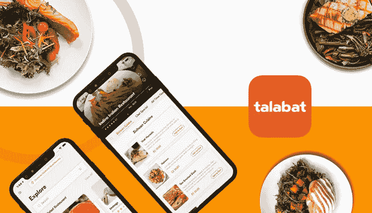
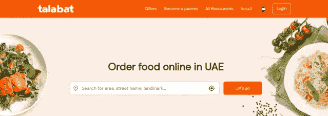

# 如何开发像 Talabat 这样的送餐应用程序来建立有利可图的餐厅？

> 原文：<https://medium.com/codex/how-to-develop-food-delivery-app-like-talabat-for-profitable-restaurant-setup-9a40b208ab19?source=collection_archive---------15----------------------->

按需食品配送应用领域目前的盈利能力为 3233.0 亿美元。这反映了这个市场在全球范围内的盈利性质。这些数字由于该应用的简单操作而变得可以实现。一旦顾客进入应用程序，并添加他们的位置细节，他们就会得到附近餐馆的名单。这使得他们可以很容易地选择他们喜欢的食物，点他们，并让他们送货上门，然后他们可以享受一顿丰盛的晚餐。

目前已经有许多应用程序允许无缝送餐，比如 Zomato、Swiggy、UberEats、Talabat 等。仅举几个例子。其中最著名的塔拉巴特在迪拜的美食爱好者和全球企业家中声名鹊起。由于方便送餐服务，它鼓励后者成为盈利的在线送餐业务的一部分。这是通过构建一个类似于迪拜的应用程序。

让我们先向您介绍解决方案，让您了解该应用受欢迎的原因。稍后，我们将向您介绍该应用之所以如此受欢迎，以至于开发了现成的解决方案 Talabat clone。我们将列举[食品配送应用程序](https://www.fooddeliveryclone.com/)应使用它的原因。最后，我们将为您提供一些步骤，如果您的餐厅采用该解决方案，这些步骤的遵守将使您的餐厅获得利润。

# 关于塔拉巴特

Talabat 于 2012 年推出，是阿联酋一款受欢迎的送餐应用，自推出以来，在中东各地送餐和点餐都非常方便。该应用程序提供服务的其他一些地方有沙特阿拉伯、科威特、巴林、阿曼、卡塔尔、约旦、埃及和伊拉克。

该应用非常受欢迎，因为它毫不费力地让中东地区的人们可以方便地获得食物，从而有一个非常有利可图的未来。如果按数字计算，该解决方案的当前收入为 10 亿美元。

# 塔拉巴特受欢迎的原因

Talabat 有许多优势。以下为部分选择。

*   提供了一个用户友好的和有组织的视图，可用的餐馆。
*   提供系统化的菜单排列，方便点菜。
*   拥有大量功能，因此客户、餐厅和送货司机可以无缝操作。
*   依靠三个收入流——佣金、送货费和广告来获利。

由于上述因素，该解决方案在中东非常受欢迎。

# 塔拉巴特的市场统计数据

Talabat 由于其简单的食品订购和送货服务而在中东非常受欢迎，并赢得了极有前途的邪教地位。

查看市场统计数据，接受这方面的教育。

*   Talabat 应用程序的下载量超过 30 万次。
*   该解决方案带来的收入为 10 亿美元。
*   根据 Zawya 的说法，该应用程序观察到订单增加了 60%。

这些数字极其清楚地阐明了这一陈述。这就是为什么食品配送机构通过构建 Talabat 应用程序来控制成本，从而增强他们的运营能力。因此，他们使用食品配送克隆应用程序，这样他们就可以快速启动业务并获得更多用户参与。

# 如何开发类似 Talabat 的 App？

在当前的应用程序世界中，通过解决方案来支持运营是非常重要的。如果你是一家餐饮企业，这一点尤其重要。举个例子，你想进行塔拉巴特克隆应用程序开发，你[知道如何开发类似塔拉巴特的应用程序](https://www.fooddeliveryclone.com/blog/boost-profits-for-your-restaurant-setup-with-talabat-clone-app/)是至关重要的。

## 1.了解你的需求

评估您的需求，研究它们在当前业务场景中的有用性。通过对强有力的竞争对手的分析和对目标市场的研究，这是可能的。

问这些问题-

1.竞争对手在做什么？

2.顾客满意吗？是/否？

3.如果没有，缺少什么，缺少的元素对我有好处吗？

## 2.保持独特

注重用户友好性。因此，要使设计直观，并增加一些功能，使顾客、送货司机和餐馆能够方便地操作解决方案。

下面是要添加的功能。

> ***客户***

1.订单管理以查看当前和过去的订单

2.多份订单，方便从不同餐厅订餐

3.多种支付模式使从不同选择中选择一种模式并支付餐费变得容易

4.订单跟踪，以了解餐食的实时位置，并了解其预计配送时间

5.电话号码验证使订购过程变得简单

> ***送货司机***

1.根据灵活性接受/拒绝交付请求

2.设置在线/离线可用性，让餐厅知道可用性

3.收入历史记录，了解每日/每周/每月/每季度的收入情况

4.上传文件，如执照，保险等。

5.谷歌地图导航跟踪餐厅和顾客的位置

> ***餐厅***

1.支付管理，允许餐厅接收菜肴的付款

2.菜单管理，方便餐馆上传和编辑菜单

3.订单管理，帮助餐厅观察过去和当前的订单

4.准备时间，这样顾客可以知道准备一顿饭所需的时间

5.交易管理，检查平台上的交易

## 3.选择合适的收入模式

我们之前讨论的解决方案有三种方式来利用其利润。请务必了解它们，并选择一个适合您的业务需求。

餐厅根据顾客订单收取的佣金

高峰时段、深夜递送等向客户收取的递送费用

餐馆在平台上上市的广告费用

通过这些步骤，你可以像专业人士一样执行 Talabat 克隆应用程序开发，并建立一个有利可图的在线食品配送业务。

# 构建塔拉巴特克隆应用程序的成本

当你计划创建一个有利可图的在线食品配送业务，除了坚持一些重要的做法，预算必须得到控制。因此，使用食品递送克隆是一个好主意。

因此，当你计划开发 Talabat 应用程序时，构建 Talabat 克隆应用程序的成本将为 20，000 美元至 50，000 美元。注意-尽管基于应用程序的复杂性、无关功能的增加等，财务可能会上升。仅举几个例子。

# 包扎

Talabat 彻底改变了阿联酋的食品配送业务。它简化了食品配送服务的提供方式。它还吸引了全球企业家的注意，这些企业家正在建立一个食品配送企业，引导他们在不降低成本的情况下建立一个类似的解决方案。这就是为什么他们中的大多数人都在使用 Talabat clone 应用程序来快速启动业务，并使他们的产品易于被人们使用。如果你也是他们中的一员，今天就联系一家 Talabat 克隆应用开发公司。分享您的业务需求，传授与客户相关的知识。这将简化您的应用程序开发之旅，并确保您获得利润。