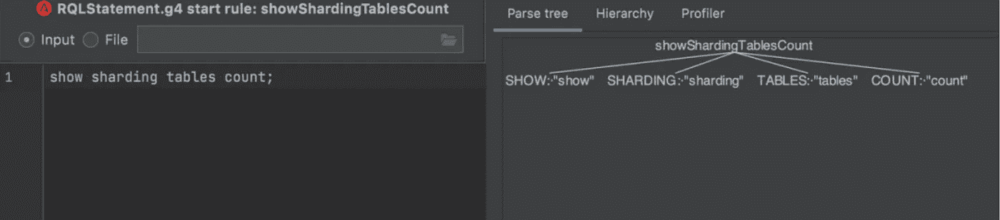

# 如何在 Apache ShardingSphere 中开发分布式 SQL 语句

> 原文：<https://medium.com/codex/how-to-develop-your-distributed-sql-statement-in-apache-shardingsphere-2939eb689c61?source=collection_archive---------4----------------------->

在之前的文章“[DistSQL 简介](https://opensource.com/article/21/9/distsql)”和“[将 SCTL 集成到 DistSQL 的 RAL——让 Apache ShardingSphere 成为数据库管理的完美之选](https://dzone.com/articles/integrating-sctl-into-distsqls-ral-making-apache-s)”中，Apache ShardingSphere 委员会成员分享了 dist SQL 开发背后的动机，解释了它的语法系统，并令人印象深刻地展示了如何只使用一条 SQL 来创建一个分片表。

今天，为了帮助您更好地理解 DistSQL 并开发您自己的 DistSQL 语法，我们的社区作者分析了 DistSQL 的设计和开发流程，并展示了如何在开发生命周期的四个阶段(即需求分析、设计、开发和测试)中实现全新的 DistSQL 语法。

## 什么是 DistSQL？

与标准 SQL 一样，DistSQL 或分布式 SQL 是 ShardingSphere 独有的内置 SQL 语言，它提供了标准 SQL 之外的增量功能。其设计目的是为资源和规则管理提供 SQL 操作能力。更多关于 DistSQL 的信息，请阅读 [*“用 DistSQL 构建数据分片服务”*](https://opensource.com/article/21/9/distsql) 。

## 为什么需要 DistSQL？

DistSQL 的设计目标是重新定义中间件和数据库之间的界限，并允许开发人员利用 [Apache ShardingSphere](https://shardingsphere.apache.org) ，就像他们正在本地使用数据库一样。

因此，DistSQL 提供了类似于标准 SQL 的语法结构和语法验证系统，以避免陡峭的学习曲线。DistSQL 的另一个优势是它能够在 SQL 级别管理资源和规则，而无需配置文件。

## 如何开发 DistSQL？

## 准备

**工具包**

1.  ANTRL4 是一个把你的语法翻译成 Java(或另一种目标语言)的解析器/词法分析器的工具。它被用作解析器。在开始开发 DistSQL 之前，您需要对其进行配置。想入手 ANTLR 4？请参考本 [ANTRL4 简明教程](https://wizardforcel.gitbooks.io/antlr4-short-course/content/)。
2.  IntelliJ IDEA 是一个用 Java 编写的集成开发环境，用于开发计算机软件。还需要插件 [ANTLR v4](https://plugins.jetbrains.com/plugin/7358-antlr-v4) 来测试 ANTRL4 定义的语法规则。

*   首先，选择正确的测试规则:


*   在 ANTLR 预览中输入要验证的语句:



您需要了解 DistSQL 执行过程以及 synatics 和插件的基础知识。完整的 DistSQL 执行过程确实很复杂，但 ShardingSphere 令人敬畏的架构允许开发人员开发 DistSQL 特性，而不必关注整个过程。

但是，您仍然需要注意以下核心步骤:


*注:这里我们以数据分片为例。要知道，不同的功能有不同的前景。*

## 实践

在理解了 DistSQL 的执行过程之后，您现在可以欣赏实际案例并学习如何开发您的第一条 DistSQL 语句。

在上一篇文章[“DistSQL 简介”](/nerd-for-tech/intro-to-distsql-an-open-source-more-powerful-sql-bada4099211)中，作者展示了如何利用 dist SQL 用 statement`show sharding table rules`创建分片。

现在，我们有了一个新的请求:如何使用 DistSQL 语句快速查询每个表分片的分片数量。设计的语法语句如下:

```
show sharding tables count [from schema] ;
```

## 准备

1.  [MySQL](https://www.mysql.com) 包含用于分片的数据库和表格。
2.  Zookeeper 用作注册中心
3.  sharding sphere-代理 5.0.0

## 示范

1.  **定义语句**

将以下语句定义添加到文件`src/main/antlr4/imports/sharding/RQLStatement.g4`中。完成后，就可以用 ANTLR v4 来测试了。


请确保该语句中的所有关键字都已定义。比如`COUNT`在这里是一个未定义的语句，所以需要在`src/main/antlr4/imports/sharding/Keyword.g4'`中定义。

在你定义了语句之后，你还需要把它添加到文件`ShardingDistSQLStatement.g4`中。这是用来解析 rounter 的。


现在，该用`shardingsphere-sharding-distsql-parser`编译生成相关对象了。

**2。解析定义**

然后还需要在`shardingsphere-distsql-statement`中添加一个定义的 DistSQLStatement 对象来保存语句的变量属性。例如，语句定义的`schemaName`需要保存到对象`DistSQLStatement`中。


由于 ShardingSphere 使用 ANTLR 的访问者模式，在定义处理方面，需要重写`ShardingDistSQLStatementVisitor`中的`visitShowShardingTableCount`。该方法的目的是创建一个`ShowShardingTablesCountStatement`对象，并将相关的变量属性保存到对象`DistSQLStatement`中。


`shardingsphere-distsql-statement`其实要靠`shardingsphere-sharding-distsql-parser`，所以需要编译`shardingsphere-distsql-statement`。

**3。处理数据并返回结果**

数据处理由`Handler`或`Executor`的`execute`方法管理，`getRowData`返回结果。不同类型的语句定义关注不同的事情。例如，当 DistSQLResultSet 被用作结果存储对象时，结果数据在方法`execute`中被组装。

显示执行方法和`DistSQLResultSet`，如下图所示:


在`ShardingTablesCountResultSet`中，`init`获取并组装数据，`getRowData`返回行数据。`getType`显然也是在班里。该方法属于`TypedSPI`接口，因此`ShardingTablesCountResultSet`也需要将`org.apache.shardingsphere.infra.distsql.query.DistSQLResultSet`添加到当前模块的目录`src/main/resources/META-INF/services`中，以完成 SPI 注入。路径和内容如下:


现在，您已经成功开发了这个语句定义的特性。

**4。完成你的单元测试和解析测试**

当您完成基本特性开发时，为了确保它的持续可用性，您需要向新的类或方法添加测试用例，并完成新语法的解析测试。下面的代码块是`ShardingTablesCountResultSet`的单元测试。


除了单元测试，你还需要完成`shardingsphere-parser-test`中语法定义的解析测试。目的是将输入 DistSQL 解析成一个`DistSQLStatement`，然后将解析后的语句与预期的`TestCase`对象进行比较。步骤如下:

a.在`src/main/resources/sql/supported/rql/show.xml`中添加您想要测试的 SQL


b.在`src/main/resources/case/rql/show.xml`中添加一个测试用例


c.添加一个`TestCase`对象，其功能是保存案例中定义的结果


d.使用`SQLParserTestCases`类加载`TestCase`


e.将右边的`Assert`对象添加到`ShowRulesStatementAssert`判断中


f.执行`DistSQLParserParameterizedTest`中的测试方法。现在，测试结束了。


最后，您可以使用命令行工具执行开发的 DistSQL 验证功能。

## 结论

DistSQL 是 5.0.0 版本中发布的最新特性之一，我们将继续改进它。

如果您感兴趣，欢迎开发语法系统或提供令人敬畏的特性，以真正打破中间件和数据库之间的界限。

# Apache ShardingSphere

[ShardingSphere Github](https://github.com/apache/shardingsphere)

[ShardingSphere Twitter](https://twitter.com/ShardingSphere)

[切割球松弛通道](https://join.slack.com/t/apacheshardingsphere/shared_invite/zt-sbdde7ie-SjDqo9%7EI4rYcR18bq0SYTg)

[投稿指南](https://shardingsphere.apache.org/community/cn/contribute/)

## 作者

兰程响

> SphereEx 中间件开发工程师& Apache ShardingSphere 贡献者。他专注于设计和开发 DistSQL。

