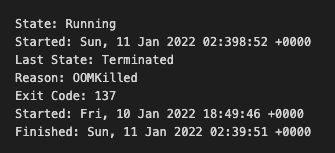

# 如何诊断 Kubernetes 应用程序中的 OOMKilled 错误

> 原文：<https://medium.com/codex/how-to-diagnose-oomkilled-error-in-kubernetes-application-201a9966be0d?source=collection_archive---------2----------------------->

[照片](https://unsplash.com/photos/GCFuprAvC6A)由 [Ihor Dvoretskyi](https://unsplash.com/@ihor_dvoretskyi?utm_source=unsplash&utm_medium=referral&utm_content=creditCopyText) 在 Unsplash 上拍摄

**OOMKilled 错误**表示一个容器或箱已经被终止，因为它已经使用了比它所分配的更多的内存。首字母缩写词 OOM 代表“内存不足”。

**OOMKilled** ，俗称 [**退出代码 137**](https://komodor.com/learn/how-to-fix-oomkilled-exit-code-137/) ，是起源于 Linux 的一类错误。 **OOM(内存不足管理器)**是 Linux 系统上的一个工具，它跟踪进程的内存使用情况。如果系统即将耗尽内存，OOM 黑仔将会介入并开始终止进程，试图释放内存并避免崩溃。OOM 黑仔的目的是通过杀死尽可能少的进程来释放尽可能多的内存。

Kubernetes 允许 pods 限制其容器在主机上可以使用的资源数量。一个 pod 可以设置一个内存限制——容器被允许使用的**内存**的**最大** **数量**——以及一个内存请求——容器应该消耗的最小内存数量。如果容器使用的内存超过了它的内存限制，它就会以 OOMKilled 状态终止。如果节点上所有容器或所有单元的总内存使用量超过某个阈值，则一个或多个单元可以被终止。

Kubernetes 中有两种类型的 **OOMKilled** **错误**。

*   **OOMKilled** :限制超量承诺
*   **OOMKilled** :达到容器极限

让我们来看看每一个。

# 由于达到容器极限而被杀死

这是迄今为止在 pod 中可能发生的最基本的记忆错误。与影响节点上 RAM 总量的限制过量使用错误不同，如果正常达到容器限制，它只会影响一个 pod。当 Kubernetes 发现一个 pod 使用的内存超过配置的限制时，该 pod 将被终止，并出现错误 **OOMKilled** — [达到容器限制](https://kubernetes.io/docs/concepts/policy/limit-range/)。

在大多数情况下，这会导致容器死亡，一个 pod 变得不健康，Kubernetes 会重新启动该 pod。发生这种情况时，请查看应用程序日志，了解为什么 pod 使用了比预期更多的内存。这可能是由于各种因素，包括流量的增加或长时间运行的 Kubernetes 任务占用了比平时更多的内存。

如果您在整个查询过程中发现程序按预期运行，但只需要额外的内存来执行，您可能希望增加请求和限制值。

# 由于限额超量承诺而导致死亡

当 pod 限制的总和大于节点上的可用内存时，会发生 **OOMKilled** : [**限制超量使用**](/pareture/kubernetes-node-overcommitted-57ec7c3dfe9e) 错误。Kubernetes 不会分配需要超过节点可用内存的 pod。另一方面，限制可以高于请求。因此，所有限制的总和可能超过节点容量。这就是所谓的过度承诺，是一种非常常见的现象。

实际上，如果所有容器消耗的内存都比请求的多，那么节点的内存将会耗尽。释放一些内存经常会导致一些 pod 的死亡。

因此，一个具有 8 GB 内存的节点，Kubernetes 可能运行 8 个容器，内存请求值为 1 GB。如果这些容器的内存限制为 1.5 GB，一些 pod 可能会使用超过最小值的内存，从而导致节点耗尽内存并强制终止一些 pod。

# 诊断

## 收集信息

运行命令[**ku bectl**](https://www.tutorialspoint.com/kubernetes/kubernetes_kubectl_commands.htm)describe pod[name]并将输出保存到文本文件中以备将来使用。

## 检查退出代码 137

检查描述窗格文本文件的事件部分:

容器因内存不足而终止，退出代码为 137。现在，回顾一下 pod 最近的历史事件，并尝试找出触发 OOMKilled 错误的原因，因为只有两个常见原因:

*   由于**容器**和**限制**，pod 被终止。
*   由于**节点**上的**过载**，pod 被终止。

# 解决办法

## 如果 Pod 由于容器限制而终止

检查你的应用程序是否真的需要更多的内存。如果应用程序面临增加的负载，它可能需要比原来提供的更多的内存。在这种情况下，请在 pod 规范中增加容器的内存限制以纠正错误。

如果内存使用量意外增加，并且似乎与应用程序需求无关，则应用程序可能正在经历[内存泄漏](https://en.wikipedia.org/wiki/Memory_leak)。在这种情况下，调试应用程序并找到内存泄漏的来源。增加应用程序的内存限制会消耗更多的资源。

## 如果 Pod 由于节点上的过载而被终止

如果**pod**的内存请求值小于某个**节点**上的可用内存，则允许在该节点上进行调度，这可能会导致过量使用。您需要确定 Kubernetes 终止 pod 的原因，然后调整限制值和内存请求，以确保节点不会过载。

您需要不断地监控您的环境，了解 pod 和容器的内存行为，并检查您的设置以完全诊断和解决 Kubernetes 内存问题。

# 结论

在本文中，我们仔细研究了起源于 Linux 的**Kubernetes**oom killed错误。它有助于 Kubernetes 在调度 pod 时管理内存，并在资源变得稀缺时决定杀死哪些 pod。记住要考虑两种类型的 OOMKilled 错误:达到容器限制和限制超量使用。了解这两者可以帮助您有效地进行故障排除，并减少将来遇到错误的机会。