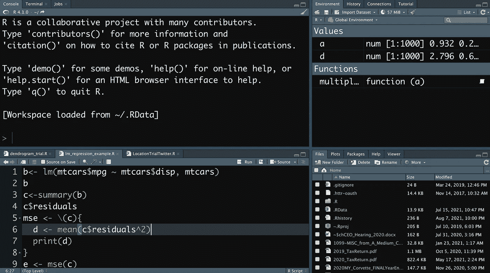

# 如何在博客中显示编程代码

> 原文：<https://medium.com/codex/how-to-display-programming-code-in-a-blog-a1c621e1df?source=collection_archive---------5----------------------->

## 开发者有很多选择，比如 GitHub Gists，Carbon，YouTube，来直观的解释一个程序。

写一篇关于最新编程框架或 IDE 特性的博文并不是一件困难的事情。开发人员和程序员可以通过多种方式在博客上展示他们的技巧和想法(或者在这个…