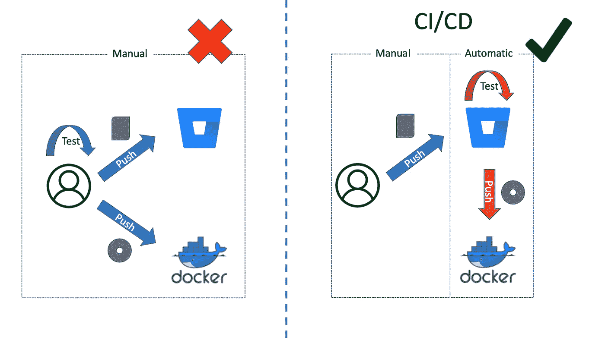
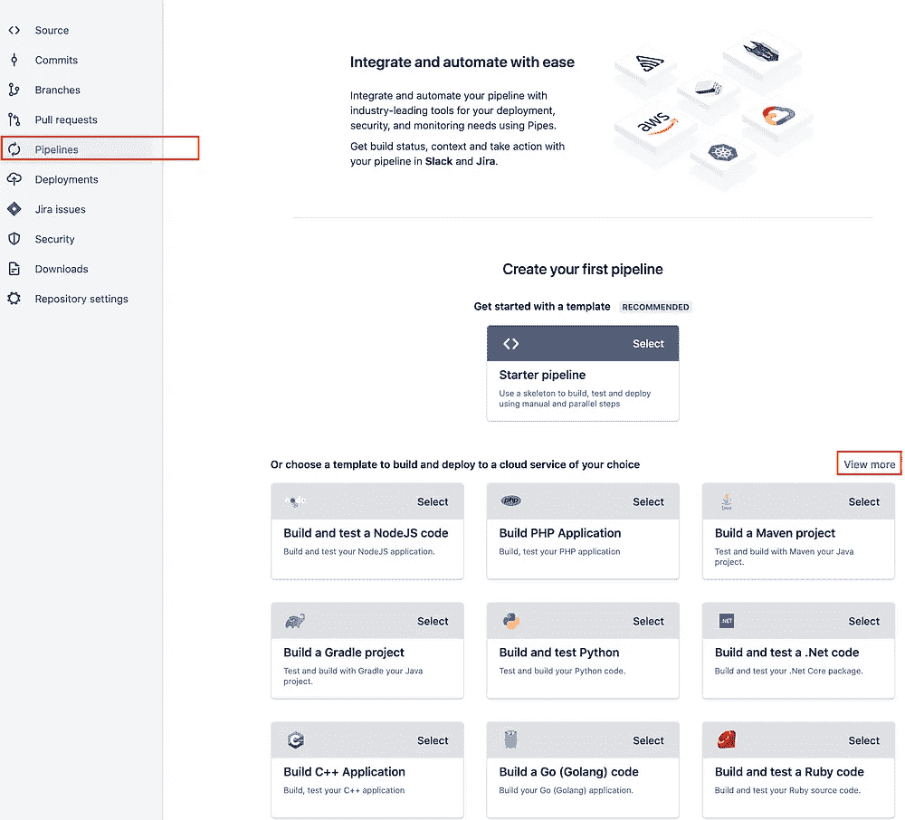
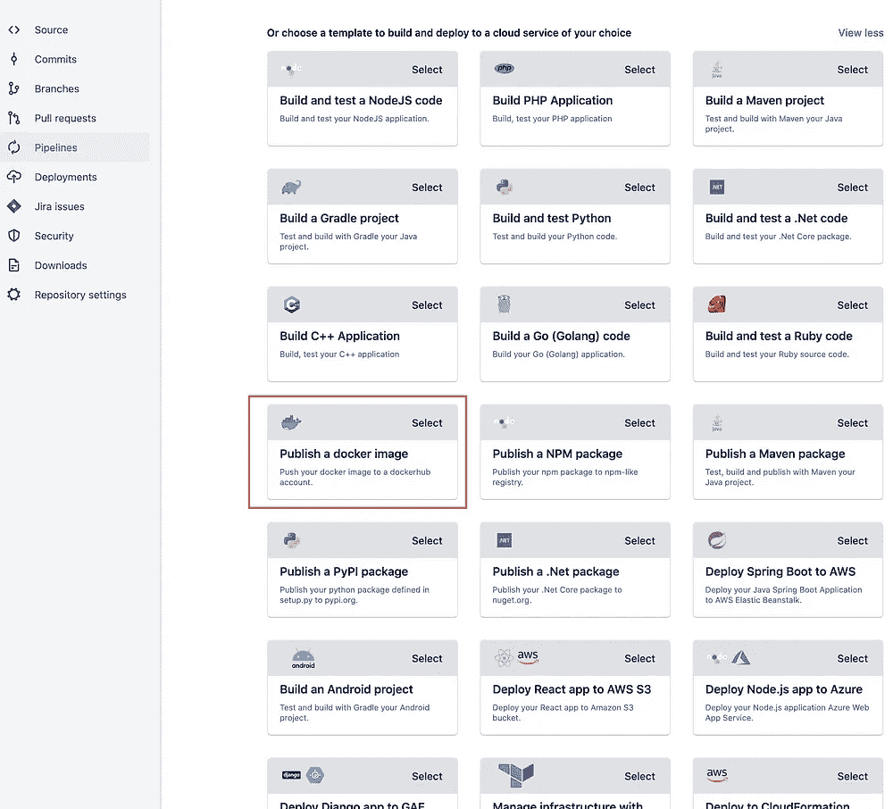
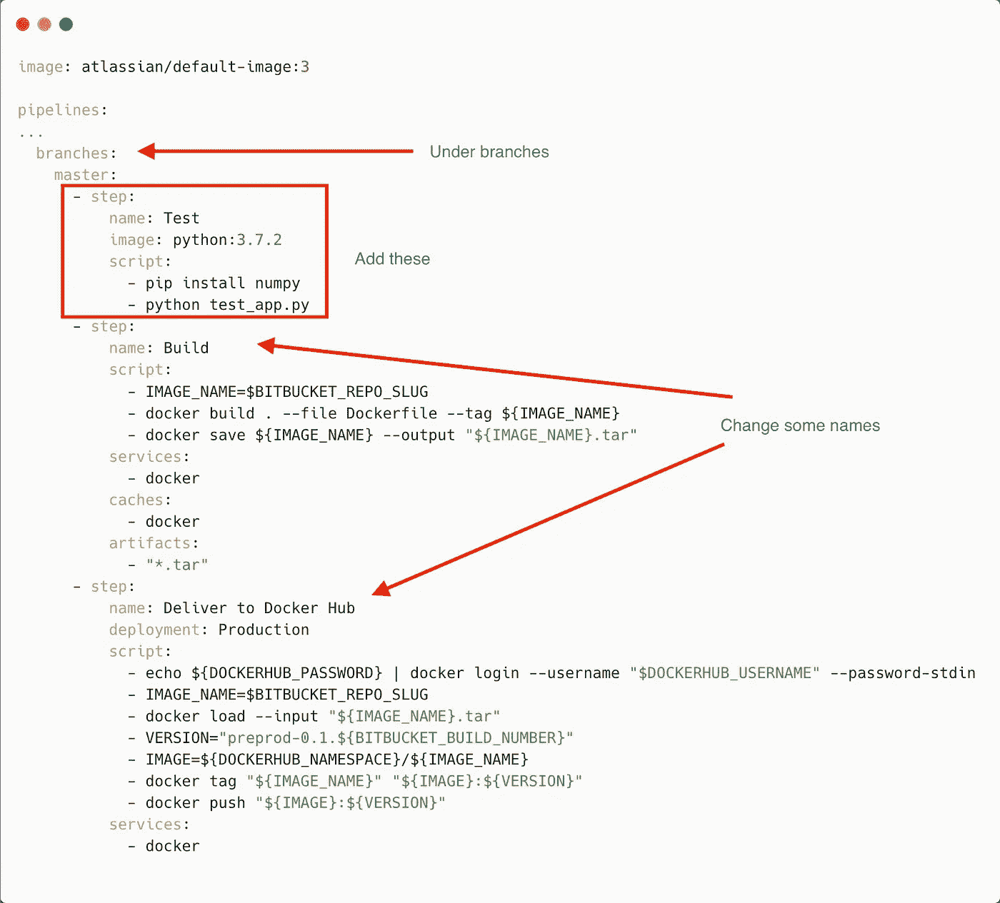
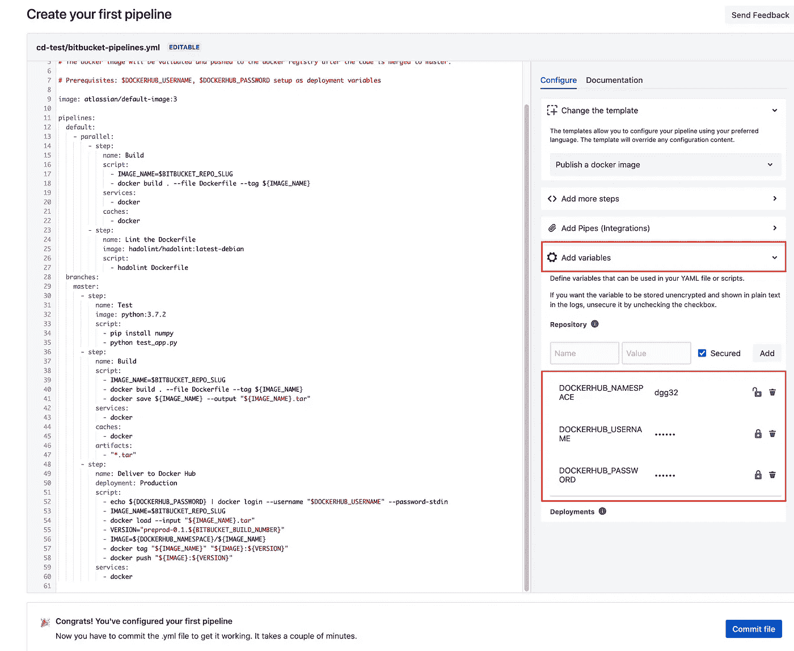
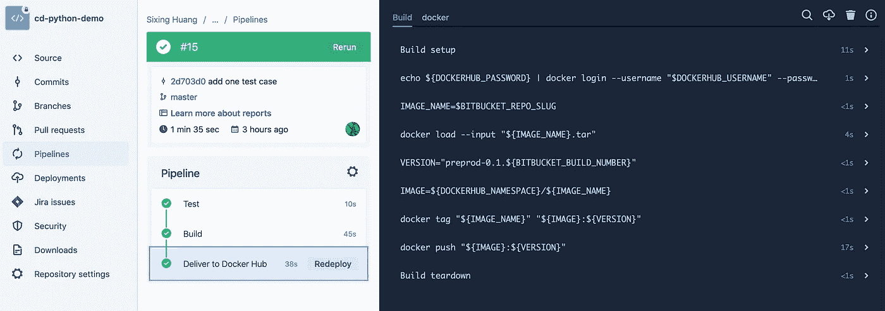
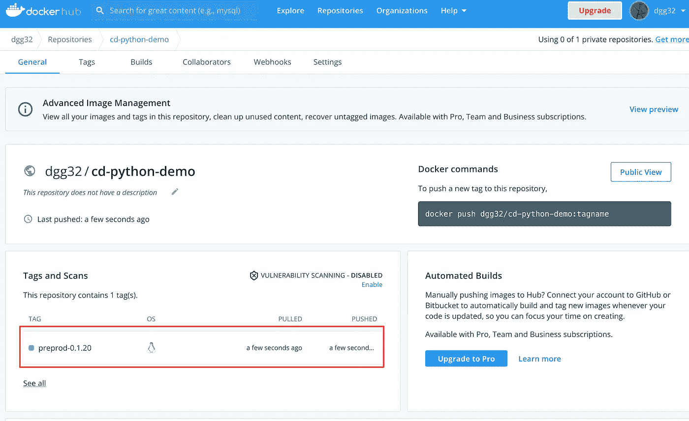

# 如何在 BitBucket 管道中执行 CI/CD

> 原文：<https://medium.com/codex/how-to-do-ci-cd-in-bitbucket-pipeline-f6d96d5fa48b?source=collection_archive---------0----------------------->

## 一个简单但完整的 Python 演练

Photo by [苏 静斋](https://unsplash.com/@karosu?utm_source=unsplash&utm_medium=referral&utm_content=creditCopyText) on [Unsplash](https://unsplash.com/s/photos/pipeline?utm_source=unsplash&utm_medium=referral&utm_content=creditCopyText)

持续集成和持续交付/持续部署，即所谓的 CI/CD，需要一个自动化的管道。每当一些新代码被推送到存储库时，管道被触发并开始对代码进行单元测试，构建映像并将映像推送到容器注册表。这是一个巨大的时间节省和现代软件开发的必备。

图一。传统集成/交付与 CI/CD 的比较。图片作者。

GitHub 和 BitBucket 都为我们提供了 CI/CD。但是我在 BitBucket 上试的时候，跌跌撞撞了一个小时才成功。我很惊讶网上竟然没有一个完整的演练。所以我在这里为那些想要一帆风顺的人记录了这些步骤。

您需要一个 BitBucket 帐户和一个 Docker Hub 帐户来完成本教程。免费账户没问题。该项目的代码托管在 BitBucket 中。

 [## 比特桶

### 具有位桶管道的 CI/CD 的源代码

bitbucket.org](https://bitbucket.org/dgg32/cd-python-demo/src/master/) 

# 1.创建一个简单的测试驱动开发 Python 项目

首先，创建一个位存储库。然后我们需要一个准系统的测试驱动开发(TDD) Python 项目作为我们的代码库。创建、提交和推送这四个文件到存储库:`test_app.py`、`app.py`、`requirement.txt`和`Dockerfile`。它们的内容如下:

剧本 1。test_app.py

剧本 2。app.py。

剧本 3。requirements.txt

剧本 4。Dockerfile 文件

`test_app.py`是我们单位的测试文件。它可以后验地测试*完成的主代码在不同的测试用例中是否能返回正确的答案。我们也可以从一个不同的角度来看:测试用例是我们想要用我们的主代码一个接一个完成的*先验*目标。从这个角度来说，我们应该先写`test_app.py`再编码`app.py`。代码开发变成了打靶练习。这也是 TDD 的意义所在。*

在提交代码并将代码推送到 BitBucket 之前，我们最好在本地测试我们的代码。但是可以在 BitBucket 上强制执行自动单元测试，以便只有有效的修改才被存储库接受。而这也是我们下一步要设置的。

# 2.设置位桶管道

我们现在可以配置 BitBucket。在浏览器中访问位存储库。在新存储库控制台中，点击`Or choose a template to build and deploy to a cloud service of your choice`中的`Pipeline`和`View more`。选择`Publish a docker image`(图 2):

图二。选择 docker 发布选项。图片作者。

BitBucket 会为你创建一个预填充的`bitbucket-pipelines.yml`文件。我们需要在它的`master`分支下添加一个`step`来执行单元测试。此外，您还可以在一些名称中进行一些编辑。我的`bitbucket-pipelines.yml`里的`branches`长这样:

图 3。我的 bitbucket-pipelines.yml 文件的摘录。图片作者。

这里有一个陷阱。预填充的`bitbucket-pipelines.yml`中的文档声明我们只需要两个部署变量:DOCKERHUB_USERNAME 和 DOCKERHUB_PASSWORD。这并不完全准确，因为如果没有变量 DOCKERHUB_NAMESPACE，交付将会失败。此外，错误的 DOCKERHUB_NAMESPACE 值将在推送过程中导致“`denied: requested access to the resource is denied`”错误。对我来说，DOCKERHUB_NAMESPACE 也是我的 DOCKERHUB 用户名，所以它与 DOCKERHUB_USERNAME 具有相同的值。要设置这些变量，在`Add variables`面板中添加三个键值对。关键字是 DOCKERHUB_NAMESPACE、DOCKERHUB_USERNAME 和 DOCKERHUB_PASSWORD。确保在输入凭证时选中了`Secured`(图 4)。

图 4。在管道中添加三个变量。图片作者。

一旦点击`Commit file`按钮，BitBucket 将立即开始第一次运行。如果一切运行顺利，您应该会在`Pipeline`面板中的三个步骤旁边看到绿色复选标记(图 5):

图 5。存储库中第一次运行配置项/光盘。图片作者。

去你的码头中心。如果图像存储库不存在，Bitbucket 将为您创建一个，然后将新的图像放入其中(图 6。你可以从我的版本号看到，我做了一些实验😉).

图 6。Docker Hub 中图像的成功传送。图片作者。

您也可以在本地计算机上部署映像。

图 7。在我的本地计算机上成功部署映像。图片作者。

# 结论

恭喜你！每当您将新代码推送到 BitBucket 存储库时，管道都会对代码进行单元测试，构建一个新的映像并将其推送到 Docker Hub。所以 BitBucket 只是接管了重复性的东西，把你从体力劳动中解放出来。从现在开始，我们鼓励您编写和提交更多高质量的代码。

你可以玩一下管道。例如，您可以更改您的 Python 脚本，故意使单元测试失败。您将看到管道在`Test`步骤停止。BitBucket 会向您发送一封关于失败的电子邮件警告。您可以尝试另一种编程语言，或者将映像推送到您的私有映像注册表中。由于本教程没有演示持续部署，您也可以将它作为您的家庭作业来实现。

既然 CI/CD 如此简单，为什么不从今天就开始使用它来提高你的工作效率呢？

 [## 加入媒介与我的介绍链接-黄思兴

### 作为一个媒体会员，你的会员费的一部分会给你阅读的作家，你可以完全接触到每一个故事…

dgg32.medium.com](https://dgg32.medium.com/membership)