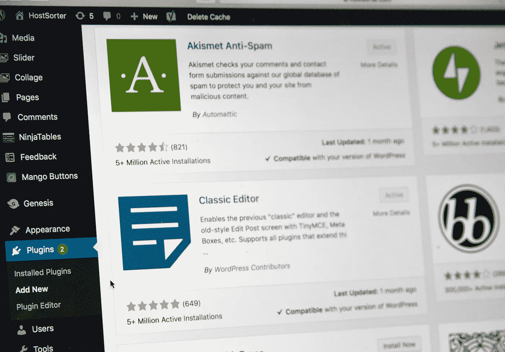

# 如何对你的 WordPress 站点进行分类

> 原文：<https://medium.com/codex/how-to-dockerize-your-wordpress-site-73adff9db697?source=collection_archive---------2----------------------->

## [法典](http://medium.com/codex)

## 同时使用 Docker 和 WordPress 是一件非常美妙的事情



斯蒂芬·菲利普斯-Hostreviews.co.uk 在 [Unsplash](https://unsplash.com/s/photos/wordpress?utm_source=unsplash&utm_medium=referral&utm_content=creditCopyText) 上的照片

*这篇文章也发表在我的博客上，你可以在*[*http://brockheriondev . com/how-to-dockerize-your-WordPress-site/*](http://brockheriondev.com/how-to-dockerize-your-wordpress-site/)找到

我喜欢 Docker。我真的很喜欢这项技术。能够在任何操作系统上的容器中启动任何项目，并在几乎没有配置的情况下将其部署到任何操作系统上，这是令人震惊的。您可以加速整个数据库或。或者，正如我最近一直在玩的，一个完整的 WordPress 安装。

我对 WordPress 还比较陌生。PHP 不是我日常使用的语言，MySQL 也绝对不是我的数据库首选。但是当我读到更多关于这个平台的信息时，我决定用它来一次真正的亲身体验。

我认为学习 WordPress 的最好方法是开发一个主题或插件。这意味着我必须在我的台式机上安装 PHP、WordPress 和 MySQL 或 MariaDB，如果我决定在沙发上学习或做其他事情，可能还需要在我的笔记本电脑上安装。更糟糕的是，我的台式电脑运行的是 Windows 10，笔记本电脑是 MacBook Pro。

进来吧，我穿着闪亮盔甲的骑士。我以前曾多次使用 Docker，并在生产环境中使用过一次。我没有做的是使用 Docker Compose 开发整个堆栈来管理整个事情。事实证明，这是我的正确选择。它解决了我的跨平台问题，我不必在我的系统上安装任何工具或数据库，并且我可以自由地创建我想创建的任何实例，而不必删除大量文件。

# **项目设置**

我假设如果你正在阅读这篇文章，你已经在你的系统上设置了 Docker 和 Docker Compose。如果你不知道，网上有很多很棒的教程可以教你如何设置。请随意查看 Docker 的[网站](https://www.docker.com/)以获取关于该平台的更多信息或其[文档](https://docs.docker.com/)。现在，让我们开始吧！

打开一个命令提示符或终端，找到你希望你的站点在本地的位置。然后，跑

```
mkdir my-wordpress-docker-site && \
cd my-wordpress-docker-site
```

这将把你放在你刚刚创建的文件夹中。我们现在准备好获取 Docker 编写文件设置了！

# **docker-compose 文件**

在你喜欢的编辑器中打开这个文件夹。我更喜欢使用 Visual Studio 代码，但是 Atom、PHP Storm 和其他代码应该也可以。

进入文件夹后，创建一个名为 docker-compose.yml 的文件。打开新创建的文件，让我们开始添加配置！

我们要添加的第一行是

```
version: ‘3’
```

这告诉 Docker Compose 我们希望使用版本 3 进行文件格式化。在写这篇文章的时候，最新的版本是 3.8。

接下来，我们需要添加两个部分，一个用于定义和配置我们的服务，另一个用于装载我们的卷。让我们继续添加下面几行

```
services:volumes:
```

这两个都应该在你的版本声明下。

## **数据库设置**

现在，让我们添加我们的数据库服务。对于这次安装，我选择了 MariaDB 而不是 MySQL。MariaDB 是 MySQL 的替代数据库，由最初创建 MySQL 的人创建。如果您愿意，也可以在这里非常容易地进行 MySQL 配置，设置几乎是相同的。

让我们在服务下添加以下部分

```
db:
  image: mariadb:10.5
  volumes:
    - db_data:/var/lib/mysql
  restart: always
  environment:
    MYSQL_ROOT_PASSWORD: <your-root-password>
    MYSQL_DATABASE: <your-database-name>
    MYSQL_USER: <your-user-name>
    MYSQL_PASSWORD: <your-user-password>
```

这就是在 Docker 中构建一个新的 MySQL/MariaDB 实例所需的全部内容。很酷吧？

我们现在需要进入我们的卷部分和插件

```
db_data:
```

这将把 Docker 容器中的/var/lib/mysql 文件夹映射到一个名为 db_data 的文件夹。现在，每当我们启动或关闭容器时，我们的数据都会被持久化。

我们现在准备好安装 WordPress 了！

## **WordPress 设置**

在服务下，我们需要添加另一个部分。继续添加以下配置

```
wordpress:
  depends_on: db
  image: wordpress:latest
  ports:
    - “8000:80”
  restart: always
  volumes:
    - ./wordpress:/var/www/html/
  environment:
    WORDPRESS_DB_HOST: db:3306
    WORDPRESS_DB_USER: <your-db-user>
    WORDPRESS_DB_PASSWORD: <your-db-password>
    WORDPRESS_DB_NAME: <your-database-name>
```

注意，我们在这里添加了 depends_on:db。我们告诉 Docker，这项服务要求我们的数据库在 WordPress 启动之前准备就绪。这将防止 WordPress 试图连接到一个可能准备好也可能没有准备好的数据库。我们还将系统上的端口 8000 映射到容器中的端口 80。

## **点火**

现在，你要做的就是跑

```
docker-compose-up
```

让 Docker 完成它的工作。

一旦完成，你应该能够访问 [http://localhost:8000](http://localhost:8000) 并登陆默认的 WordPress 设置页面。在你的文件夹中，你应该会看到一个 wordpress 文件夹。这将包含你可以管理的全部 WordPress 安装。你可以在这里添加或开发主题和插件。

这里需要注意的一点是，正如 WordPress 官方 Docker 页面中提到的，这个图像不包含任何其他 PHP 扩展或一些插件需要的库。如果您确实需要它们，您可能希望找到不同的图像或创建自己的 docker 文件来添加它们。

# **最终 docker-compose 文件**

```
version: ‘3’services:
  db:
    image: mariadb:10.5
    volumes:
      - db_data:/var/lib/mysql
    restart: always
    environment:
      MYSQL_ROOT_PASSWORD: <your-root-password>
      MYSQL_DATABASE: <your-database-name>
      MYSQL_USER: <your-user-name>
      MYSQL_PASSWORD: <your-user-password>

  wordpress:
    depends_on: db
    image: wordpress:latest
    ports:
      - “8000:80”
    restart: always
    volumes:
      - ./wordpress:/var/www/html/
    environment:
      WORDPRESS_DB_HOST: db:3306
      WORDPRESS_DB_USER: <your-db-user>
      WORDPRESS_DB_PASSWORD: <your-db-password>
      WORDPRESS_DB_NAME: <your-database-name>volumes:
  db_data:
```

# **总结**

我想感谢你花时间通读这篇文章，我希望我能帮助你在 Docker 上运行 WordPress。Docker 确实是一项了不起的技术，它使开发变得更加容易。当您现在准备好部署时，您可以部署到 Azure App Service 或 Kubernetes 集群之类的东西，或者，现在您已经在本地映射了所有内容，只需打包您的站点并将其发送到 SiteGround 或 Digital Ocean 之类的东西。就这么简单。

关于 Docker WordPress 图片的更多信息，请查看[https://hub.docker.com/_/wordpress](https://hub.docker.com/_/wordpress)