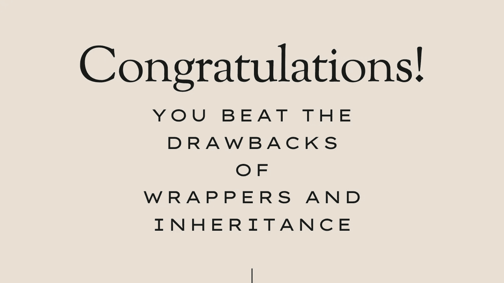

# 如何用 C#记录轻松克服包装器和继承的缺点

> 原文：<https://medium.com/codex/how-to-easily-beat-drawbacks-of-wrappers-and-inheritance-with-c-records-2a3dc8216755?source=collection_archive---------4----------------------->

## 使用 C# 9 记录轻松提高您的开发人员生活质量

图片由[作者](http://www.arnoldcode.com)经由 Canva.com 制作

开发软件通常伴随着单调乏味和重复的任务。一条运行良好的捷径怎么样？

记录类带来一些实用的功能。使用它们让你的日常工作——如下图所示——变得非常……