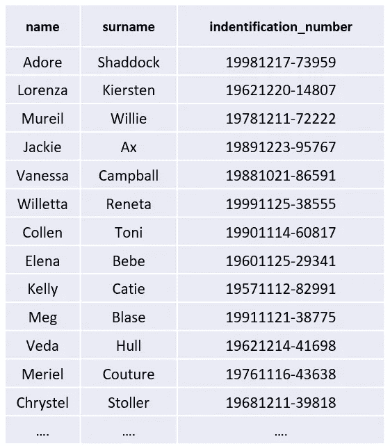
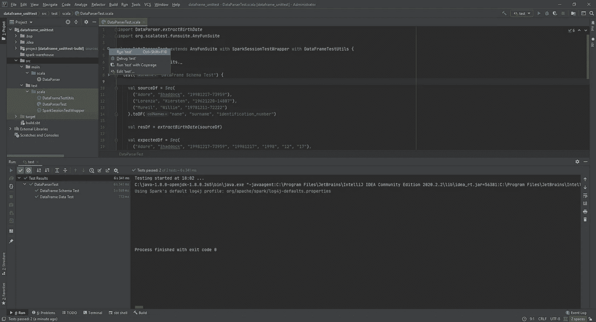

# 如何轻松测试 Spark 数据帧转换

> 原文：<https://medium.com/codex/how-to-easily-test-spark-dataframe-transformations-3b8cc160a705?source=collection_archive---------2----------------------->


约翰尼斯·格罗尔在 [Unsplash](https://unsplash.com?utm_source=medium&utm_medium=referral) 上的照片

作为一名数据工程师，我经常需要编写不同复杂度的数据帧转换。通常，这些操作会变得非常复杂，以至于在一个较大的数据集上，可能需要几个小时甚至更长时间来测试。当你明白这是不可行的时候，你需要利用 Spark 的一个伟大特性——*无处不在*。因此，让我们尝试在我们的 IDE 中运行我们的测试，看看我们如何能够轻松地测试我们的数据帧转换。

## 工作

首先，我们需要想象一些数据，例如，对于我们来说太大而不能直接测试的数据:



公民数据样本

我们有一个包含公民姓名和身份证号的数据集。这项任务很简单——我们需要提取公民出生日期的年、月、日。出生日期在*标识号*栏内，作为破折号前的第一部分。例如，第一个公民**崇拜柚子**的身份证号**1998 12 17–73959**，因此出生日期 **1998-12-17** 。

## 解决办法

让我们编写一些代码来实现这一点。首先，我们需要以某种方式捕获破折号符号之前的标识号部分——这里我们可以使用一个简单的*正则表达式来提取它:*

```
\d+(?=-)
```

*   **\d** 匹配任何数字字符(0–9)。
*   **+** 是一个量词，用来匹配 1 个或多个以此为开头的字符类型(数字)。
*   **(？=-)** 匹配主表达式后的一个组，而不包括在破折号后的结果中。

现在是提取出生日期的 Spark 转换:

```
def extractBirthDate(inputDf: DataFrame): DataFrame = {
  inputDf
    .withColumn("birth_date", *regexp_extract*(*col*("identification_number"), """\d+(?=-)""", 0))
    .withColumn("year", *substring*(*col*("birth_date"), 0, 4))
    .withColumn("month", *substring*(*col*("birth_date"), 5, 2))
    .withColumn("day", *substring*(*col*("birth_date"), 7, 2))
}
```

我们获取列 *identification_number* ，并使用我们的 *RegEx* 表达式将第一部分提取到名为 *birth_date* 的新列中。然后从这个列中使用 *substring()* 函数提取*年*、*月*日*日*。

## 测试解决方案

现在，在为你的数据帧转换编写任何测试之前，一定要注意你的函数是纯函数。因此他们不能访问网络资源、数据库或文件系统。

对于测试，我们将使用 Scala 最流行的测试工具 *ScalaTest* ,但是你也可以使用任何你喜欢的工具。在编写测试之前，我们还需要让 S *park* 在我们的 IDE 中运行。最方便的方法是编写一个*特征*，它可以扩展我们的测试类并为我们设置一个 *SparkSession* :

```
import org.apache.log4j.{Level, Logger}
import org.apache.spark.sql.SparkSession

trait SparkSessionTestWrapper {

  Logger.*getLogger*("org").setLevel(Level.*ERROR*)
  Logger.*getLogger*("akka").setLevel(Level.*ERROR*)

  val *spark*: SparkSession =
    SparkSession
      .*builder*()
      .master("local[1]")
      .appName("Local Test")
      .getOrCreate()
}
```

通过设置。 *master("local[1]")* 选项我们指定 *Spark* 用一个线程在本地运行，这对我们的测试来说非常好。

为了测试一个数据帧转换或这些转换的链，我们需要对需要测试什么有一些概念。我们必须比较两个数据帧，为此我们需要比较以下内容:

*   **数据框架模式** —这包括数据框架的所有结构信息，如列名、数据类型和可空性。
*   **数据帧数据** —这些是存储在我们的数据帧中的值。

让我们编写一个通用且可重用的函数来比较这两种数据帧属性:

```
import org.apache.spark.sql.DataFrame
import org.apache.spark.sql.types.StructType

trait DataFrameTestUtils {

  def assertSchema(schema1: StructType, schema2: StructType, checkNullable: Boolean = true): Boolean = {
    val s1 = schema1.fields.map(f => (f.name, f.dataType, f.nullable))
    val s2 = schema2.fields.map(f => (f.name, f.dataType, f.nullable))
    if (checkNullable) {
      s1.diff(s2).isEmpty
    }
    else {
      s1.map(s => (s._1, s._2)).diff(s2.map(s => (s._1, s._2))).isEmpty
    }
  }

  def assertData(df1: DataFrame, df2: DataFrame): Boolean = {
    val data1 = df1.collect()
    val data2 = df2.collect()
    data1.diff(data2).isEmpty
  }
}
```

同样，为了在我们的测试中重用它，我们用两个方法 *assertSchema()* 和 *assertData()* 将它编写为一个特征。

**assertSchema()** 接受两个结构类型(数据帧模式)和一个布尔值(是否检查可空性)，并返回一个布尔值来指示这两个数据帧模式是否匹配。如果您为数据指定了自己的模式，并且没有在读取时自动推断它(当您不关心可为空性时)，则需要进行可为空性检查。

assertData() 简单地获取两个数据帧，并返回一个布尔值来表示这两个数据是否相同。它通过在驱动程序中将数据集的所有元素作为数组返回并比较它们来实现这一点。collect() 是一个动作，它可能会在性能方面付出很高的代价，所以注意不要超出测试模型数据的大小。

现在我们有了创建本地 SparkSession 和数据帧比较的功能，让我们编写测试本身。首先，我们需要一些测试数据。通常，您可以只从数据集中提取几条记录，但是要确保您被允许这样做，并且代码中没有敏感数据。您可以为测试数据创建一个单独的文件(如. csv 或。json)并在运行测试时读取它，或者只是在代码中以编程方式创建一个:

```
import spark.implicits._

val sourceDf = *Seq*(
  ("Adore", "Shaddock", "19981217-73959"),
  ("Lorenza", "Kiersten", "19621220-14807"),
  ("Mureil", "Willie", "19781211-72222")
).toDF("name", "surname", "identification_number")
```

现在我们已经有了源数据，让我们创建一个预期的数据框架——它在我们转换后应该是什么样子:

```
val expectedDf = *Seq*(
  ("Adore", "Shaddock", "19981217-73959", "19981217", "1998", "12", "17"),
  ("Lorenza", "Kiersten", "19621220-14807", "19621220", "1962", "12", "20"),
  ("Mureil", "Willie", "19781211-72222", "19781211", "1978", "12", "11")
).toDF("name", "surname", "identification_number", "birth_date", "year", "month", "day")
```

将所有这些放在一个测试中:

```
test("DataFrame Schema Test") {

  val sourceDf = *Seq*(
    ("Adore", "Shaddock", "19981217-73959"),
    ("Lorenza", "Kiersten", "19621220-14807"),
    ("Mureil", "Willie", "19781211-72222")
  ).toDF("name", "surname", "identification_number")

  val resDf = *extractBirthDate*(sourceDf)

  val expectedDf = *Seq*(
    ("Adore", "Shaddock", "19981217-73959", "19981217", "1998", "12", "17"),
    ("Lorenza", "Kiersten", "19621220-14807", "19621220", "1962", "12", "20"),
    ("Mureil", "Willie", "19781211-72222", "19781211", "1978", "12", "11")
  ).toDF("name", "surname", "identification_number", "birth_date", "year", "month", "day")

  assert(assertSchema(resDf.schema, expectedDf.schema))
}
```

类似地，对于 DataFrame 数据测试:

```
test("DataFrame Data Test") {
  val sourceDf = *Seq*(
    ("Jackie", "Ax", "19861126-29967"),
    ("Vanessa", "Campball", "19881021-86591"),
    ("Willetta", "Reneta", "19991125-38555")
  ).toDF("name", "surname", "identification_number")

  val resDf = *extractBirthDate*(sourceDf)

  val expectedDf = *Seq*(
    ("Jackie", "Ax", "19861126-29967", "19861126", "1986", "11", "26"),
    ("Vanessa", "Campball", "19881021-86591", "19881021", "1988", "10", "21"),
    ("Willetta", "Reneta", "19991125-38555", "19991125", "1999", "11", "25")
  ).toDF("name", "surname", "identification_number", "birth_date", "year", "month", "day")

  assert(assertData(resDf, expectedDf))
}
```

你可以在两个测试中重用相同的 *sourceDf* 和 *expectedDf* ，减少代码行，但我认为最好是每个测试都有单独的模型数据。现在让我们试着在 *Intellij* 中运行我们的测试，看看我们的函数 *extractBirthDate()* 是否做了它应该做的事情:



在 Intellij 中运行数据帧转换测试

成功！我们在 IDE 上运行了一个经过测试的数据帧转换，耗时不到 7 秒。如果您还没有开始测试您的 Spark 转换，那么我希望现在您已经有了一些编写您自己的测试的基本设置。

该项目在 [**GitHub**](https://github.com/Bigdataengr/dataframe_unittest) 上可用。

谢谢你，祝你考试顺利！