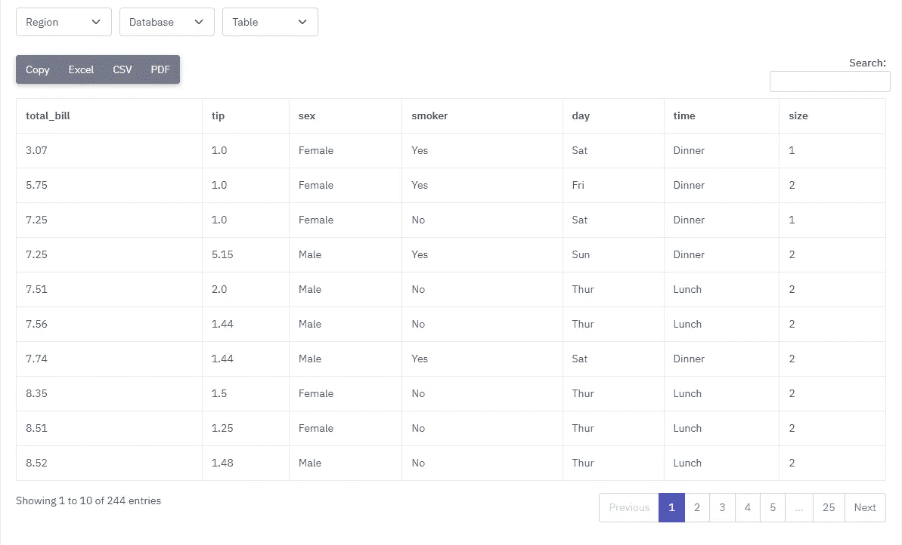

# 如何在 Django 中轻松地将任何熊猫数据帧转换成 HTML 表格

> 原文：<https://medium.com/codex/how-to-easily-transform-any-pandas-dataframe-to-html-tables-in-django-ad17fb84edbc?source=collection_archive---------4----------------------->

## 一个真实的例子和自定义 Django 模板标签

大家好。如今，我是一个团队的成员，该团队正在为土耳其最大的建筑公司之一的云 BI 基础设施项目提供咨询。在这篇文章中，我将写一个我今天早上遇到的真实例子。


照片由[海伦娜·赫兹](https://unsplash.com/@imperiumnordique?utm_source=unsplash&utm_medium=referral&utm_content=creditCopyText)在 [Unsplash](https://unsplash.com/s/photos/template-tag?utm_source=unsplash&utm_medium=referral&utm_content=creditCopyText) 拍摄

我正在为这个项目开发一个 Django 项目。Django 应用程序将被用作网关，向董事会成员显示数据仓库中的一些表格。我必须开发 4 个数据表页面来过滤表格并显示它们。数据必须从 CSV 文件中读取。

我为处理这项任务而开发的定制模板标签工作得很好。您可以通过下面的链接获得更多详细信息。

 [## 如何创建自定义模板标签和过滤器| Django 文档| Django

### Django 的模板语言带有各种各样的内置标签和过滤器，旨在解决表示问题…

docs.djangoproject.com](https://docs.djangoproject.com/en/4.1/howto/custom-template-tags/) 

另外，你可以通过下面的链接阅读本文的第二部分。

[](/codex/a-boilerplate-to-self-hosted-continuous-delivery-django-apps-part-2-f358274a0ac3) [## 自托管连续交付 Django 应用程序的样板文件(第 2 部分)

### Django，Docker，GitHub 操作，工作流，自托管，自定义运行器

medium.com](/codex/a-boilerplate-to-self-hosted-continuous-delivery-django-apps-part-2-f358274a0ac3) 

# 自定义模板标签

首先，我在我的 app 文件夹下创建了`templatetags`文件夹。然后，我创建了`datagateway_template_tags.py`文件。在我的模板文件中，我将直接加载这个文件。

```
from django import templateregister = template.Library()def convert_data_frame_to_html_table_headers(df): html = "<tr>" for col in df.columns: html += f"<th>{col}</th>" html += "</tr>" return html def convert_data_frame_to_html_table_rows(df): html = "" for row in df.values: row_html = "<tr>" for value in row: row_html += f"<td>{value}</td>" row_html += "</tr>"
   html += row_html
   return html register.filter("convert_data_frame_to_html_table_rows", convert_data_frame_to_html_table_rows)register.filter("convert_data_frame_to_html_table_headers", convert_data_frame_to_html_table_headers)
```

这些模板标签函数需要获得至少 1 个参数，这是我们任务的数据帧。然后，我创建一个 HTML 字符串来呈现模板文件。

# 使用标签

在我的模板文件中，我正在加载我创建的模块。

```
# this is the file that I created to store my template tags

```

然后，我通过将从后端视图函数发送的数据帧传递给模板来使用标记。

```
<table *id*="efficiency-hub-table" *class*="table table-bordered dt-responsive nowrap w-100"> <thead>
  {{ table_data | convert_data_frame_to_html_table_headers | safe}}
 </thead>
 <tbody>
   {{table_data | convert_data_frame_to_html_table_rows | safe}}
 </tbody></table>
```

# 最后

这是一个将 Pandas 数据帧转换成 HTML 表格的简单方法。希望它能帮助您开发自己的项目并将数据框嵌入到您的网页中。另外，我可以在模板函数上使用`mark_safe`函数。然而，我更喜欢在模板上使用`|safe`标签。



作者图片

问候

另外，你可以通过下面的链接阅读本文的第二部分。

[](/codex/a-boilerplate-to-self-hosted-continuous-delivery-django-apps-part-2-f358274a0ac3) [## 自托管连续交付 Django 应用程序的样板文件(第 2 部分)

### Django，Docker，GitHub 操作，工作流，自托管，自定义运行器

medium.com](/codex/a-boilerplate-to-self-hosted-continuous-delivery-django-apps-part-2-f358274a0ac3)