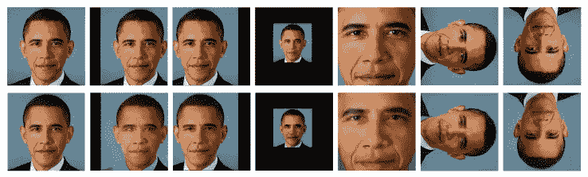
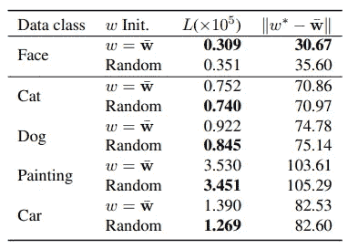

# 如何用 GANs 编辑图像？控制 GANs 的潜在空间

> 原文：<https://medium.com/codex/how-to-edit-images-with-gans-controlling-the-latent-space-of-gans-afde630e53d1?source=collection_archive---------2----------------------->

StyleGAN 和 BigGAN 等最近的图像生成作品能够生成真正高质量的图像。虽然这些关于 GANs 的工作非常令人兴奋，但我们必须更多地了解潜在的空间，以开发有趣的应用程序。我们希望能够控制我们想要生成的图像类型。

在本帖中，我们将回顾一篇关于如何在 GAN 潜在空间中嵌入给定图像的论文。要理解这些论文，你首先需要理解 GANs 和 StyleGAN，我们不会在这篇文章中解释。

这篇论文…

*   研究 GAN 的潜在空间并提供相关见解。
*   建议为 StyleGAN 嵌入一个“W+”扩展潜在空间。
*   提出了一种将给定图像映射到潜像的嵌入算法。

[*原文:Image2StyleGAN:如何将图像嵌入 StyleGAN 潜空间？*](https://arxiv.org/abs/1904.03189)

## 将新图像嵌入潜在空间

GANs 中图像处理的第一步是能够将给定的图像映射到潜在空间。实现这一点的流行方法是训练编码器将图像映射到潜在空间。在使用 GAN 损失训练生成器之后，我们冻结生成器(解码器)权重并训练将图像映射到潜在空间的编码器。然后，生成器基于预测的潜像生成合成图像。通过将原始图像与发生器的输出进行比较，编码器网络像 AE 一样被训练。

[Zi2Zi](https://kaonashi-tyc.github.io/2017/04/06/zi2zi.html) 汉字生成的流水线，上面描述的过程的例子。

另一种方法是从潜在空间中的随机点开始，并通过梯度下降学习输入(潜在)，以便生成器的输出与给定图像匹配。通常使用第一种方法，因为它在测试时速度更快。

## GAN 潜在空间

本文提出了“梯度学习输入”的第二种方法的更一般和稳定的扩展。

顶行:输入图像。底行:将图像嵌入到 StyleGAN 潜在空间的结果。

甚至有可能在 GAN 潜空间中嵌入任意图像吗？实验在 GAN 空间中嵌入人脸、猫、狗、汽车、绘画 5 类 25 幅图像。虽然汽车等类别直观上与人脸没有结构相似性，但嵌入算法和生成器能够超越人脸。虽然与奥巴马的脸相比，其他类上有更多的缺陷，但这展示了生成器令人惊讶的嵌入能力。示例如上图所示。

顶行:输入图像。底行:将图像嵌入到 StyleGAN 潜在空间的结果。

人脸图像的嵌入有多鲁棒？另一个实验测试了嵌入性能的鲁棒性，方法是尝试使用仿射变换嵌入图像，如上图所示。通常，与普通嵌入相比，会有模糊的图像和更多丢失的细节。然而，该模型对下图中的缺陷具有惊人的鲁棒性。这些结果意味着生成器依赖于空间变换，但是面部特征的嵌入是彼此独立的。

顶行:输入图像。底行:将图像嵌入到 StyleGAN 潜在空间的结果。

## W+潜在空间

嵌入哪个空间？

斯泰勒根有多个潜在空间可以嵌入。作者测试了各种潜在空间，并比较了上图中的结果。Z 空间是初始潜在空间，W 空间是全连通映射后的中间潜在空间。将图像嵌入到这些琐碎的空间中，结果很差，如图(c)(d)所示。早期阶段的嵌入似乎没有向生成器传达足够的关于给定图像的信息。为了解决这个问题，作者建议利用 StyleGAN 架构，并在扩展的潜在空间中嵌入图像。

左:原始 StyleGAN，右:嵌入到 W+应用到 StyleGAN

W+潜在空间是 StyleGAN 中 AdaIn 层的每个*样式*的 18 个不同的 512 维 W 向量的串联。本文提出在 StyleGAN 中处理每个 AdaIn 层的 w 输入。这样不会对网络干扰太大吗？在这种程度的干扰下，网络权重还重要吗？图(b)(e)显示了随机初始化模型上的嵌入图像。看起来 W+潜在空间可以控制输出，即使在随机模型上也能生成给定的图像，但需要训练卷积进行质量重建，如图(e)所示。

## 嵌入有多大意义？

这一切都归结于关于嵌入 W+空间是否有意义的讨论。这些作品的主要目标是应用于图像编辑。本文对对应于一些图像编辑应用的潜在代码进行操作，以测试潜在代码的有效性。

变形

首先，作者在嵌入的潜影上执行两幅图像之间的变形。这是通过在两个图像的潜像之间生成计算为线性插值的潜像来实现的。在上图中，该算法能够在人脸图像之间生成高质量的变形(域内),但对于非人脸图像却不能。我们可以在插值过程中发现类似人脸的伪像。这表明内在的潜在空间是专门给人脸的。

这使得两个给定的面之间的变形！这项工作确实令人惊叹。然而，域外数据的生成似乎是一种延伸，源于 W+空间中的嵌入可能对最终输出造成的不自然的影响。

使用 StyleGAN 进行风格转移

StyleGAN 的基本设计使其应用于风格转换。早期层的 Te 潜在代码影响空间和高级特征，例如面部形状和姿态，而较深层的姿态改变纹理和色彩方案。因此，例如，如果我们将奥巴马的潜在代码用于早期层，将一幅漫画的潜在代码用于更深的层，我们就会得到上面描述的风格转移效果。

嵌入能够将低层次的特征转化为人脸(上图)，但不能保留非人脸图像的高层次内容(下图)。这进一步支持了内心潜在空间是专门给人脸的说法。

非人脸图像上的风格转移

本文还提供了关于*表达转移*的实验，该实验也显示是成功的。在人脸上的总体实验被证明是非常成功的，表明在 W+潜在空间上嵌入是合理的决定。生成的嵌入在语义上对许多图像编辑应用程序有意义。

虽然生成器能够充分地从嵌入在 W+空间上的图像生成域外图像，但是实验表明非人脸图像的嵌入具有较少的语义意义。在操作过程中出现的人脸碎片暗示着内在的潜在空间是专用于人脸的。

## 嵌入算法

最后，我们将讨论将给定图像嵌入到预训练生成器的流形上的优化算法。该方法使用梯度下降在专用损失上优化初始嵌入 w。

初始嵌入的一种方法是简单地从均匀分布中采样。然而，在 StyleGAN 设置中，AdaIN 层的输入是一个复杂的分布，我们可以期望最终向量收敛到一个更接近平均潜在向量的向量 w*。我们可以将嵌入初始化为平均潜在向量。这对嵌入人脸图像有效，但对非人脸图像无效。

感知损失旨在测量图像之间的高级相似性。VGG 图像分类模型的中间特征通常用于计算感知损失。具体来说，我们计算图像的特征(Conv 层的输出)之间的差异。损失函数被定义为给定图像和发生器输出之间的感知损失和逐像素 MSE 损失的组合。

本文对原始论文中提供的各种损失、训练配置和超参数进行了烧蚀研究。

## 总结和意见

*   我们可以将任何给定的图像嵌入到 StyleGAN 潜在空间中。甚至是训练域之外的图像。
*   当在各种操作上进行实验时，人脸嵌入获得了良好的语义意义。
*   非人脸嵌入在这样的实验中严重失败，这表明虽然 StyleGAN 可以生成这样的图像，但潜在空间主要是人脸。
*   嵌入到 W 和 Z 空间不能为生成器提供足够的信息。W+ space 就可以了。
*   我们可以将潜在向量初始化为平均潜在向量。

本文对 GAN 潜在空间(特别是 StyleGAN)提供了有趣的见解，并建议通过选择足够复杂的潜在空间，我们可以将给定的图像映射到 StyleGAN 潜在空间，而信息损失很小。这篇论文的见解和改进是惊人的。

论文中的许多实验都涉及到非人脸图像。非人脸图像的结果和超参数建议与人脸图像的大部分结果相矛盾。作者还指出，潜在空间专门用于人脸。直觉上，训练人脸的生成器不应该能够生成汽车的图像。我怀疑这些实验是否有意义。