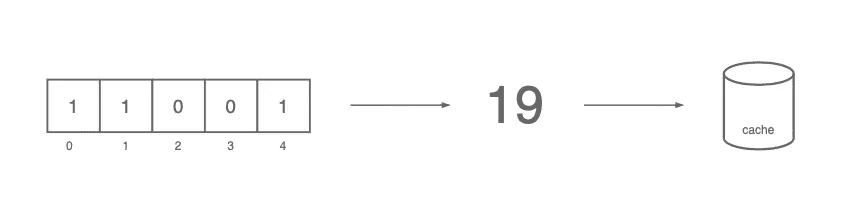

# 布鲁姆过滤器初学者指南

> 原文：<https://medium.com/codex/how-to-efficiently-check-if-a-username-is-registered-dbbe02cca20f?source=collection_archive---------1----------------------->

## 如何高效地检查用户名是否注册？

由[拉胡尔·潘迪特](https://www.pexels.com/@rahulp9800/)在[佩克斯](https://www.pexels.com/photo/yellow-cosmos-flower-close-up-photography-1212487/)拍摄的照片

给定用户注册页面上的用户名，我们如何判断它是否已经注册了？

虽然查询索引数据库很有帮助，但是它很慢，而且会引起网络调用。

为了加快速度，我们可以在 Redis 这样的键值存储中缓存注册用户名的列表。

然而，这意味着缓存数百万条记录，并使我们的内存占用加倍。

在这个看似微不足道的问题上，我们如何才能做得更好？

布鲁姆过滤器可能是答案，让我们来看看吧！

# 什么是布鲁姆过滤器？

布隆过滤器检查项目是否在集合中

布隆过滤器回答了一个简单的问题，

**一个元素是否存在于给定的集合中？**

布隆过滤器是一种概率数据结构。对于上面的问题，它输出以下答案之一

*   **大概**是的
*   **100%** 否

换句话说，假阳性**可能**，而假阴性**永远不会**发生。

而它最大的优势就是，它做到了在**恒定**的时间和空间里。

# 它是如何工作的？

布隆过滤器由两个组件组成

*   N 大小的位数组
*   几个散列函数

## **初始化**

布隆过滤器是 N 大小的比特阵列

它首先被初始化为一个 N 大小的位数组，所有的位都被设置为零。现在让我们假设数组的长度为 10。

## **添加项目**

对项目进行散列和 mod 以获得有界索引

添加一个项目很简单

*   称之为“tiger”的项目是使用散列函数散列的
*   生成的哈希值由数组长度决定，以获得一个有界索引
*   然后，位数组的索引被设置为 1

## **检查一个项目是否存在**

如果 index 设置为 1，则项目可能在集合中。不然肯定不在套里。

类似于添加一个条目，我们使用散列函数对元素进行散列，并对其进行修改以获得一个有界索引。

输出评估如下，

*   如果位数组的索引值为 0，则该项是集合中的**而不是**。
*   否则，该物品可能是**中的**

布隆过滤器中的项目不能**被移除，因为多个项目可能共享相同的索引。**

## 存储布隆过滤器

我们可以将其位表示转换为十进制数，而不是将 bloom filter 存储为数组。

例如，我们可以将包含`10011`的数组转换为 19，并将其存储在缓存中。

如果列表不经常改变，服务器可以将十进制数发送给客户端，允许在客户端进行验证。

# 我们能做得更好吗？

如果散列函数为“tiger”和“cow”都输出了索引 1，那么检查“cow”是否在集合中会产生答案 Yes **，即使它不是**。

我们可以通过以下解决方案降低误报的几率。

*   增加数组的长度
*   增加哈希函数的数量

增加阵列的长度减少了碰撞的机会。

使用多个散列获得多个索引

代替一个索引，我们可以使用几个散列获得多个索引。

添加项目时，所有获得的索引将被设置为 1。

只有当**所有的**索引都被设为 1 时，一个项目才被认为可能在集合中。

利用这些方法，我们可以显著降低假阳性的概率。

# 应用程序

让我们来看一些现实生活中的例子。

## 检查用户名是否存在于用户注册流程中

*   当创建用户名时，该用户名被添加到存储在键值存储中的布隆过滤器中。
*   当用户在用户注册页面上键入用户名时，服务器首先查询布隆过滤器。
*   如果用户名不在布隆过滤器中，服务器会立即向客户端返回一个错误。
*   否则，服务器会在数据库中进行查询和交叉检查。

## 检查用户是否阅读了中等文章

*   中为每个用户维护一个布隆过滤器。
*   在推荐文章之前，Medium 会检查文章 ID 是否存在于用户的 bloom filter 中。
*   当然不在布隆过滤器中的文章被推荐给用户。

## 在 Chrome 中检查一个 URL 是否是恶意的

*   当访问一个 URL 时，Chrome 首先验证该 URL 是否是恶意列表的一部分。
*   Google 不是每次都查询 Google 服务器，而是使用预先确定的恶意列表构建一个 bloom filter 并发送给浏览器。
*   在访问网站之前，浏览器会对 URL 进行哈希处理，并与布隆过滤器进行交叉检查。

# 关闭

虽然可能会有**误报**，但是当我们想要判断列表中的某个项目是否是**而不是**时，布隆过滤器是很方便的。

由于其在时间和空间上的效率，它可以用作第一层过滤。

我希望这能对你有所帮助，下次再见！