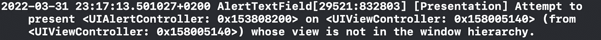
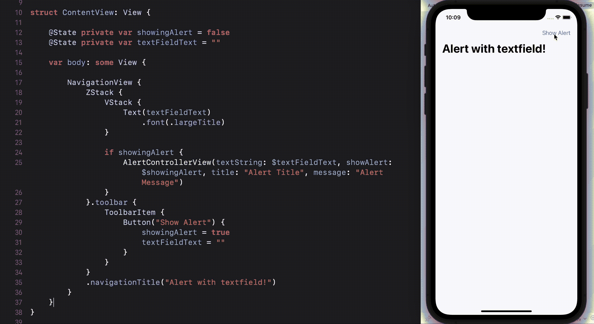

# 如何在 SwiftUI 中嵌入带有文本字段的 UIKit 警报

> 原文：<https://medium.com/codex/how-to-embed-a-uikit-alert-with-text-field-in-swiftui-8547afaa1fc?source=collection_archive---------3----------------------->

## 如何使用 UIViewControllerRepresentable 的快速指南


*与* [*合写的 Alessia Andrisani*](https://medium.com/u/7a4361f94887?source=post_page-----8547afaa1fc--------------------------------) *。*

如果你在这里，你可能对 SwiftUI 比对 UIKit 更熟悉。如果你不知道，SwiftUI 是苹果在 2019 年推出的新框架，而 UIKit 是它在 2008 年诞生的哥哥。

也许你在问自己，为什么我应该使用 UIKit，而不是完全依赖新的、更容易学习的 SwiftUI？答案是，不幸的是，仍然有许多组件只存在于 UIKit 中，而其他组件在 SwiftUI 中的可定制性不如 UIKit。您可能想在 SwiftUI 中直接创建这种自定义视图，但正如您将看到的那样，结果永远不会与原始视图完全一样，并且您将会失去一些原生视图免费提供给您的功能。

在本文中，我们将解释如何在 SwiftUI 项目中使用带有文本字段的警报，但我们在此应用的相同步骤和原则也适用于其他 UIKit 组件。

## 1.设置项目

首先创建一个新项目，注意选择 SwiftUI 作为语言。创建一个新的 SwiftUIView 文件，并将其命名为`AlertControllerView`。删除或评论预览，因为我们在这里不需要它。现在，重要的部分是:结构需要符合协议`UIViewControllerRepresentable`。

这个协议是做什么的？该协议用于在 SwiftUI 界面中创建和管理 UIKit 视图控制器对象。

为了符合该协议，需要两个功能:

*   `makeUIViewController`
*   `updateUIViewController`

这些函数是不言自明的:第一个函数创建了`UIViewController`，第二个函数用于将数据从 SwiftUI 发送到 UIKit。现在将这些函数添加到您的结构中。

SwiftUI 中的警报需要一些变量和绑定，以便在`SwiftUIView`中正确显示。将这些变量和这些绑定添加到结构中。

## 2.协调者

下一步是添加一个`Coordinator`类，它将协调我们的视图控制器和 SwiftUI 视图，使我们能够响应变化。这个协调器是必需的，因为否则您的`UIViewController`将无法响应视图中发生的变化。

要创建一个协调器，我们需要函数`makeCoordinator`，该函数创建自定义实例，您可以使用该实例将视图中的更改传达给 SwiftUI 界面的其他部分。将这个函数添加到您的代码中，然后添加`Coordinator`类。协调者需要符合`NSObject`(大多数 Objective-C 类层次结构的根类)和`UITextFieldDelegate`。

**委托**是一个对象，当另一个对象在程序中遇到事件时，它代表该对象或与该对象协作。我们刚刚创建的协调员将是我们的文本字段的代表。

然后，让我们通过添加这两个变量`alert`和`control`以及初始化器来完成我们的协调器。下一步是添加这个函数，它将文本字段的内容链接到绑定变量`textfieldText`。

## 3.UpdateUIViewController

现在让我们转到警报的逻辑实现。我们将在`updateUIViewController`函数中工作。让我们检查在视图的主体被重新呈现后，Alert 实例是否存在。之后，添加这段代码来创建一个将出现在`UIViewController`上的`UIAlertController`实例。

现在让我们创建文本字段，并确保协调员是它的代表。我们现在要做的是将按钮添加到我们的警报中。我们将添加一个`"OK"`按钮来确认和消除，并添加一个`”Cancel"`按钮来消除警告。

要完成`AlertControllerView`您必须做的最后一件事是添加该方法来呈现警告，并在完成时消除它(当您点击其中一个按钮时)。

小心点！该方法需要在主线程上被调度**，否则警报可能不会出现，并且您可能会在控制台中得到该消息。**



## 4.警报正在使用中

现在终于到了使用我们刚刚在 SwiftUI 中创建的警报的时候了。这里有一个简单的例子来说明它是如何工作的。好好享受吧！



如果你想在一个简单的项目中看到这个带有文本字段的警告，请访问 GitHub。

[](https://github.com/alessia-andrisani/UIKit-SwiftUI) [## GitHub-alessia-andrisani/ui kit-swift ui

### 此时您不能执行该操作。您已使用另一个标签页或窗口登录。您已在另一个选项卡中注销，或者…

github.com](https://github.com/alessia-andrisani/UIKit-SwiftUI) 

```
**Discord Contacts:** Alessia Andrisani #7384
Vito Gallo #2837
```