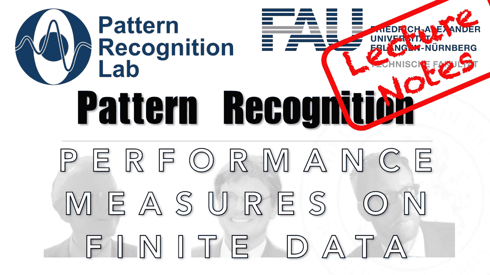

# 如何在不收集新数据的情况下估计分布误差

> 原文：<https://medium.com/codex/how-to-estimate-out-of-distribution-errors-without-collecting-new-data-b4c3a4d307ca?source=collection_archive---------5----------------------->

## 模式识别中的 FAU 讲义

## 有限数据上的性能度量

来自[模式识别讲座](https://www.youtube.com/playlist?list=PLpOGQvPCDQzsWvT_bqmexrJ359RTQQuMO)的 [CC BY 4.0](https://creativecommons.org/licenses/by/4.0/) 下的图像。

**这些是 FAU 的 YouTube 讲座“** [**模式识别**](https://www.youtube.com/playlist?list=PLpOGQvPCDQzsWvT_bqmexrJ359RTQQuMO) **”的讲义。这是讲座视频&** [**配套幻灯片**](https://doi.org/10.5281/zenodo.4429576) **的完整抄本。幻灯片的来源可在** [**此处**](https://github.com/akmaier/pr-slides) **获得。我们……**