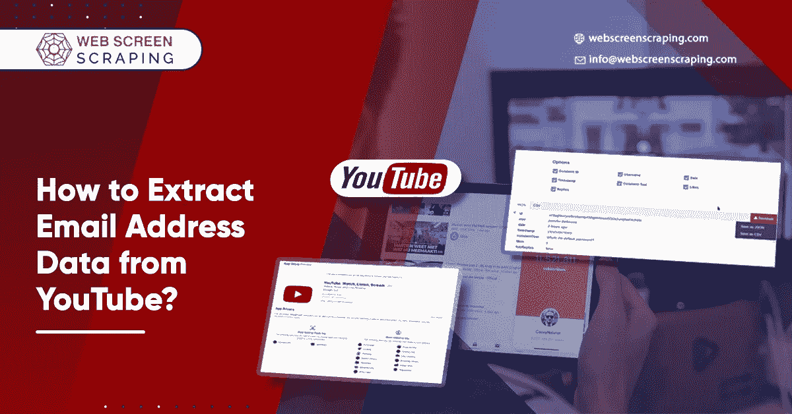
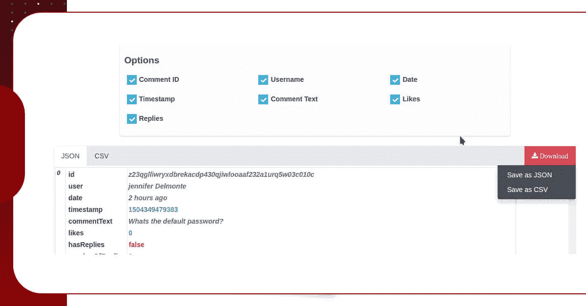
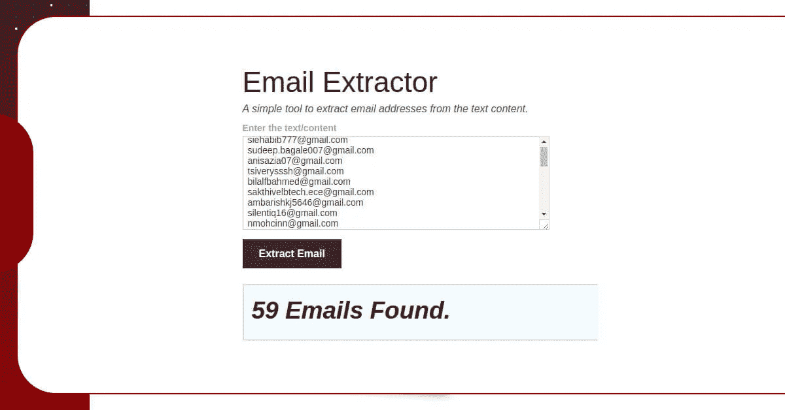

# 如何从 YouTube 中提取邮箱地址数据？

> 原文：<https://medium.com/codex/how-to-extract-email-address-data-from-youtube-bace501f3e72?source=collection_archive---------3----------------------->



许多人都在寻找时事通讯订户，也有很多方法可以做到这一点。在这个博客中，我们将与你分享一个组织良好的方法，帮助你寻找正确的目标。

让我们一步一步来看。想象你是一名程序员，你关心使用 Laravel 框架开发 web 应用程序，你希望与人们分享它，或者出售它，或者你需要的任何东西。

因此，您需要在 YouTube 上搜索相关视频。例如:

所以，现在我们需要从这个视频中提取所有的评论，但是怎么做呢？

谷歌提供了一个 API，我们可以利用它来做这样的工作。这段代码可以帮助我们做任何我们想做的事情:

```
$.ajax({ dataType: "jsonp", type: 'GET', url: "https://www.googleapis.com/youtube/v3/commentThreads?key=PUT-YOUR-KEYXXXXXXX&textFormat=plainText&part=snippet&videoId=PUT-YOUR-VIDEO-ID", success: function(result){ data = result; $('.data').text(data); console.log(data); }});
```

你会从这里拿到你的钥匙。

抓取数据后，您将使用一种技术从字符串内容中只选择电子邮件 id。这里有许多开放源代码，您可以利用它们，也可以编写自己的= >示例

对于非程序员:

你可以从网络屏幕抓取中使用 YouTube 评论刮刀，因为它很容易使用。只需输入视频的链接，然后点击提取。你可以下载不同格式的评论，比如 JSON 和 CSV。

让我们试试上面给出的例子:



您可以下载一个 JSON 文件，也可以将 JSON 文件复制并粘贴到这个 [YouTube 电子邮件地址提取器](https://www.webscreenscraping.com/scrape-emails-from-youtube-channels.php)或电子邮件服务抓取器中，以便只选择电子邮件地址。



如果您有任何疑问或想了解更多关于我们的 YouTube 电子邮件 ID 刮板，然后联系网络屏幕抓取或要求免费报价！

*最初发表于*[T5【https://www.webscreenscraping.com】](https://www.webscreenscraping.com/how-to-extract-email-address-data-from-youtube.php)*。*