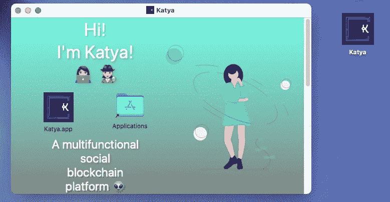
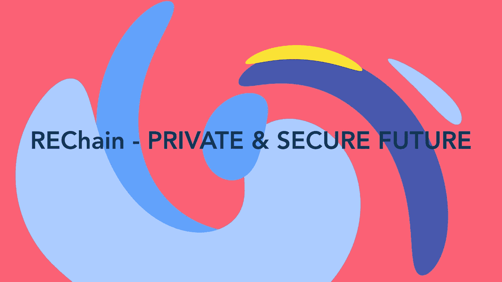
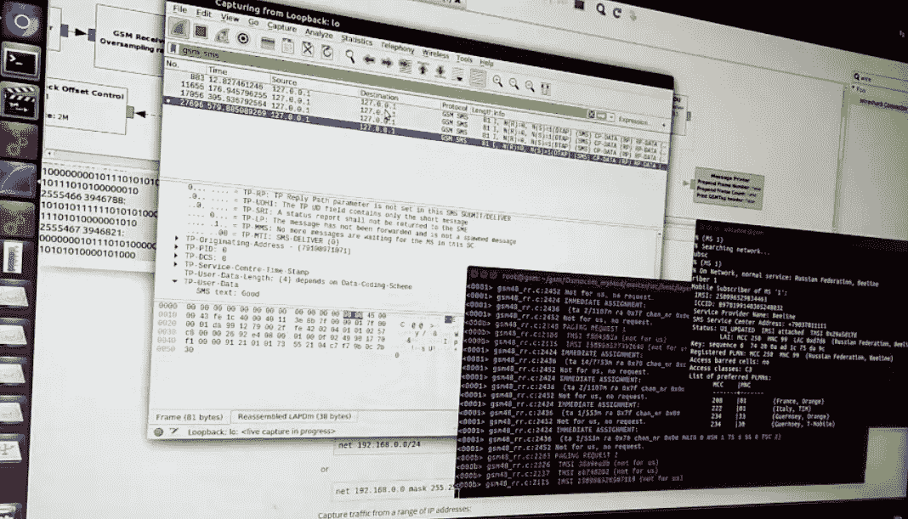
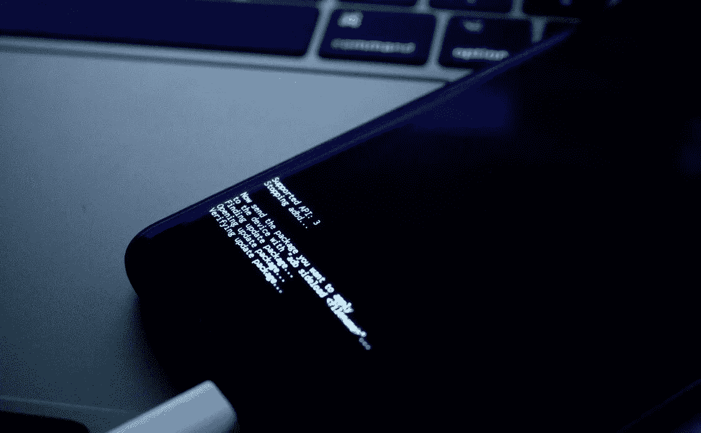
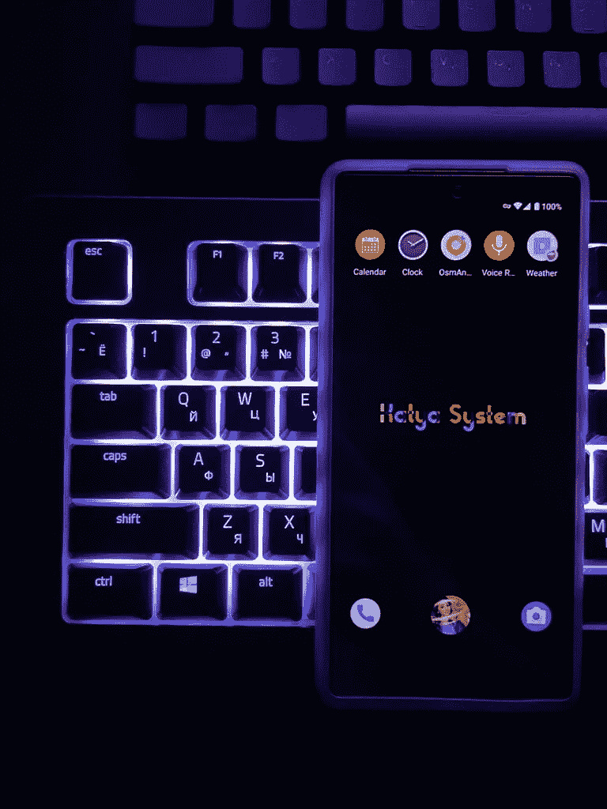
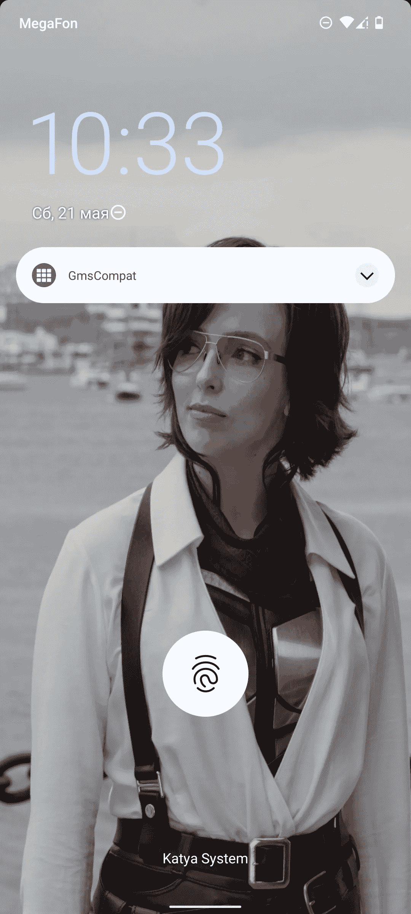
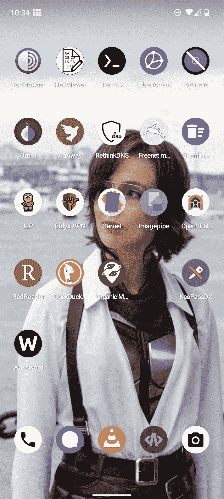

# 如何爱上无意识或者美的感觉如何帮助技术向前发展？！第一部分。🐾

> 原文：<https://medium.com/codex/how-to-fall-in-love-part-1-ee850116daa9?source=collection_archive---------20----------------------->

卡蒂亚👽！👩🏻‍💻 🕵🏻‍♀️安爱🧠多功能社交区块链平台👽！

大家好。我叫德米特里。有一天，我遇见了一个女孩并爱上了她。我拼命想了解她。但是什么都没用。然后，我决定以她的名义成立一家公司，以显示我的认真态度和兴趣。该项目被视为开发对社会真正有用的技术的起步，这些技术将捍卫权利和自由、个人数据的安全和保密以及信息的保密性。但是我决定不停留在一个项目上，而是同时创建几个项目。我把所有的项目都献给了我心爱的人，虽然事实上我甚至不认识她。从介绍图可以看出，这个女孩的名字叫叶卡捷琳娜！嗯，或者只是——卡蒂亚。

目前，有多达三个卡蒂亚。其中一个负责人工智能和机器学习。 [***另一个是面向桌面和移动设备的下一代操作系统***](https://katyasystem.site) 。最后， [***Katya 是一个社交区块链交流平台***](https://katya.wtf) 。但是首先事情来了。

2019 年秋季。当时，我已经有了一个项目，在区块链创建一个新的分散分布式点对点互联网，代号为 REChain 。但是 [**Katya**](https://katya.wtf) 作为一个独立平台的创建完全改变了整个项目的愿景。

瑞金。在线！—私人和安全的未来

[**re chain**](https://rechain.online)🪐——主要设计为安全和隐私分析模拟，完全专注于使用平台时刻和消息进行交流，基于源代码库，包括我们为尊重自由和隐私以及个人数据安全的人开发的源代码库。🌤我们的任务是制作一个使用起来令人愉快的工具，你们每个人都可以用它来交流、扩展内容、创建工作空间、组织工作流程。🌈我们努力向世界上所有的巨头展示，在不出售广告、用户个人数据、他们的权利和自由的情况下，创造对社会、对人们之间的互动非常重要的酷产品是可能的！🦄2021 年底，AppStore、Mac AppStore、Google Play Market、REChain 的下载量。商店突破***1300 万次下载*** 。📡

# 移动卡佳！👽操作系统！📲

2021 年秋季，我们宣布，我们打算发布自己的桌面和移动系统开源操作系统，其中我们也将关注隐私和保密性，防止监听您的电话，拦截短信和互联网流量。移动操作系统开发已经全面展开一年多了。我们将其命名为“ [**移动卡佳**](https://rechain.online)”(*卡佳移动 OS* )。

[**卡佳👽Mobile OS**](https://katyasystem.site) 或简称 Mobile Katya 是目前最安全的移动操作系统，支持为 Android 开发的应用程序。我们决定专注于隐私和安全技术的研发，包括对沙盒、漏洞缓解和权限模型的重大改进。

Mobile Katya 自下而上增强了操作系统的隐私和安全性。它使用技术来解决整个类别的漏洞，并使利用最常见的漏洞来源变得更加困难。这提高了操作系统和其上运行的应用程序的安全性。应用程序沙箱和其他安全边界得到了加强。我们不会像苹果和谷歌那样，试图通过隐私和安全功能来影响用户体验。理想情况下，功能可以设计为始终启用，而不会影响用户体验或引入额外的复杂性，如配置选项。这并不总是可能的，在 Mobile Kat 中，我们添加了各种切换功能，如网络权限、传感器权限、设备锁定时的限制(USB 外设、摄像头、快速磁贴)等。，以及更多高级功能。隐私和安全以用户为中心，拥有自己的 UX。

移动卡佳！👽操作系统！📲

我们还为我们的移动操作系统开发各种应用和服务，重点关注隐私和安全性。因此，举例来说，我们的相机，即使现在拍摄(在正式发布之前)，也比竞争对手更好，这要归功于神经网络和我们的算法，这些算法是基于我们的 Katya 编写的👽人工智能🧠，还可以让你保持用户的个人数据安全。我们已经完全排除了任何元数据，您使用 Mobile Katya 拍摄的照片不会包含任何数据，如地理位置、日期、时间、型号、代码和设备号、操作系统标识符和其他服务元数据，这些数据也可能会被用来对付您。

一个用手机卡佳的相机拍照的例子！

# 默认没有谷歌应用程序或服务！

Mobile Katya 永远不会包含 Google Play 服务或者 Google 服务的其他实现，比如 microG。通过我们的沙盒 Google Play 兼容层，可以将 Google Play 服务安装为一组完全沙盒化的应用程序，而无需特殊权限。但与此同时，谷歌将无法访问你的数据，你的个人资料将完全匿名！

# 防止未知漏洞被利用！

防止未知漏洞被利用

Mobile Katya 非常注重保护用户免受攻击者利用未知(0 天)漏洞的攻击。修补漏洞并不能保护用户，直到漏洞为供应商所知，并且已经开发并发布了补丁。

未知(0 天)漏洞的使用比许多人想象的要广泛得多，不仅在有针对性的攻击中利用用户，而且在广泛的部署中也利用用户。Project Zero 维护一个电子表格，用于跟踪发现的零日漏洞。这只是对正在发生的事情的快速浏览，因为它只记录了攻击者被发现利用用户的实例，通常是因为攻击不是有针对性的，而是部署在公共网站等。

卡蒂亚👽系统！🖥

第一道防线是减少攻击面。删除不必要的代码或开放的攻击面可以完全消除许多漏洞。Mobile Katya 避免删除任何对最终用户有用的功能，但我们仍然可以默认禁用许多功能，并要求用户同意使用它们，以便将它们排除在大多数功能之外。例如，在 Mobile Katya 和 Android 中，默认情况下禁止使用内核分析支持，因为这一直是并且仍然是 Linux 内核中漏洞的主要来源。现在，只有包含开发人员工具、启用 Android 调试桥(ADB)、然后通过 ADB 使用分析工具的开发人员应用程序才能使用分析。它也只在下次引导前启用。

下一道防线是通过使漏洞变得不可能、不可靠，或者至少变得更加难以利用来防止攻击者利用漏洞。绝大多数漏洞都属于众所周知的漏洞类别，可以通过使用语言/工具来防止漏洞，或者使用强大的漏洞利用缓解措施来防止漏洞利用。在许多情况下，漏洞类别可以完全消除，而在许多其他情况下，它们可能更加难以利用。Android 在这方面做了很多工作，Katya Mobile 帮助将其推入和推出 Linux 内核。对这些问题的基本修复需要大量的资源来开发，并且它们的部署通常会带来很高的性能、内存或兼容性成本。主流操作系统通常不会将安全性置于其他领域之上。Mobile Katya 准备走得更远，我们为用户提供开关来选择他们喜欢的妥协，而不是被迫的。与此同时，如果漏洞利用防护设计有明确的威胁模型，那么较弱且不太全面的漏洞利用防护仍然可以提供有意义的攻击屏障。卡蒂亚👽移动操作系统在这些保护的许多开发领域投入了大量资金:开发/部署内存安全语言/库、静态/动态分析工具以及许多类型的缓解措施。

最后一道防线是通过不同级别的沙箱进行遏制:围绕特定上下文的细粒度沙箱，如每个站点的浏览器渲染器，围绕特定组件的沙箱，如媒体编解码器沙箱，以及应用程序/工作区沙箱。Mobile Katya 通过加强核心和其他组件以及改进沙盒策略，改进了所有这些沙盒。

Mobile Katya 的锁屏看起来很熟悉，很简约。

防止攻击者通过验证启动来保持对组件或操作系统/固件的控制，以及避免信任持久状态，也有助于在受到攻击后减轻损害。远程代码执行漏洞是最严重的，它允许攻击者在设备上获得立足点，甚至远程控制设备。本地代码执行漏洞允许您在远程危害应用程序呈现器或浏览器、危害应用程序供应链或强迫用户安装恶意软件后退出沙箱，包括应用程序沙箱或沙箱。还有许多其他类型的漏洞，但我们防范的大多数都属于这两大类。

# 默认隐私！

卡蒂亚👽移动操作系统不包含或使用默认的 Google 应用程序和服务，也不包含任何不符合我们的隐私和安全政策的其他应用程序/服务。使用我们的 Google Play 沙盒功能，谷歌应用程序和服务可以像常规沙盒应用程序一样在 Katya Mobile 中使用，无需任何特殊访问或特权，但我们不会默认启用这些应用程序，以便让用户在想要使用这些应用程序时有一个明确的选择。以及如果是，他们想要在哪些简档中使用它们。

卡蒂亚👽带有应用程序快捷方式的移动操作系统主屏幕！

我们正在改变默认设置，以将隐私置于小便利之上:基于打字历史收集的个性化键盘建议默认被禁用，敏感通知默认在锁定屏幕上隐藏，密码默认在打字时隐藏。我们减少攻击面的一些改变也可以通过不打开不必要的无线电等方式默认提高私密性。默认情况下，以及避免潜在的隐私漏洞对硬件的影响。

默认情况下，我们也使用 Katya👽用于以下服务的移动操作系统服务器，而不是谷歌服务器:
-检查连接
-提供证明密钥
-下载 GNSS 历书(PSDS)
-网络时间

我们提供了一个开关来切换回 Google 的服务器，以测试连接性、准备证明密钥、下载 GNSS 历书，并为断开网络时间连接添加适当的支持。这一点与其他开关相结合，使得带有 Mobile Katya 的设备看起来像 AOSP 设备。这对于验证连通性尤其重要，因为其他连接都是通过 VPN 路由的，这在实践中对于 LAN 集成至关重要。

# 支持更长的密码！

卡蒂亚👽默认情况下，移动操作系统支持更长的密码:64 个字符而不是 16 个字符。这避免了必须使用设备管理器来启用此功能。如果用户不想依赖物品的安全性，该功能允许用户使用密码，这提供了非常积极的节流，并且即使对于随机的 6 位 PIN 也提供了高级别的安全性。

# 自动重启！

如果在配置的时间段内没有解锁任何配置文件，则启用设备自动重启选项，以使设备再次完全进入休眠和完全锁定状态。

# 更安全的指纹解锁！

卡蒂亚👽移动操作系统通过只允许 5 次尝试来提高指纹解锁功能的安全性，而不是像谷歌那样，在总共 20 次尝试中，每 5 次尝试失败之间延迟 30 秒。这不仅减少了潜在的黑客攻击，而且还可以轻松关闭指纹解锁，而不用用另一根手指故意解锁 5 次！🤓

Mobile Katya 还增加了对指纹识别器仅用于应用程序验证的支持，以及通过禁用解锁支持来解锁存储硬件密钥。这项功能已经存在于标准的 Android 面部解锁功能中。

# 改进的用户配置文件！

用户配置文件是独立的工作区，具有自己的应用程序实例、应用程序数据和配置文件数据(联系人、媒体商店、主目录等)。应用程序无法看到其他用户档案中的其他应用程序，只能与同一用户档案中的应用程序进行交互(在其他应用程序同意的情况下)。根据锁定方法，每个用户配置文件都有自己的加密密钥。它们对卡蒂亚来说很棒👽移动操作系统有很大的改进空间。Mobile Katya 对用户配置文件的功能进行了改进，并致力于进一步改进，以使用户之间的切换和监控其他配置文件更加方便。

用卡特亚枪射击的例子👽阿布扎比卢浮宫的移动操作系统相机。

# 更多用户资料！

卡蒂亚👽移动操作系统将谷歌 Android 的二级用户配置文件限制从 4 (3 +访客)提高到 16 (15 +访客)，以使该功能更加灵活。

# 结束会话！

Mobile Katya 还支持注销用户配置文件，而无需使用设备管理器，设备管理器控制设备使用该功能。注销会使描述文件不活跃，因此所有已安装的应用程序都不能运行。它还从内存和硬件寄存器中删除磁盘加密密钥，将用户配置文件恢复到休眠状态。

# 禁用应用程序安装！

卡蒂亚👽移动操作系统在用户管理设置中添加了一个开关，以禁止安装其他用户应用程序。您可以安装想要作为附加用户使用的应用程序，然后在所有者描述文件中禁用作为该用户安装其他应用程序的功能。Android 支持这一标准的设备管理功能，但不允许拥有自己设备的用户使用。

# 移动 Katya 应用程序库！

卡蒂亚👽移动操作系统包括我们自己的应用商店客户端，代号为极光商店📺，专注于安全性、极简主义和可用性。我们的应用程序商店目前正被用于分发我们自己的应用程序和 Google Play 镜像，用于 Google Play 市场中所有可用应用程序的独立下载功能。在未来，它将被用于可能的 Katya 版本的发布👽移动操作系统，以及从外部开发的开源应用程序，应用了保护。

最受欢迎的开源应用也尊重隐私、隐私和安全，由 Katya 提供支持👽移动操作系统。

# 认证服务的应用程序！

我们的证明服务应用程序在设备上提供强大的硬件认证和固件/软件完整性。它使用严格的基于配对的方法，该方法还基于为每次配对生成的硬件密钥来提供设备身份验证。软件检查在最上面，信任与硬件紧密相连。

> Mobile Katya 将于 2023 年 11 月 19 日正式上市(正好是这一天，因为这一天是同一个 Katya 的生日，我们的操作系统就是以他的名字命名的！)!🦄

一个例子，全景拍摄的相机移动卡蒂亚在阳光明媚的白天。

***👻该操作系统将可用于许多移动设备，您可以直接从我们的网站下载系统本身，并通过几个简单的步骤进行安装！我们目前正在开发新功能！我们定期拍摄关于我们的移动操作系统的短视频，并在我们的社交网络以及名为 Katya 的分布式分散区块链矩阵网络上分享👽艾🧠在#聊天矩阵空间里的🪐区块链节点网络在#聊天:matrix.katya.wtf🌍！***

真诚地，
德米特里索罗金，
**403 走了
雷查因，公司
卡蒂亚艾，系统
卡蒂亚，公司
卡蒂亚系统，有限责任公司
雷查因网络解决方案**