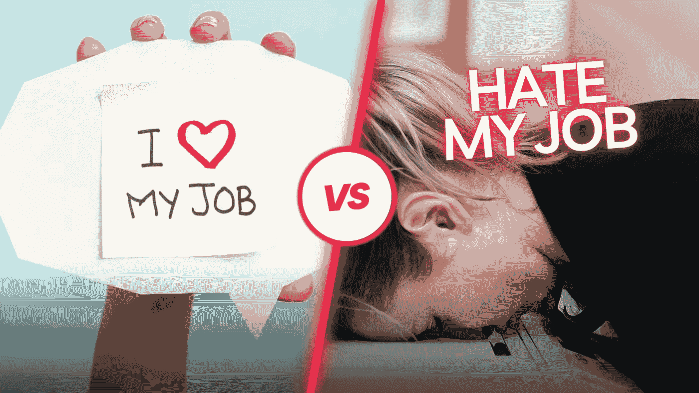

# 如何直接发现这个工作场所是否是你的个人地狱

> 原文：<https://medium.com/codex/how-to-find-out-directly-if-this-workplace-is-your-personal-hell-a99bc5b22b8d?source=collection_archive---------9----------------------->

## 以科学为后盾——必须符合的总是 3 P

图片由作者通过 Canva 制作

对开发人员的需求正在上升，而且每天都在上升。公司试图用有说服力的福利来说服你为他们工作。

他们真的认为一张台球桌、一个咖啡吧或团队体育活动会增加你的情绪吗