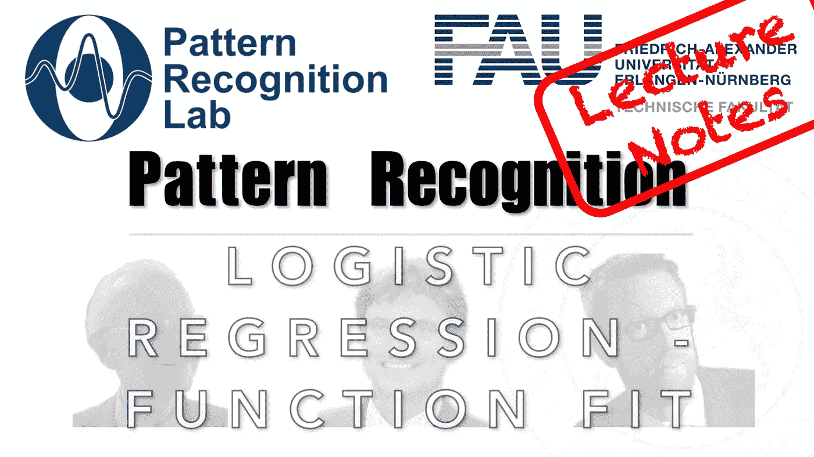

# 如何使用逻辑函数拟合数据的决策边界

> 原文：<https://medium.com/codex/how-to-fit-a-decision-boundary-to-data-using-the-logistic-function-6925d7721953?source=collection_archive---------10----------------------->

## 模式识别中的 FAU 讲义，[抄本](http://medium.com/codex)

## 逻辑回归—函数拟合

下图 [CC BY 4.0](https://creativecommons.org/licenses/by/4.0/) 来自[模式识别讲座](https://www.youtube.com/playlist?list=PLpOGQvPCDQzsWvT_bqmexrJ359RTQQuMO)

**这些是 FAU 的 YouTube 讲座** [**模式识别**](https://www.youtube.com/playlist?list=PLpOGQvPCDQzsWvT_bqmexrJ359RTQQuMO) **的讲义。这是讲座视频&** [**配套幻灯片**](https://doi.org/10.5281/zenodo.4429576) **的完整抄本。幻灯片的来源可在** [**此处**](https://github.com/akmaier/pr-slides) …