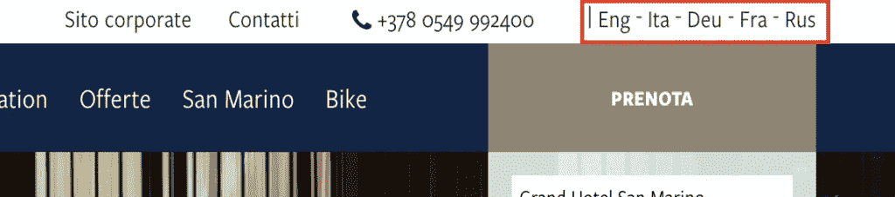
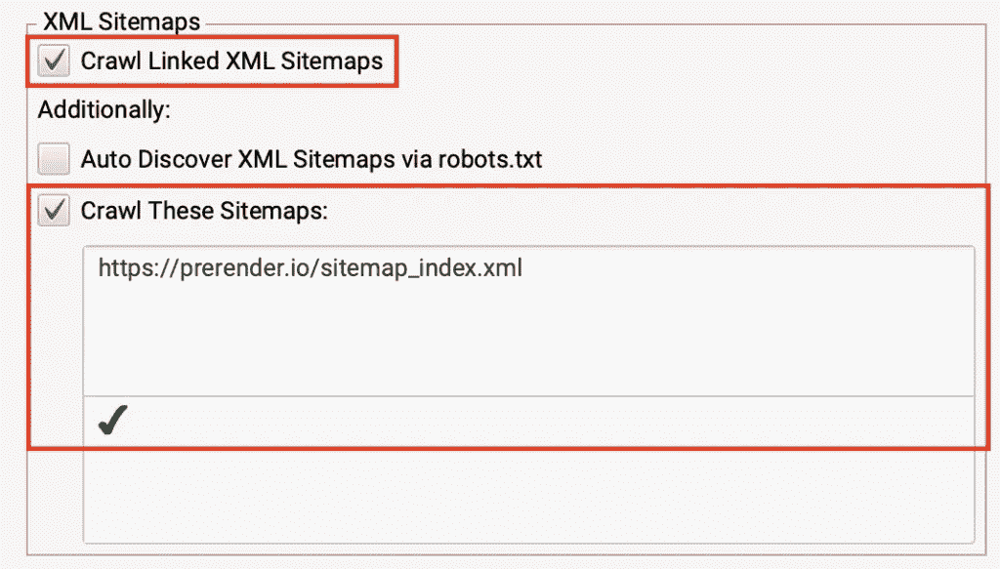
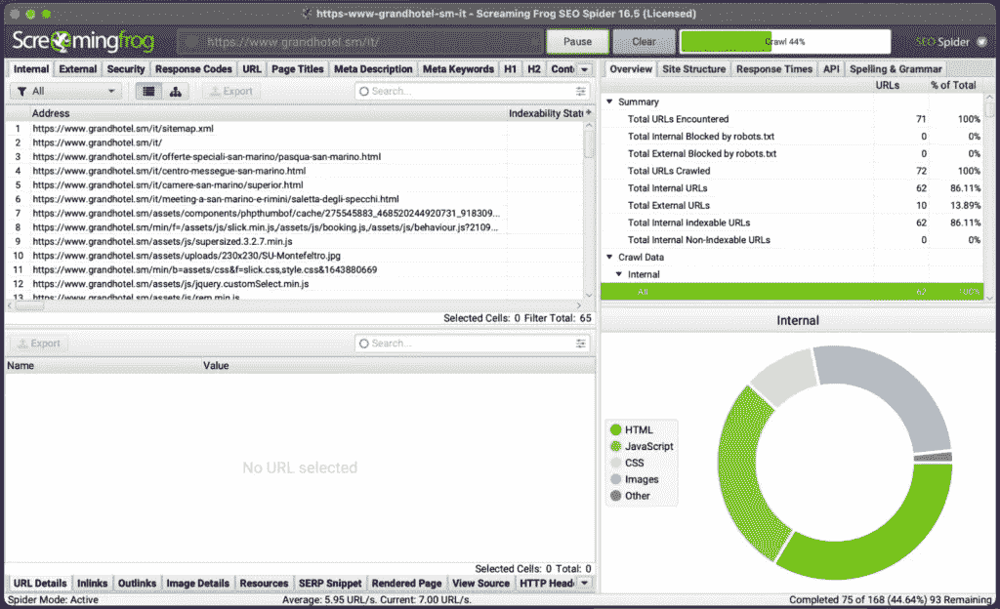

# 如何解决 Hreflang 标签问题:最佳实践和实施

> 原文：<https://medium.com/codex/how-to-fix-hreflang-tag-issues-best-practices-implementation-4c8366fb04fa?source=collection_archive---------9----------------------->

最初发表于 [*的先决条件*](https://prerender.io/fix-hreflang-tag-issues/) 。

Hreflang 标签经常被忽略，有时只是作为第二个想法来实现。正因为如此，试图在国际上获得 SERP 房地产的网站可能会遇到重大问题。

在本文中，我们将深入探讨 hreflang 问题:如何发现它们，以及如何确保正确实施，以增加来自特定国家或使用特定语言的用户的目标流量。

# 什么是 Hreflang？

hreflang 是一个 HTML 属性，用于告诉搜索引擎针对特定语言和/或位置的页面的不同版本之间的关系。

这个属性放在 HTML 文档 head 部分的 link 标记中，定义了页面所针对的语言和国家。下面是它实现时的样子:

`<link rel=”alternate” href=”https://example.com” hreflang=”en-us” />`

# Hreflang 属性和 SEO

理解 hreflang 属性如何工作对于国际 SEO 的成功至关重要。无论你是经营电子商务还是在不同国家拥有多家商店的实体企业，为你的受众本地化你的页面是非常重要的。

让我们以圣马力诺大酒店[为例。他们接待来自欧盟各地的游客，因此他们创建了意大利语、英语、德语和法语版本的网站。](https://www.grandhotel.sm/it/)

如果只是关于语言，团队可以简单地使用 html 标签中的 [lang 属性](https://www.tpgi.com/using-the-html-lang-attribute/#:~:text=The%20HTML%20lang%20attribute%20is,the%20correct%20accent%20and%20pronunciation.)来告诉浏览器和搜索引擎页面指定的语言是什么(尽管大多数搜索引擎不再使用这个标签进行语言检测)。

但是，它没有告诉搜索引擎该页面还有其他版本，也没有定义那些版本与当前版本之间的关系。因此，搜索引擎可以将其他版本标记为重复内容，或者完全忽略它们，这可以阻止它们被编入索引。

**注意:**谷歌只会将语言相同的页面标记为重复页面，而不是翻译版本。换句话说，如果你的页面在美国、英国和加拿大有不同的英文版本，你可能会遇到重复内容的问题。然而，拥有法语、英语和意大利语版本不会导致同样的问题。

我们还希望用户根据他们的语言和位置找到正确的网站版本。所以说法语的用户在谷歌或必应上搜索时可以找到法语版的网址。

[Hubspot](https://www.hubspot.com/) 有一个很好的例子:

“如果用户搜索来自德国的 HubSpot.com，hreflang 标签负责改变搜索引擎中可用的链接。然而，当有人登陆德国的 HubSpot.com 时，阿郎标签会改变页面上的语言

因此，简单地说，hreflang 标签允许我们控制搜索引擎如何管理我们的多语言网站，并确保我们的用户总是获得他们需要的版本。

# 如何实现 Hreflang 标记

既然我们理解了 hreflang 标签对于我们的 SEO 目标的重要性，我们还需要能够向我们的开发人员解释如何实现它。

让我们探索三种主要的方法来告诉搜索引擎我们页面的本地化版本:

*   HTML 标签
*   XML 站点地图
*   HTTP 标题

# 用于本地化的 HTML 标签

最简单——尽管最耗时——的策略是在 HTML 站点的`<head>`中添加`<link>`元素，告诉搜索引擎页面的不同变化。您可能更熟悉这种方法，因为在检查网站时很容易在 HTML 代码中看到它。

为了更清楚地了解这个实现是如何工作的，我们将回到前面的 Grand Hotel 示例来检查这个站点:

`<link rel="alternate" href="https://www.grandhotel.sm/it/" hreflang="it">`T10`<link rel="alternate" href="https://www.grandhotel.sm/en/" hreflang="en">`T11`<link rel="alternate" href="https://www.grandhotel.sm/de/" hreflang="de">`T12`<link rel="alternate" href="https://www.grandhotel.sm/fr/" hreflang="fr">`

我们可以将这个过程分为以下几个步骤:

*   为页面的每个变体创建一个`<link>`元素—**包括原始的**。
*   将 rel 设置为“备用”
*   添加变体的 URL
*   将 hreflang 属性设置为语言和国家

此外，请记住以下几点:

*   就像上面的例子一样，您可以单独添加语言代码，但不能添加国家代码。如果你只添加一个国家代码，搜索引擎会忽略你的标签。
*   确保自引用原始页面作为变体列表的一部分，因此页面 A 也被列为`<link>`列表的一部分。
*   页面的每个版本都必须指向另一个版本。如果页面 A 指向页面 B，但是页面 B 没有指向页面 A，Google 会将此解读为欺诈企图。

我们建议你仔细阅读[谷歌的页面本地化指南](https://developers.google.com/search/docs/advanced/crawling/localized-versions#all-method-guidelines)，这样你就能涵盖所有的基础。这里是谷歌接受的所有语言代码的完整列表。

**来自谷歌的消息:**

**重要的**:把你的 **<链接>** 标签放在 **<头>** 元素的上方附近。至少， **<链接>** 标签必须在一个格式良好的**<>**头部内，或者在任何可能导致**<>**头部过早关闭的项目之前，例如**<【p>**或一个跟踪像素。如果有疑问，将您的渲染页面中的代码粘贴到一个 [HTML 验证器](https://validator.w3.org/)中，以确保链接位于 **< head >** 元素中。

# Hreflang 实现的 XML 站点地图

对于大型网站，或者要处理超过 10 种语言和位置的变化，使用 XML sitemap 是使用 HTML 标记的更好的替代方法，尤其是为了避免在文件中添加数百行代码。

相反，我们可以创建一个 hreflang 子条目列表，方法是用`<loc></loc>`指定主 URL，用`<xhtml:link/>`列出每个变体作为子条目，并遵循与 HMTL 标签中相同的结构。

假设我们想为 Prerender 实现这个；下面是它的样子:

`<url>`
`<loc>https://prerender.io/react/</loc>`
`<xhtml:link`
`rel="alternate"`
`hreflang="de"`
`href="https://prerender.io/deutsch/react/"/>`
`<xhtml:link`
`rel="alternate"`
`hreflang="de-ch"`
`href="https://prerender.io/schweiz-deutsch/react/"/>`
`<xhtml:link`
`rel="alternate"`
`hreflang="en"`
`href="https://prerender.io/react/"/>`
`</url>`

我们可以将这个过程分为以下几个步骤:

*   为每个 URL 创建一个`<url>`元素
*   在`<url>`元素中，添加一个`<loc>`元素来指定 URL
*   为每个页面变体(包括其自身)添加一个子元素，它必须指定:
*   `rel="alternate"`
*   `hreflang="supported_language-code">`
*   `href="page_url"`

重要的是我们添加完整的 URL，包括协议(http/https ),并且我们保持子元素的一致组织。这对于维护非常重要，因为它更容易阅读和理解。

# 使用 HTTP 头进行本地化

对于像 pdf 这样的非 HTML 文件，我们可以“返回一个 HTTP 头和(我们的)页面的 GET 响应，告诉 Google 页面的所有语言和区域变量。”

这里有一个谷歌自己的例子:

`Link: <https://example.com/file.pdf>; rel="alternate"; hreflang="en",
<https://de-ch.example.com/file.pdf>; rel="alternate"; hreflang="de-ch",
<https://de.example.com/file.pdf>; rel="alternate"; hreflang="de"`

正如您在比较方法时所看到的，唯一改变的是我们向搜索引擎提供信息的方式。结构基本保持不变。

只要你坚持到底，你最终会采用哪种策略并不重要。没有必要结合不同的策略。

此外，请注意，只有开发人员或有经验的人才能使用 HTTP 头，因此将它用于 hreflang 可能比其他两种方法更耗时，也更困难。

# 7 个最常见的 Hreflang 错误和问题，以及如何解决它们

尽管 hreflang 的实现相当简单，但是仍然有很多机会出现错误和问题。

以下是我们在对国际网站进行技术审计时需要注意的七个最常见的问题:

# 1.没有自引用 Hreflang 标记

很容易忘记您需要在 hreflang 地图上添加页面本身，但是正如 Google 所说，“对于页面的每个变体，在`<head>`元素中包含一组`<link>`元素，[每个页面变体包含一个链接](https://developers.google.com/search/docs/advanced/crawling/localized-versions#html)。”如果 hreflang 映射中没有提到该页面，那么您的代码将被忽略。这条规则也适用于站点地图和 HTTP 头。

作为 HTML hreflang 实现的最佳实践，将您的列表添加到页面的规范标记之后，如下所示:

`<link rel="canonical" href="https://www.grandhotel.sm/it/">
<link rel="alternate" href="https://www.grandhotel.sm/it/" hreflang="it">
<link rel="alternate" href="https://www.grandhotel.sm/en/" hreflang="en">
<link rel="alternate" href="https://www.grandhotel.sm/de/" hreflang="de">
<link rel="alternate" href="https://www.grandhotel.sm/fr/" hreflang="fr">`

请注意，规范和“it”版本是相同的，使页面成为列表的一部分。

# 2.互换使用规范标记和 Hreflang 标记

谈论规范标签。我们一次又一次看到页面使用规范标签，就好像它是 hreflang 映射中的自引用链接，或者将 hreflang 属性添加到规范标签本身。这两种方法都是错误的。

规范标记具有已定义的函数，将它与 hreflang 属性结合会导致错误:

`<link rel="canonical" hreflang=”en” href="https://prerender.io/">`T8`<link rel="alternate" hreflang="it" href="https://prerender.io/it/">`

在这里，我们都误用了规范标签，并且忽略了自引用的 hreflang 标签。

**注意:**没有必要将所有版本规范化为一个版本。对于页面的两个版本，规范标签应该是自引用的。

# 3.缺少往复/返回链接

任何 hreflang 实现的关键步骤是确保页面 A 和页面 B 相互链接。如果其中一个页面没有回应 hreflang 标签，Google 将忽略您的代码，以避免第三方滥用，试图将他们的页面任意附属于您的页面。

假设 A 页是我们的英文版，B 页是我们的(假设的)法文版，下面是两个注释的样子:

英文版:

`<link rel="canonical" href="https://prerender.io/">
<link rel="alternate" hreflang=”en” href="https://prerender.io/">`T12`<link rel="alternate" hreflang="fr" href="https://prerender.io/fr/">`

法文版:

`<link rel="canonical" href="https://prerender.io/fr/">`
`<link rel="alternate" hreflang=”en” href="https://prerender.io/">
<link rel="alternate" hreflang="fr" href="https://prerender.io/fr/">`

# 4.损坏或重定向 Hreflang URL

hreflang 映射的功能是告诉搜索引擎应该为使用特定语言或特定位置进行搜索的用户索引和显示哪个 URL。

然而，如果 hreflang URL 被重定向或者[被破坏](https://prerender.io/how-to-fix-broken-backlinks/) (404)，那么这个链条就会断裂，像 Google 这样的搜索引擎要么会决定忽略你的地图，要么会浪费抓取预算来请求更多的页面。

对于拥有成千上万页面的网站，如电子商务或企业网站，这可能会成为一个巨大的[抓取预算](https://prerender.io/crawl-budget-seo/)杀手或创建索引循环。

我们需要保持 hreflang 映射的更新，总是将目的地 URL 添加到`<link>`元素中。

# 5.Hreflang URL 被 Robot.txt 文件阻止

Google 需要抓取每个页面版本，以便找到返回链接并理解 hreflang 映射。事实上， [John Muller 已经声明过](https://www.deepcrawl.com/blog/news/google-webmaster-hangout-notes-august-21st-2018/#8)“每个语言版本至少要被抓取和索引两次，hreflang 才能工作。”

在处理几个版本的时候，有些站长倾向于用一个 robot.txt 指令来阻止页面的“二级”版本被抓取，让 Google 无法访问页面，让整个 hreflang 逻辑失效。

我们还在网页国际版本的源代码中看到 noindex 标签，这可能会导致搜索引擎忽略您的代码。

我们说它可能会被忽略，因为在某些情况下，用户已经看到他们的非索引国际版本显示在搜索结果上。我们猜测 Google 仍然可以通过读取 hreflang 标签来理解要显示的首选版本。毕竟，它仍然是[爬行](https://prerender.io/bigger-crawl-budget/)那些页面，只是没有让它们[被索引](https://prerender.io/faster-indexation/)。

# 6.使用相对 URL 而不是绝对 URL

Hreflang 标签需要包含整个 URL，包括它的协议。根据定义，它们不能处理相对 URL，相对 URL 只包含路径(域之后的所有内容)。

正如[内容王](https://www.contentkingapp.com/academy/urls/faq/absolute-vs-relative/#:~:text=A%20relative%20URL%20is%20a,as%20the%20page%20it's%20on.)所说:

因为相对 URL 不包括完整的 URL 结构，所以当链接相对 URL 时，假定它使用与其所在页面相同的协议、子域和域

但是，它们对 hreflang 标签无效，会忽略整个 hreflang 映射。映射 hreflang 链接时，请确保添加绝对 URL:

`<url>
<loc>https://prerender.io/react/</loc>
<xhtml:link
rel="alternate"
hreflang="de"
href="https://prerender.io/deutsch/react/"/>
</url>`

代替相对 URL:

`<url>
<loc>https://prerender.io/react/</loc>
<xhtml:link
rel="alternate"
hreflang="de"
href="/react/"/>
</url>`

# 7.不正确的语言和/或国家代码

Hreflang 标签使用格式[ISO 639–1](https://en.wikipedia.org/wiki/List_of_ISO_639-1_codes)表示语言，使用格式[ISO 3166–1 alpha-2](https://en.wikipedia.org/wiki/ISO_3166-1_alpha-2)表示国家。

我们遇到的一些问题发生在网站管理员试图使用可接受格式之外的代码时。一个明显的例子是试图用“欧盟”来针对整个欧洲大陆，或用“英国”来针对英国。

为了避免混淆，总是从谷歌推荐的官方语言代码列表中选择你的代码。

# 如何检查 Hreflang 问题[Hreflang 审计流程]

既然我们已经了解了我们在寻找什么以及如何正确实施，那么是时候审核我们的网站来发现并解决这些问题了。

我们最不希望的是手动检查我们的领域的每一页。这不仅是浪费时间，而且非常困难。相反，最好使用技术审计工具。

在我们的例子中，我们将使用尖叫青蛙(SC)演示一个简单的审计过程，但是任何其他替代方法都应该做类似的事情。

**注意:**您需要付费许可证才能使用此功能。

# 1.设置尖叫青蛙查找 Hreflang 注释

我们需要做的第一件事是去配置>蜘蛛>抓取，并选择'抓取'和'存储' hreflang。这允许尖叫青蛙抓取并报告在 hreflang 注释中找到的任何链接。

如果 hreflang 实现是在站点地图中完成的，我们还需要启用“爬行链接的 XML 站点地图”并添加站点地图的 URL。

# 2.抓取网站

回到尖叫青蛙，添加初始网址开始抓取。

hreflang 选项卡将被实时填充。

# 3.执行爬网分析

虽然 13 个过滤器中的 12 个已经被填充，但是要查看“未链接的 hreflang URLs”报告，您需要执行爬网分析。这就像点击一个按钮一样简单:

# 4.查看 Hreflang 过滤器并批量导出报告

而不是从“全部”视图一次浏览所有数据。

尖叫青蛙允许 13 个过滤器，我们可以用来检查特定的问题和信息。例如，我们可以使用“缺少自我引用”报告来检查不包含在 hreflang 列表中的页面。

然后，我们可以单击该 URL 并检查底部面板中的“URL Details”选项卡，以查看有关该错误的更详细的信息。

# 5.用于进一步分析和实施的批量导出报告

现在，所有这些信息都很好，但是你需要用更有用的格式，这样你才能计划和实施策略。

要导出报告中的所有数据，请转到“报告”>“hreflang ”,然后选择您需要的数据。

**注意:**虽然有一个丢失 x-default 标签的报告，但这些并不总是必要的，但它们是一个最佳实践。因此，从技术上来说，这不是一个错误，但是如果你有大量的观众使用目标版本之外的语言，这是值得考虑的。

# Hreflang Best 最佳实践清单

当然，处理 hreflang 问题的最好方法是从一开始就有正确的实现。因此，如果您正在与一个开发团队合作进行一个国际化项目，或者您正在从头开始创建一个服务于多种语言和国家的新网站，这里有一个清单可以帮助您保持清晰:

1.  根据最适合您的业务和技能水平选择一种实现方法。

注意:没有必要结合多种方法，因为它们不会帮助你更好地理解信息。事实上，如果两者之间存在差异，它实际上可能会向谷歌发出令人困惑的信号。

2.标出你实际需要的语言和国家。

注意:不要实现超过实际需要的国家和语言。如果你提供的服务、产品或用户体验没有区别，那么英国、美国和加拿大版本就没有意义。

3.每一个变化都包含在所有的网页上，包括自我参考链接。

注意:在任何实现之前，在映射过程中这样做。这将更容易看出差异。

4.为变体保持一致的注释顺序。

注意:因为顺序无关紧要，所以从技术上讲，您可以为所有备选变体复制和粘贴相同的格式，这样更容易实现并避免错误。

5.每一页上都有确认标签/退货链接。

注意:如果您遵循第 4 步，这将不是一个问题。

6.验证使用的所有语言和国家代码。

注意:养成从 Google 的推荐列表中复制和粘贴这些代码的习惯，以避免问题。

7.验证语言代码是否与页面上的语言匹配。

8.确保只实现绝对 URL。

9.如果桌面和移动版本不同，请提交更改。

注意:如果不是这样，它可能会创建冲突的指令，并让您的代码被谷歌忽略。

10.通过运行审计或者使用像[HreflangTest.com](https://hreflangtest.com/)这样的工具来测试你的 hreflang 配置。

你网站的每一个版本都和“原始”网站版本一样重要，它们之间的关系为用户提供了一个有凝聚力的体验，无论语言或国家如何。

一个可靠的 Hreflang 策略将通过始终为您的用户提供最佳结果来节省您的时间并提高转化率。这是 SEO 技术难题中很小但很关键的一块，所以值得努力。

将此清单放在身边，并记住总是测试和验证您的过程。