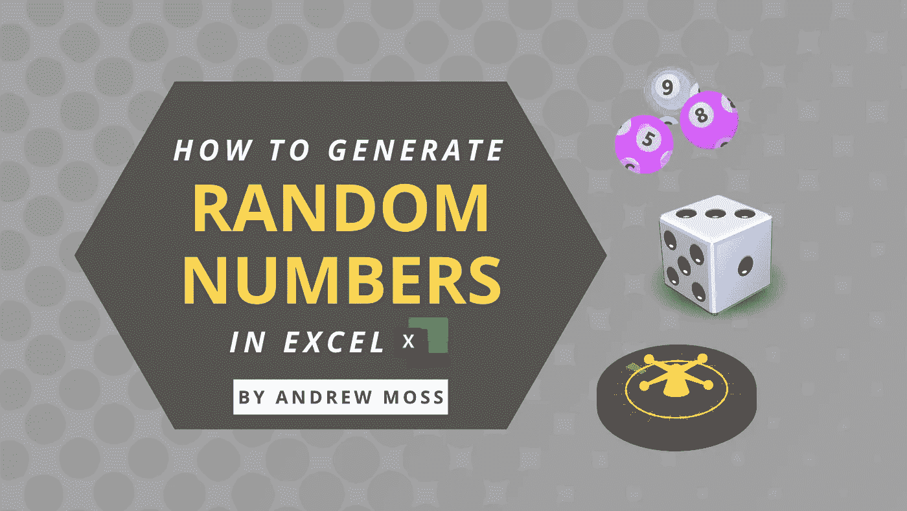

# 如何在 Excel 中生成随机数

> 原文：<https://medium.com/codex/how-to-generate-random-numbers-in-excel-4c6706cd5231?source=collection_archive---------3----------------------->

彩票球、骰子和轮盘有什么共同点？它们基于随机性，随机性跨越众多领域，并以不同形式存在。

您可能希望生成随机数来测试金融模型、创建样本数据或模拟体育赛事。

本文介绍了如何在 Excel 中生成随机数。