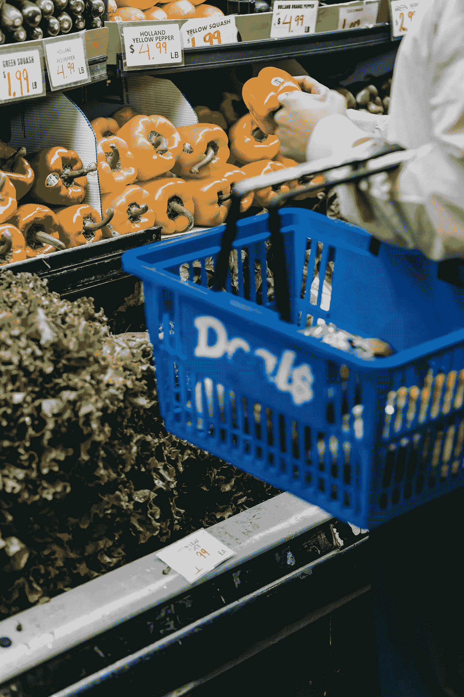

# 使用 TF-IDF 生成建议

> 原文：<https://medium.com/codex/how-to-generate-recommendations-using-tf-idf-52d46eca606f?source=collection_archive---------3----------------------->

## 调整 TF-IDF 算法以提供产品推荐



来自 [Pexels](https://www.pexels.com/photo/crop-person-purchasing-assorted-vegetables-in-grocery-market-7129160/?utm_content=attributionCopyText&utm_medium=referral&utm_source=pexels) 的迈克尔·布伦斯的照片

# 为什么选择 TF-IDF

[TF-IDF](https://en.wikipedia.org/wiki/Tf%E2%80%93idf) 是一个超级直观的识别文本关键词的工具，最初是为了改善语料库的文档索引。TF-IDF 有许多不同的用法和变体，比如 TF-ICF，它是针对文本分类的一种优化。在它的基础上，TF-IDF 的任务是识别给定子(文本)和一般(语料库)上下文的关键实体(标记)。鉴于 TF-IDF 的价值和简单性，我们可以将它应用到文本以外的其他领域。我们需要的是将它的关键特征转化到我们的领域——实体、子上下文和一般上下文。相关的例子是 Di Rocco 在 el 发表的一篇论文，其中他们使用 [TF-IDF 来生成源代码库嵌入](https://www.semanticscholar.org/paper/TopFilter%3A-An-Approach-to-Recommend-Relevant-GitHub-Rocco-Ruscio/e14d3200973e1a6a8dad2552286fdd4e53d90831)，以实现主题推荐(TF =如果主题被提及用于回购，IDF =带有该标签的回购率)。利用类似的直觉，我们可以利用 TF-IDF 生成**产品推荐**。

# 建议 101

[建议](https://en.wikipedia.org/wiki/Recommender_system)有许多方法，从简单的“总是建议最常见的”到更高级的基于深度学习的。常见的动机是提供更相关的内容，以增加参与度。在产品推荐上，我们也假设它能让顾客买得更多。2006 年的[网飞挑战赛](http://netflix_prize)是将建议带到前线的主要里程碑之一；网飞提供 100 万美元的奖金给一个能击败他们电影推荐引擎的算法。数百个团队参与其中，在 2009 年，获胜的团队成功地将网飞准确度提高了 10%以上。这些推荐算法背后的思想叫做[协同过滤](https://en.wikipedia.org/wiki/Collaborative_filtering)；表明最佳推荐将与用户已经喜欢的推荐相似。有两种主要的方法来衡量这种相似性:

1.  基于用户；建议类似用户喜欢什么。基于用户特征、购买习惯、购物车相似性等的相似性..主要缺点是“[冷启动](https://en.wikipedia.org/wiki/Cold_start_(recommender_systems))音位；第一天的建议是不可能的，因为需要在此之前收集用户数据。问题是这是一个典型的[‘鸡和蛋’](https://en.wikipedia.org/wiki/Chicken_or_the_egg)悖论，因为推荐应该是一个主要的流量因素。
2.  基于项目；给用户喜欢的东西推荐类似的产品。基于产品描述、类别、图片等的相似性..主要的缺点是可能性更加狭窄；购买了特定 t 恤的用户可能会被建议购买类似的 t 恤，但相应的一双鞋可能不在范围内。

虽然基于用户的“冷启动”可以通过简单的“最常见建议”初始化来解决，并且基于项目的狭窄范围可以通过在过程中添加随机性来解决，但是需要回答的更固有的问题是“用户到底有多大可能再买一件 t 恤？”。如果动机是增加粘性，那么确保客户将看到相关内容就足够了。但是如果想法是增加购买，那么需要采取不同的方法。新内容与相同但更相关的内容。购物篮分析试图通过简化来回答这两个问题——比较交易而不是用户，假设来自同一个购物篮的项目彼此相关。

# 市场篮子分析

[相似性分析](https://en.wikipedia.org/wiki/Affinity_analysis)使用共现关联规则推导关系。[“啤酒和尿布”](https://tdwi.org/articles/2016/11/15/beer-and-diapers-impossible-correlation.aspx)依靠它产生产品推荐；据称，它是由一家超市公司开发的，该公司发现了包括啤酒和尿布在内的篮子之间的相关性，并将它们放在一起，这两种产品的销量都得到了提高。 [Apriori](https://en.wikipedia.org/wiki/Apriori_algorithm) 是发现那些规则的常用算法。在市场购物篮分析中，我们依靠两个因素来搜索可能出现在同一个购物篮中的产品——支持度(优先考虑更常见的产品)和置信度(根据规则代表的购物篮比率，优先考虑更正确的关联规则)。

# 违反产品推荐的地方

虽然这是一个直观的解决方案，但主要问题是“顾客购买建议商品的可能性有多大？”遗体。购物篮分析倾向于突出常见产品(因为支持标准)，因此像牛奶和面包(超市最常购买的商品)这样的产品很可能被建议使用**任何**购物篮。由于客户可能已经知道这些产品，并决定不购买它们，建议改变它的可能性有多大？。这揭示了一般推荐系统评估的一个更固有的问题——因为我们假设有许多缺失的购物篮(因为手头没有推荐，客户不知道要购买什么额外的东西，因此他们的购物篮部分缺失)，依赖于购买的购物篮历史将导致我们更喜欢建议更常见的项目(其中测试分割的精确度和召回率将更高)。但是，如果只有一小部分顾客在购买运动鞋时添加了袜子，而这是我们想要鼓励的行为，那会怎么样呢？(也向其他顾客推荐袜子)。可能的解决办法是选择一条不同的道路；搜索具有异常连接的产品作为可能的推荐指标。假设彼此高度相关的产品是良好的推荐候选产品。[基于对数似然比(LLR)的推荐](http://tdunning.blogspot.com/2008/03/surprise-and-coincidence.html)就是这种实现的一个例子。回到我们开始的地方，TF-IDF 也可以回答类似的需求。

# 修改 TF-IDF 以分析样品篮

TF-IDF 度量在给定更广泛的上下文(语料库)的情况下，实体(术语)与子上下文(文本)的关系有多强。[在 TF-ICF 上，我们调整了 TF-IDF 以适应分类问题](/codex/icf-the-missing-ingredient-of-tf-idf-d9f715c9946f),将子上下文设置为类连接文本，将更宽的上下文设置为所有类连接文本。通过这样做，我们测量了一个类与其他类文本之间的术语关系。在购物篮推荐中，我们在给定其他可能的产品对的情况下，搜索具有强关联的产品对。例如,[milk: product_n]是一个可能存在于目录中每个 product_n 的对，但是它不是一个异常强的对。为了使用 TF-IDF 实现这一点，我们可以将 data domain 描述为实体(product_x)与子上下文(与 product_x 一起购买的产品)的关系，给出更广泛的上下文(对于目录中的每个 product_n，与它一起购买了哪些产品)。更具体地说，要遵循的算法是:

```
For each product_i in the products catalog:
    Initialize product_i_purchased_together text
    For each basket_i in the purchases that includes product_i:
        For each product_j in basket_i:
            Append product_j to product_i_purchased_together
Calculate TF-IDF (terms=products, corpus=purchased_together texts)
For each product_i in the products catalog:
    Sort product_i_purchased_together terms by their TF-IDF scores
    Product_i recommendations = the top_k terms (products)
```

# 实用提示

*   TF-IDF 揭露了非平凡的产品关系，比如[hamburger_bun: hamburger]而不是[hamburger_bun: milk]。
*   要记住的重要细微差别是，这种关系是**而不是** **对称**，这是有意义的(虽然 hamburger_bun 可能表示购买汉堡的可能性，但相反的关系可能较弱，不是每个人都喜欢在面包中吃汉堡)。
*   由于像牛奶这样的超级普通产品可能会得到类似于[停用词](https://en.wikipedia.org/wiki/Stop_word)的分数(根本不显著)，因此在提供推荐之前应用一些显著性得分阈值是有意义的，并且可能会完全忽略此类产品(不包括过于普通的产品)。
*   由于对过去购物篮的直接测量不是相关的 KPI(我们假设这种状态需要修正),评估该算法的一种常见方法是 [AB 测试](https://en.wikipedia.org/wiki/A/B_testing)它。

# 最终注释

TF-IDF 是一种经典的直观算法，用于突出显示文本中的关键实体。即使在今天，有许多其他先进的方法(特别是在 NLP 领域)，熟悉该领域的构建模块也是很重要的。此外，我发现找到利用经典方法来完成今天任务的方法很有启发性。将很高兴听到您如何针对您的特殊使用案例调整 TF-IDF。