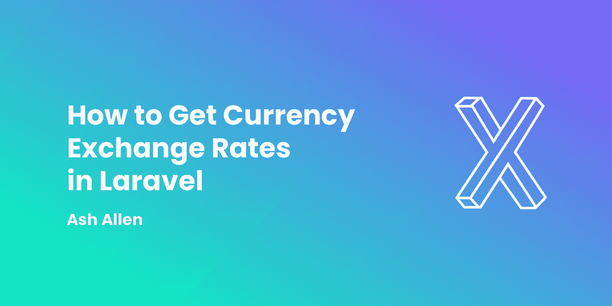
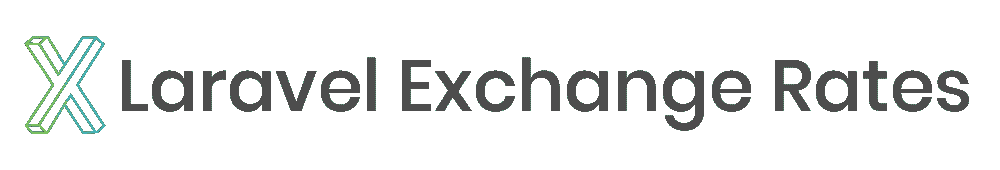

# 如何获取拉韦勒的货币汇率

> 原文：<https://medium.com/codex/how-to-get-currency-exchange-rates-in-laravel-a4e053bde494?source=collection_archive---------3----------------------->



# 介绍

有时，当您构建 web 应用程序时，您可能需要一些功能来处理来自世界各地的不同货币。为了能够处理不同的货币，你需要找到汇率。

在本文中，我们将了解如何使用 [Laravel 汇率](https://github.com/ash-jc-allen/laravel-exchange-rates)包与[Exchange ratesapi . io](http://exchangeratesapi.io)API 进行交互。我们还将了解如何使用它来获取最新或历史汇率，并在不同货币之间转换货币值。



# 装置

要开始使用 Laravel 汇率包，我们首先需要运行以下命令来使用 Composer 安装它:

```
composer require ashallendesign/laravel-exchange-rates
```

# 获取您的 API 密钥

现在我们已经安装了这个包，我们需要从[https://exchangeratesapi.io/pricing](https://exchangeratesapi.io/pricing)获得一个 API 密匙。您可以免费注册或使用付费层，这取决于您需要访问哪些功能。

# 配置

现在，您可以使用以下命令发布包的配置文件:

```
php artisan vendor:publish --provider="AshAllenDesign\LaravelExchangeRates\Providers\ExchangeRatesProvider"
```

您现在应该有了一个新的`config/laravel-exchange-rates.php`文件。默认情况下，包的配置设置为通过 HTTP 发出请求。但是，如果你在一个生产环境中，并且使用 API 的一个付费层，我强烈推荐使用 HTTPS。为此，您可以简单地将配置文件更新为，并将`api_url`字段更改为以`https://`开头，而不是以`[http://](/)` [:](/) 开头

```
return [

    // ...

    'api_url' => env('EXCHANGE_RATES_API_URL', 'http://api.exchangeratesapi.io/v1/'),

    // ...

];
```

您还需要确保将您的 API 密钥添加到您的`.env`中:

```
EXCHANGE_RATES_API_KEY={Your-API-Key-Here}
```

# 获取单个日期的汇率

为了将一种货币兑换成另一种货币，我们可以使用包的`->exchangeRate()`方法。

如果我们想得到今天英镑对欧元的汇率，我们可以这样写:

```
$exchangeRates = new ExchangeRate();
$result = $exchangeRates->exchangeRate('GBP', 'EUR');

// $result: '1.10086'
```

然而，如果我们想要获得特定日期的交换，我们可以传递一个我们想要的日期的`Carbon`日期对象。例如，如果我们想获得 2021 年 1 月 1 日从“英镑”到“欧元”的汇率，我们可以使用以下公式:

```
$exchangeRates = new ExchangeRate();
$result = $exchangeRates->exchangeRate('GBP', 'EUR', Carbon::create('2021-01-01'));

// $result: '1.10086'
```

# 获取两个日期之间的汇率

如果我们想获得给定日期范围内两种货币之间的汇率，我们可以使用包的`->exchangeRateBetweenDateRange()`方法。

假设我们想获取过去 3 天英镑对欧元的汇率。我们可以这样写代码:

```
$exchangeRates = new ExchangeRate();
$result = $exchangeRates->exchangeRateBetweenDateRange(
    'GBP',
    'EUR',
    Carbon::now()->subDays(3),
    Carbon::now(),
);

// $result: [
//     '2021-07-07' => 1.1092623405
//     '2021-07-08' => 1.1120625424
//     '2021-07-09' => 1.1153867604
// ];
```

# 转换单一日期的货币

该软件包不仅允许我们获取货币之间的汇率，还允许我们将货币价值从一种货币转换为另一种货币。为此，我们可以使用`->convert()`方法。

例如，我们可以用今天的汇率将 1 英镑兑换成欧元:

```
$exchangeRates = new ExchangeRate();
$result = $exchangeRates->convert(100, 'GBP', 'EUR', Carbon::now());

// $result: 110.15884906
```

您可能已经注意到，我们将`100`作为第一个参数传递。这是因为该包要求我们以货币的最低面额传递货币值。例如，在这种情况下，我们希望转换 1，所以我们传递 100，因为 1 等于 100 便士。

# 在两个日期之间转换货币

类似于获取日期范围之间的汇率，您还可以使用包将货币值从一种货币转换为另一种货币。为此我们可以使用`->convertBetweenDateRange()`方法。

假设我们想使用过去 3 天的汇率将 1 英镑兑换成欧元。我们可以这样写代码:

```
exchangeRates = new ExchangeRate();
$exchangeRates->convertBetweenDateRange(
    100,
    'GBP',
    'EUR',
    Carbon::now()->subDays(3),
    Carbon::now()
);

// $result: [
//     '2020-07-07' => 110.92623405,
//     '2020-07-08' => 111.20625424,
//     '2020-07-09' => 111.53867604,
// ];
```

# 通过使用包的缓存来提高性能

默认情况下，来自 [exchangeratesapi.io](http://exchangeratesapi.io) API 的所有 API 响应都被包缓存。这可以显著提高性能并减少服务器的带宽。这也是有益的，因为如果您已经获取了过去的汇率，它可以防止您使用一些每月的 API 请求。

但是，如果出于某种原因，您需要来自 API 的新结果，而不是缓存的结果，那么 pacakge 提供了一个我们可以使用的`->shouldBustCache()`方法。

让我们看看如何从 API 中获取新的汇率，并忽略任何缓存的汇率:

```
$exchangeRates = new ExchangeRate();
$exchangeRates->shouldBustCache()->convert(100, 'GBP', 'EUR', Carbon::now());
```

# 使用包的验证规则

有时，您可能允许用户选择要兑换的货币。在这种情况下，确保您的用户只能输入汇率 API 支持的货币非常重要。

为了有助于这一点，Laravel 汇率有自己的`ValidCurrency`规则来验证货币。

假设我们有一个表单请求，用于验证请求中发送的货币。我们的表单请求可能看起来有点像这样:

```
<?php

namespace App\Http\Requests;

use AshAllenDesign\LaravelExchangeRates\Rules\ValidCurrency;
use Illuminate\Foundation\Http\FormRequest;

class MyAwesomeRequest extends FormRequest
{
    // ...

    public function rules(): array
    {
        return [
            'currency' => ['required', new ValidCurrency()],
        ];
    }

    // ...
}
```

# 试验

如果您正在为处理 Laravel 汇率包的代码编写测试，您可能希望阻止任何 API 请求被实际发出。出于这个原因，您可能希望使用依赖注入或使用软件包提供的 facade 来实例化`ExchangeRate`类。事实上，如果你有兴趣阅读更多关于这方面的内容，我建议你阅读一下我的[如何让你的 Laravel 应用程序更具可测试性](https://ashallendesign.co.uk/blog/how-to-make-your-laravel-app-more-testable)的文章。

让我们快速地看一下如何为一个控制器方法编写一个基本测试，该方法获取今天从“英镑”到“欧元”的汇率。我们的控制器可能看起来像这样:

```
use AshAllenDesign\LaravelExchangeRates\Classes\ExchangeRate;
use Illuminate\Http\JsonResponse;
use Illuminate\Http\Request;

class MyAwesomeController extends Controller
{
    public function __invoke(Request $request, ExchangeRate $exchangeRate): JsonResponse
    {
        $rate = $exchangeRates->exchangeRate('GBP', 'EUR');

        return response()->json(['rate' => $rate]);
    }
}
```

现在，让我们为这个控制器方法编写一个测试。我们将假设该方法的路由名称是`awesome.route`。我们的测试可能看起来像这样:

```
use AshAllenDesign\LaravelExchangeRates\Classes\ExchangeRate;
use Mockery\MockInterface;
use Tests\TestCase;

class MyAwesomeControllerTest extends TestCase
{
    /** @test */
    public function success_response_is_returned(): void
    {
        // Create the mock of the service class.
        $this->mock(ExchangeRate::class, function (MockInterface $mock): void {
            $mock->shouldReceive('exchangeRate')
                ->once()
                ->withArgs(['GBP', 'EUR'])
                ->andReturn(123.456);
        });

        $this->postJson(route('awesome.route'))
            ->assertExactJson([
                'rate' => 123.456
            ]);
    }
}
```

# 结论

希望本文已经向您展示了如何使用 Laravel 汇率包与汇率 API 进行交互，以获得汇率和货币转换。它还应该让您简要了解如何为使用该包的代码编写测试。

如果这篇文章对你有所帮助，我很乐意听听。同样，如果你对这篇文章有任何改进的反馈，我也很乐意听到。

如果你有兴趣在我每次发布新帖子时得到更新，请随意[注册我的简讯](https://ashallendesign.co.uk/blog)。

继续建造令人敬畏的东西！🚀

*原载于*[*https://ashallendesign.co.uk*](https://ashallendesign.co.uk/blog/how-to-get-currency-exchange-rates-in-laravel)*。*