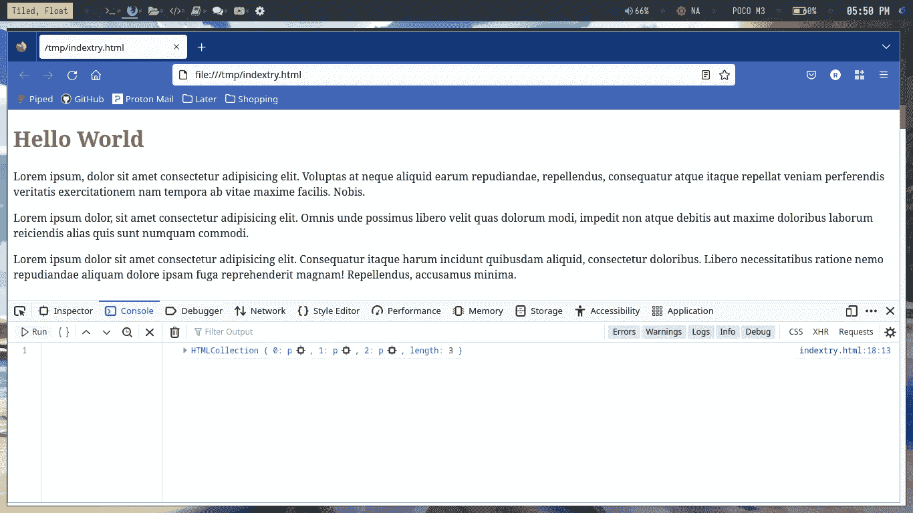
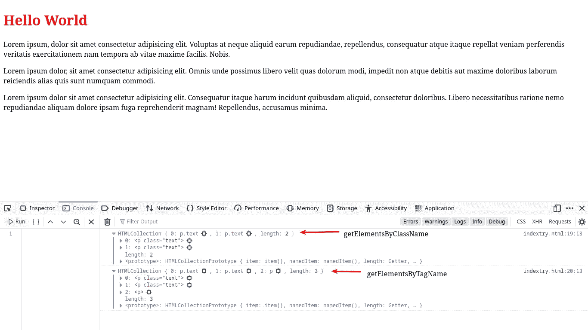

# 如何使用 JavaScript 获取 HTML 元素

> 原文：<https://medium.com/codex/how-to-get-html-elements-using-javascript-631c10f1176e?source=collection_archive---------11----------------------->


有三种方法可以找到 HTML 元素

*   document.getElementById()
*   document.getElementsByTagName()
*   document . getelementsbyclassname()

# 按 ID 排列的元素:-

document.getElementById()方法是查找 HTML 元素最常用的方法。您可以为标签分配任何想要的 id，并将 id 作为参数传递给 document.getElementByid()。
示例:-

```
<!DOCTYPE HTML>
<html>
  <head>
  </head>
  <body>
    <h1 id="intro"> Hello World</h1>
  </body>
  <script>
    var value = document.getElementById("intro");
    value.style.color = "red";
  </script>
</html>
```

**输出**


标题的颜色变了

# 按标记名排列的元素

第二种方法是通过标记名查找元素。

```
<!DOCTYPE HTML>
<html>
<head>
</head>
<body>
<h1 id="intro"> Hello World</h1>
<p>Lorem ipsum, dolor sit amet consectetur adipisicing elit. Voluptas at neque aliquid earum repudiandae, repellendus, consequatur atque itaque repellat veniam perferendis veritatis exercitationem
nam tempora ab vitae maxime facilis. Nobis.</p>
<p>Lorem ipsum dolor, sit amet consectetur adipisicing elit. Omnis unde possimus libero velit quas dolorum modi, impedit non atque debitis aut maxime doloribus laborum
reiciendis alias quis sunt numquam commodi.</p>
<p>Lorem ipsum dolor sit amet consectetur adipisicing elit. Consequatur itaque harum incidunt quibusdam aliquid, consectetur doloribus. Libero necessitatibus ratione nemo repudiandae 
aliquam dolore ipsam fuga reprehenderit magnam! Repellendus, accusamus minima.</p>
</body>
<script>
var value = document.getElementById("intro");
value.style.color = "red";
var para = document.getElementsByTagName("p");
console.log(para)
</script>
</html>
```

这里，函数通过标签获取元素，返回类型是一个数组。

**输出**



# 按类别排列的元素

与 document.getElementsByTagName()方法类似，document . getelementsbyclassname()方法也用于查找
多个元素。它使用类名来查找元素。返回类型是数组。

```
<!DOCTYPE HTML>
<html>
  <head>
  </head>
  <body>
    <h1 id="intro"> Hello World</h1>
    <p class="text">Lorem ipsum, dolor sit amet consectetur adipisicing elit. Voluptas at neque aliquid earum repudiandae, repellendus, consequatur atque itaque repellat veniam perferendis veritatis exercitationem
       nam tempora ab vitae maxime facilis. Nobis.</p>
    <p class = "text">Lorem ipsum dolor, sit amet consectetur adipisicing elit. Omnis unde possimus libero velit quas dolorum modi, impedit non atque debitis aut maxime doloribus laborum 
      reiciendis alias quis sunt numquam commodi.</p>  
    <p>Lorem ipsum dolor sit amet consectetur adipisicing elit. Consequatur itaque harum incidunt quibusdam aliquid, consectetur doloribus. Libero 
      necessitatibus ratione nemo repudiandae aliquam dolore ipsam fuga reprehenderit magnam! Repellendus, accusamus minima.</p> 
  </body>
  <script>
    var value = document.getElementById("intro");
    value.style.color = "red";
    var para = document.getElementsByTagName("p");
    var classname = document.getElementsByClassName("text");
    console.log(classname)
    console.log(para)
  </script>
</html>
```

**输出**



这显示了两种结果

[链接到系列的第一部分:-](/@Prinux/consoles-in-javascript-explained-d80018f4df99) [链接到系列的第二部分:-](/@Prinux/building-a-number-guesser-using-javascript-97cec69c419a)

> 如果你喜欢这个博客，请别忘了鼓掌。如果你想了解更多关于隐私、安全、技术和 Linux 的知识，可以考虑关注我。另外，任何我觉得有趣和有价值的东西。