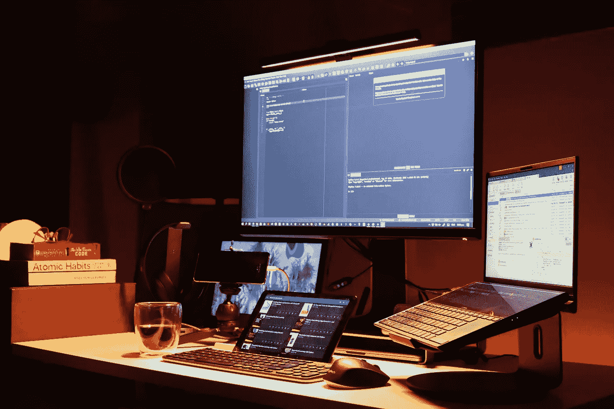

# 以正确的方式学习编程

> 原文：<https://medium.com/codex/how-to-get-started-with-coding-b5159586838b?source=collection_archive---------2----------------------->

## 以正确的方式开始你成为程序员的旅程

在 [Unsplash](https://unsplash.com/s/photos/computer-science?utm_source=unsplash&utm_medium=referral&utm_content=creditCopyText) 上由 [Boitumelo Phetla](https://unsplash.com/@writecodenow?utm_source=unsplash&utm_medium=referral&utm_content=creditCopyText) 拍摄的照片

编程是一个令人生畏的话题。很难找到从哪里开始。你应该开始一个项目吗？该不该看书？看文件了吗？有这么多的方法可以开始，你可能会被它淹没。

这就是我决定写这篇文章的原因。曾经有一段时间，我处于同样的位置，我知道我会从这样的文章中受益匪浅。

别再浪费你的时间了，让我们开始阅读这份指南吧。

## 学习的基础

事实是编程没什么特别的。这是一种和其他技能一样的技能。没有什么秘密方法能让你在几个月内成为超级巨星。相反，你应该遵循学习其他技能的原则。

最重要的事情之一是使用许多不同的方法来学习。这些主要方法中的三种可以应用于任何技能。我还将在本文末尾介绍一些额外的方法，您可以尝试一下。

## 方法一:理论

这是无法回避的。你只能编程你知道的东西。了解你所写的代码是做什么的，会让你成为一个更有效率的程序员。这也能让你发展自己的工作方法。

如果你考虑从事编程工作，这一点尤其重要。如果你有很强的理论理解，你可以击败很多只做简单项目的程序员。

学习理论有几种不同的方法。很多人喜欢建议阅读文档，通常被称为 docs。我个人不同意这一点，尤其是如果你刚刚起步。

文档是一个很好的资源，它可以告诉你正在使用的任何模块的确切工作方式。问题是它们通常不是那么清晰，如果你有一些编程经验，你会从中获得更多。

这就是为什么我建议看编程书籍，youtube 教程，或者课程。我个人开始读的书是[用 Python 自动化枯燥的东西](https://automatetheboringstuff.com/)。这是一个很好的资源，也是我们下一个学习方法的一部分

显然，去学校学习数据科学将胜过大多数在线资源，但这意味着所有这些部分。

## 方法二:练习

理解理论是伟大的，但你也需要知道如何应用它。练习如何编写代码是学习你需要的实用技能的最好方法。

练习编码的最好方法之一是制作自己的项目。选择一个你可以自动化的东西或者一个你曾经有过的应用想法。也许你可以像我一样，编写一个简单的程序，在你处理完某些文件后，自动将它们转移到云存储中。

这听起来可能很复杂，但特别是通过谷歌搜索，这并不是一个很难的项目。你自己的项目也是学习一些关键技能的好方法。使用 [Git](https://git-scm.com/) 进行版本控制，使用 [Docker](https://www.docker.com/) 部署软件，这些都是需要学习的基本技能。

也有像 [LeetCode](https://leetcode.com/) 这样的网站提供编程“谜题”。拼图是简单的小规模任务。如果你要开始，我建议你先从最简单的谜题开始。

无论你最终采用哪种方法，这种方法都可能是这里列出的所有方法中最关键的。不管你有多少理论，如果你不能把一切都写出来，你就不会有什么进展。

## 方法三:学习

这种方法听起来可能很奇怪。我是说，你做的一切不都是为了学习吗？在某种程度上，是的，但这种方法更上一层楼。

用自己的程序研究学习理论和实践的结合。学习本质上就是去翻别人的项目，把它们作为一种学习的方式。要做到这一点，你至少需要一点理论，但这对你的发展非常有益。

观察别人的项目可以教会你技巧和方法，而这些你自己可能要花上几个月才能意识到。网上都是学了几十年编程的人。不利用这一点来为自己谋利是愚蠢的。

像 [GitHub](https://github.com/) 这样的网站有许多精心策划和专业制作的项目，你可以看看。还有许多不同的网站可供您使用。

如果你对数据科学感兴趣，我建议你查看一些 Kaggle 竞赛的最佳答案。他们能教会你很多专业数据分析和预测中使用的方法和步骤。

## 方法 4:其他东西

这个最后的方法实际上是一些更小的东西的组合。即使其中大多数只有很小的效果，它们也可以成为你日常学习的很好的补充。

我最喜欢做的一件事就是回顾我以前的项目。随着我的进步，回顾我过去的错误并改正它们是确保我所学的一切真正记住我的一个好方法。

加入开放项目并与他人合作是我做过的最好的事情之一。这是为未来做准备的好方法，而且在简历上看起来也很棒。

播客是我最喜欢的跟踪编程世界的方式之一。你可以随时听，比整天阅读要轻松得多。

## 底线

进入编程有很多方法。老实说，第一年是我编程生涯中最开心的一年。你写的最初几个程序，实际上是有效的，将会令人难忘。

坚持你的目标，无论你做什么，你都会成功。

感谢您阅读这篇文章。如果你还不是 Medium 的会员，你可以通过[点击这个链接](https://kaarlsamu.medium.com/membership)获得所有的故事。在这个过程中，你也会支持我，不会给你带来额外的费用。