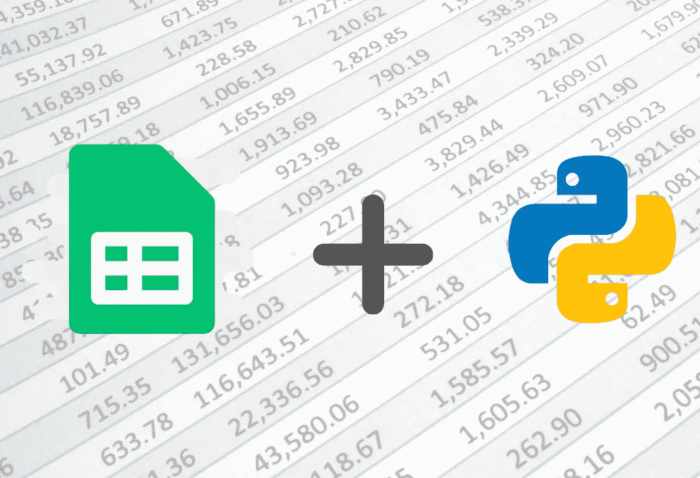

# 如何开始使用 Python 中的 Google Sheets API

> 原文：<https://medium.com/codex/how-to-get-started-with-the-google-sheets-api-in-python-d38edab13274?source=collection_archive---------2----------------------->

## 自动化你的谷歌电子表格，释放你的时间。

作者用 [canva](https://www.canva.com/) 创建的图像。

如果您正在维护一个必须以可预测和一致的方式频繁更新的数据集，自动化该过程有明显的好处。建立自动化工作的代码可能会花费一些时间，但从长远来看，您可能会节省时间。如果你是…