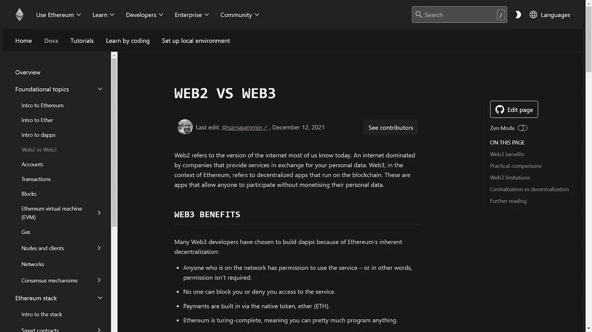
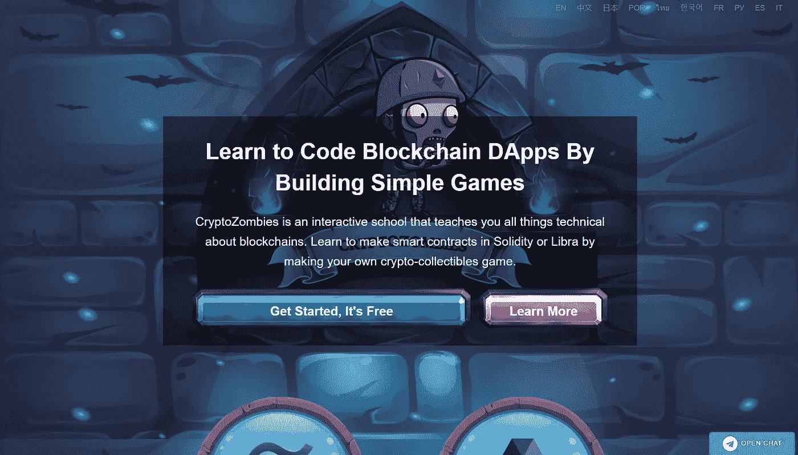

# Web 3.0 如何入门？

> 原文：<https://medium.com/codex/how-to-get-started-with-web-3-0-43d920161b08?source=collection_archive---------2----------------------->

完整的入门指南。

WEB 3.0 Ahed

Web3 现在就在我们身边，不难发现 solidity 开发者的年薪高达 15 万美元。我是一个 web3 爱好者，也打算从头开始学习。我浏览了 youtube 上的许多路线图指南、medium 上的文章和社交媒体上的帖子。

在做了所有这些之后，我已经为自己找到了一条路/路线图，我在这里分享它。希望你也会觉得有用。🤞

## 首先，wtf 连 web3 都是？

Web3 是网络发展的下一个阶段，其核心可能由区块链推动。我们今天所知的现代网络是“web2 ”,主要由谷歌、FB 等大公司控制。

Web3 扭转了这一局面，将这些公司的权力划分给用户和创造者。今天，大公司拥有我们的数据，并从中获利，在 web3 的世界里，没有数据所有者，它的社区，这可能是由于区块链。

如果你想更深入地了解它，你可以参考官方的[以太坊文档](https://ethereum.org/en/developers/docs/web2-vs-web3/)。

现在，一旦你对 web3 的基本需求有了一些了解，你就可以从比特币和以太坊的官方白皮书开始了。只要谷歌一下，你就会知道。但是，不要被这些论文中使用的技术术语弄得不知所措，只需关注更广泛的概念。

对于区块链背后的数学，你应该看看 YouTube 上的一个叫做 **3Blue1Brown** 的频道。

主要有两种不同的区块链开发商:

1.  核心区块链开发人员设计区块链系统的架构和安全性。
2.  区块链软件开发者使用核心开发者构建的核心 web 基础和架构来创建去中心化应用(DApps)和 web 应用，以及智能合约。

大多数公司需要第二类开发人员，即开发 DApps 和智能合约的开发人员。

现在 DApps 可以进一步分为两个部分，一个是前端开发，另一个是后端开发，前端开发和传统的一样。但是后端部分很棘手，我们必须与区块链进行数据和交易通信，这需要借助以太坊平台的官方语言 Solidity language。

对于前端开发，要学习 Javascript 或者 Python。它允许你使用 **web3.js** 和 **web3 与以太坊区块链互动。py** 相应地。Youtube 和 FreeCodeCamp 上有各种各样的教程来学习这些语言。

为了稳固，你可以访问 [cryptozombies.io](https://cryptozombies.io/) 他们确实提供了一种学习稳固的有趣方式，完成后你需要做的就是练习。

如果你打算使用 python，那么这里有一个关于智能合约开发的 **FreeCodeCamp** 的综合教程。

如果你遵循 Javascript 的方式，那么有一个名为 **Dapp 大学的 Youtube 频道。**

接下来是开发一些项目的关键部分。这个你可以再参考一下 **Dapp 大学**和 **FreeCodeCamp。他们有一些关于从零开始开发 DApp 的惊人教程和一些项目想法(或者我会提出来😉)也是。**

## 就这些了，谢谢大家的配合！