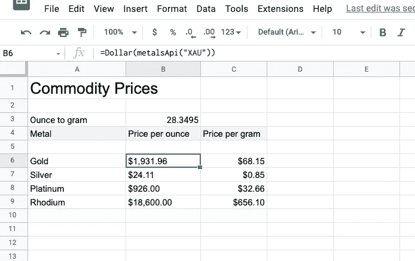

# 如何在 Google Sheet 中获取最新的商品定价

> 原文：<https://medium.com/codex/how-to-get-the-latest-commodity-pricing-in-google-sheet-61ab01b482b4?source=collection_archive---------1----------------------->

Google sheet 有简单的宏来获取美国股票和货币的价格，但不能获取黄金或白银的价格。以下是获取最新价格的简单而免费的技巧！

作者使用自定义手写功能的 Google Sheet 截图。

我用谷歌资产负债表来追踪我的支出、资产和负债。Google Sheet 为查询美国交易所(如`NASDAQ`或`NYSE`)的股票最新价值提供了一流的支持。另一方面，它没有…