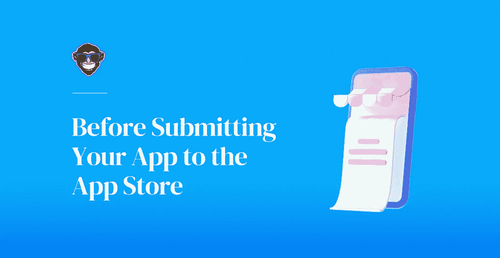
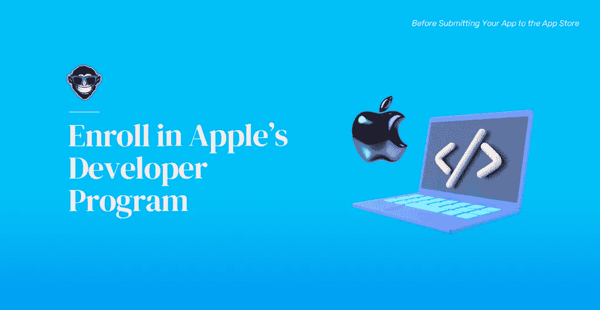
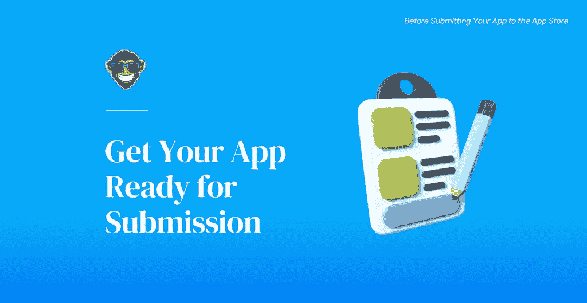
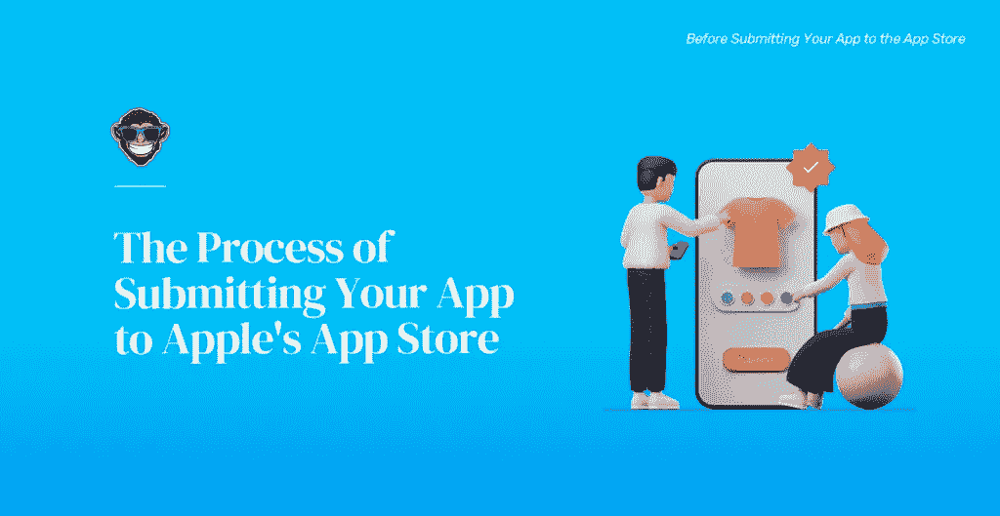
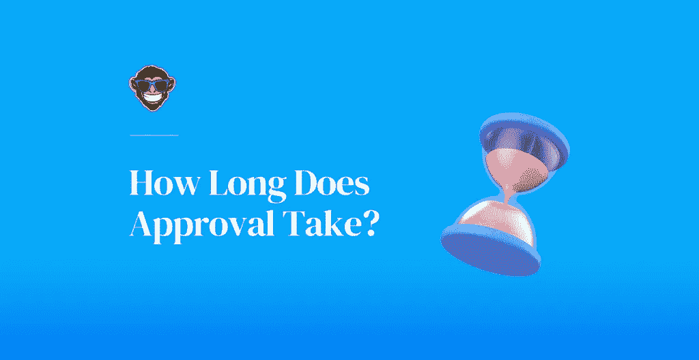
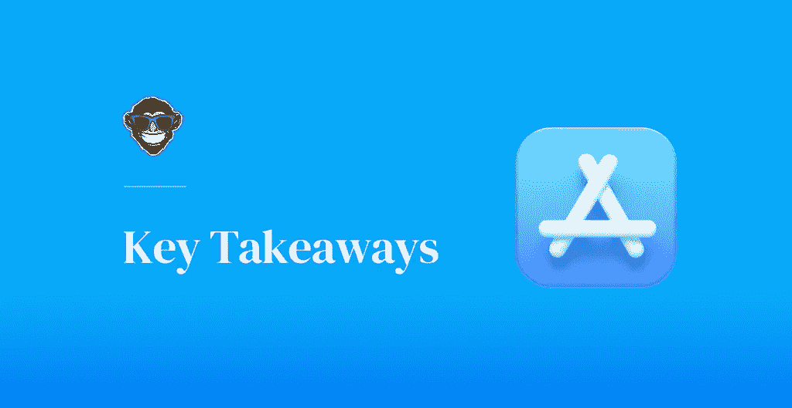

# 如何让你的应用程序在苹果的应用程序商店

> 原文：<https://medium.com/codex/how-to-get-your-app-on-apples-app-store-469019032c69?source=collection_archive---------13----------------------->

开发一个应用程序是一项非常累人的工作。然而，生产和运输你新开发的 iOS 应用程序的复杂过程一旦完成就不会停止。下一步是让你的应用在应用商店发布；因此，理解苹果的条款并遵守它们将确保你的应用程序被发布。

所以，辛苦的工作和漫长的夜晚结束了；您已经完成了 iOS 应用程序的构建。你在规划、设计、开发和测试你的应用上投入了无数的时间和宝贵的资源。你和你的团队检测并修复了每一个错误，并确保 UX/用户界面设计在每一个设备上无缝运行。这个想法最初是一块木板上的抽象概念或一张纸上的涂鸦，现在已经成为让你自豪的现实。这听起来很棒，很令人兴奋，但是现在呢？好吧，你的 iOS 应用成功进入用户手机的旅程真正开始于它走向世界的时候。而且，正如你已经知道的，你的 iOS 应用获得新的全球成功的途径是苹果的应用商店。

这听起来很简单:你开发你的应用程序，在应用商店下载，下载开始，瞧！立竿见影。不幸的是，将你的应用提交到 App Store 并不像点击上传按钮那么简单。然而，它也没有看起来那么复杂。尽管如此，在你看到你的应用程序在 App Store 上杀死它之前，你需要遵循一些技术和法律准则，并满足苹果对应用程序发布的先决条件和要求。

你可能听说过苹果在接受应用程序进入他们的平台时有些挑剔；然而，这些要求并非不可能满足。当然，苹果确实比谷歌难一点，但是在适当的指导和准备下，让你的应用程序被批准进入应用商店是可行的，也是值得的。这是本文的主要目标。作为经验丰富的 iOS 应用程序开发人员，我们 Foonkie Monkey 将尝试概述和解释你必须考虑和遵守的步骤和要求，以帮助你的应用程序在苹果广受欢迎的移动平台上获得令人垂涎的位置。

# 在将您的应用程序提交到 Apple 的 App Store 之前

在我们深入 App Store 的提交流程之前，我们认为有必要看一下苹果的一些先决条件，如果事先得到解决，可以为您和您的团队简化事情。这些先决条件对于充分准备提交和避免拒绝以及其他可能妨碍您的应用程序在 App Store 中的包含的问题至关重要。请记住，去年，苹果拒绝了超过[100 万个应用，](https://www.cnbc.com/2021/05/11/apple-rejected-nearly-1-million-new-apps-in-2020-heres-why.html)约 35%的应用提交，因为不符合它们的法律和技术要求，因此，如果应用商店中的聚光灯是你所追求的，那么满足它们并遵守它们是没有商量余地的。

# 加入苹果的开发者计划

首先，你必须在[苹果开发者计划](https://developer.apple.com/programs/)中创建一个账户，才能获准向苹果应用商店提交应用。这将花费你每年 99 美元和一个团队账户 299 美元，与谷歌[25 美元的一次性费用相比，这似乎太贵了。然而，请记住，在 2020 年，iOS 应用占当年总应用收入的](https://console.developers.google.com/)[近 62%](https://clutch.co/app-developers/resources/how-much-money-can-you-make-mobile-app-2021) ，而 Android 应用仅占 38%。此外，Apple 的开发者计划将为您提供各种好处，包括:

*   免费提交你所有的应用到所有苹果平台的应用商店
*   使用 [TestFlight](https://developer.apple.com/testflight/) 访问公开测试应用。
*   能够创建 Safari 扩展。
*   访问所有苹果软件产品(iOS、iPad、macOS、watchOS 和 tvOS)的测试版。
*   与 [Xcode](https://developer.apple.com/xcode/) 集成。
*   访问 [Apple Store Connect 的](https://appstoreconnect.apple.com/)高级应用分析和高级应用功能。

如果你打算开发更多的 iOS 应用，注册开发者计划是值得的。苹果的应用程序商店有 196 万个应用程序可供下载，是你的应用程序的无价平台。但是，如果你不想注册，你仍然可以为苹果的操作系统开发应用程序。尽管如此，你仍然无法获得上面列出的所有好处，你创建的应用程序将与你的设备绑定，因为你没有任何自然的方式来分发或货币化它们。此外，请记住，如果你决定注册，但在一年后没有续订会员资格，苹果将从 App Store 中删除你的应用程序。

设置好 Apple 开发者帐户后，如果您还没有连接到 Xcode，您需要将它连接到 Xcode，并创建三个东西，以便稍后提交应用程序进行审核时使用:

*   **分发证书:**分发证书标识你和你的团队——或组织——并确保你的应用程序代码来自你。它还允许您将所有 iOS 应用程序提交到 App Store。你可以在你的开发者账户的证书，id&配置文件菜单中直接获得你的发行证书。
*   **应用 ID:** 应用 ID 是您的应用或一组应用的唯一标识符，有助于确定哪些应用被授权签名和发布。你的应用 ID 有两部分:捆绑包 ID 和团队 ID。捆绑 ID 是一组用于识别特定应用程序的字符，而团队 ID 是由 Apple 生成的 10 个字符的字符串。为您的开发团队分配一个唯一的团队 ID，用于识别您的所有应用。您可以在您的开发者帐户中的证书、ID&配置文件菜单中直接创建您的应用 ID。
*   **配置文件:**如你所知，只有苹果公司签署的应用程序才能安装在 iOS 设备上，这意味着在部署之前在真实设备上进行测试可能是一个问题。创建预置描述文件解决了这个问题，它允许您在 Apple 签名之前在专门授权的设备上运行您的应用程序。您必须为每个应用程序创建一个预置描述文件，您可以在您的开发人员帐户的“证书，id&描述文件”菜单中直接生成它。

# 准备好您的应用程序以供提交

创建开发人员帐户后，您需要确保您的应用程序已准备就绪，并符合特定的指导原则和技术要求，然后才能进行审核。在准备提交 iOS 时，请谨记以下一些注意事项:

*   **App Store 指南:**确保你的应用遵循苹果 [App Store 审核指南](https://developer.apple.com/app-store/review/guidelines/)。您的应用程序将接受彻底的审查和认证过程，以确保它符合所有这些准则和规则。苹果的评审人员将在这些规范的保护伞下评判你的应用，因此这一步对于你的应用获得批准非常重要。因此，你必须确保你的 iOS 应用程序的安全和安全协议无缝工作。如果你的应用程序崩溃，有漏洞，容易受到黑客攻击和数据泄露，它将不会被批准在应用程序商店发布，这就是为什么你必须确保你的测试协议是完美的。
*   幸运的是，你可以使用苹果的[测试飞行](https://developer.apple.com/testflight/)，这是一个用你的开发者账户测试你的应用的优秀工具。此外，你的 UX/用户界面设计必须完美和流畅，你的应用程序的版权和其他法律要求，如果有的话，必须得到满足，并确保你的应用程序的整体性能是正确的。
*   **人机界面指南:**苹果的[人机界面指南](https://developer.apple.com/design/human-interface-guidelines/ios/overview/themes/)概述了开发者应该如何设计运行在 iOS 设备上的应用的用户界面(UI)元素。它们包括公认的分辨率、主题、设计原则、图像大小、像素和其他由苹果公司建立的用户界面资源，以寻求在所有 iOS 设备上轻松无缝地集成应用程序。
*   **开发要求:**你可能已经知道，要开发原生 iOS 应用，你需要一台能有效运行 MacOS X 的 Mac 电脑，并且安装了最新版本的 [Xcode](https://developer.apple.com/xcode/) ，在这种情况下应该是 Xcode 13。Xcode 是苹果的 [IDE](https://www.codecademy.com/articles/what-is-an-ide) (集成开发环境)，用于开发 Mac 和 iOS 应用。这是你和你的团队应该用来交付你的 iOS 应用的图形界面。此外，Xcode 包括 [iOS SDK](https://developer.apple.com/ios/) (iOS 软件开发工具包)，支持 [Swift](https://developer.apple.com/swift/) 编程语言，并拥有设计、开发和调试全新 iOS 应用程序所需的所有工具、编译器和框架。
*   **法律要求:**除了满足之前公布的提交指南之外，你提交给苹果应用商店的 iOS 应用必须符合[的所有法律要求](https://www.foonkiemonkey.co.uk/5-legal-considerations-in-app-development/)。例如，在美国，根据你提交的应用程序的类型，你必须遵守 [HIPAA](https://www.hhs.gov/hipaa/index.html) 法律或 FTC(美国联邦贸易委员会)法规。另一方面，在欧盟国家，需要遵守 PSD2 和 GDPR 指令。请记住，苹果密切关注你如何处理和保护你的用户数据，如果你的应用不符合其[开发者计划许可协议](https://developer.apple.com/support/terms/)，它将拒绝你的应用。

# 将您的应用程序提交到 Apple 的 App Store 的过程

希望到现在为止，你已经设计、开发和测试了你的应用程序，你和你的团队已经做好了充分的准备，并且拥有了开始你的 iOS 应用程序提交过程所需的所有信息和工具。所以，事不宜迟，下面是在苹果应用商店启动你的应用的流程概述。

# 1.App Store 连接

一旦您的开发者帐户设置完毕，并且您已经创建了前面提到的元素并查看了指南和要求，请登录您的 App Store Connect 帐户。在那里，是时候开始提交你的应用程序了，进入 MyApps 菜单，点击“+”添加你的新应用程序。在那里，你必须注册你的应用程序的首选平台，名称，主要语言，用户访问，以及你之前创建的应用程序的 ID 和捆绑 ID。之后，系统将引导您进入应用的产品页面，您需要在该页面提供应用的元数据和其他有关应用的详细信息，包括:

*   隐私策略 URL。
*   应用程序名称、副标题和关键字优化
*   定价和销售区域(您的应用将在哪些国家上市)
*   类别(游戏、健身、医疗保健等。)
*   你的应用的图标(应该是 024px x 1024px)。
*   你的应用的版本号(如果是新应用，则为 1.0.0)
*   版权信息和其他知识产权标识符
*   联系和支持 URL
*   最小用户年龄
*   你的应用的年龄分级(每个人、青少年、仅限成人等。)
*   **发布选项:**如果你的应用通过了苹果的审核流程，你可以选择发布的方式和时间。您可以选择一个特定的发布日期，一旦批准后自动发布，或者您可以手动完成。
*   **查看信息:**如果您的应用需要用户访问它的身份验证方法，您将需要创建一个测试帐户并提供演示凭据。

# 2.上传截图

为了让你的 iOS 应用获得苹果应用商店的批准，你需要按照苹果[截图要求规范](https://help.apple.com/app-store-connect/#/devd274dd925)提交你的应用在不同设备上的截图。你可以上传多达 10 个应用截图，确保你选择的是最能体现你的应用 UX 设计的截图。这些截图至关重要，因为它们会出现在你的应用页面上，是你的用户在搜索你的应用时看到的第一个视觉上有吸引力的东西；因此，它们必须吸引人、简单、干净、醒目。您可以使用 iOS 模拟器轻松捕捉它们，或者您可以设计一些图像或模型，成功传达和布局您的应用程序的外观和感觉。你可以使用图形设计工具，如 [Figma](https://figma.com/) 或 [Sketch](https://www.sketch.com/) 搭配智能手机模型工具，如 [Mockuphone](https://mockuphone.com/) 来设计这些模型。

# 3.上传你的应用版本

一旦你成功地达到这一点，并且你确信你的应用程序没有错误，没有安全漏洞，你就可以上传它了。但是，您不能将您的应用程序直接上传到 App Store Connect，因此您需要使用 Xcode 来归档您的应用程序并上传，以正确完成此步骤。只需转到 Xcode 并选择“通用 iOS 设备”作为部署目标。接下来，从菜单中选择“产品”,然后单击“存档”开始该过程。在 Xcode 中归档您的应用程序可能需要一段时间，因为它使用版本设置来使您的应用程序能够在所有选定的 iOS 设备上运行。

Xcode 归档您的应用程序后，您可以从管理器窗口中选择它，并通过“分发应用程序”选项将它上传到 App Store Connect，选择 App Store 选项。到目前为止，您已经拥有了分发证书，因此您的应用程序应该可以顺利上传。尽管如此，Xcode 会让您知道是否有任何问题，并在这一步完成后提醒您。

之后，您可以返回到您的 App Store Connect 帐户，并点击仪表板左侧的“1.0 准备提交”。接下来，点击“+”按钮，选择您最近在 Xcode 中上传的构建。一旦您选择了应用程序的版本，将会出现一个对话框询问您的应用程序是否使用加密。选择符合应用安全协议的答案，然后点击“下一步”完成该过程。最后，点击右下角的 Done 按钮，然后点击右上角的 Save，一切都准备好了。

# 4.试飞测试

根据您的目的，您可能不想立即将应用程序提交到 App Store。相反，你可能想使用 TestFlight 对你的应用程序进行测试。在这种情况下，整个过程是相同的，除了在 Xcode 中归档您的应用程序构建之前；你需要创建一个 App Store 发行版来进行测试，而不是 App Store。

# 5.审核并提交

上传应用程序并完成前面提到的所有步骤后，您就差不多完成了。但是，首先，我们建议您对您丢失的所有信息进行最后一次检查，因为一旦您的提交被发送，编辑就不是一个选项。准备就绪后，单击屏幕右上角的保存按钮，然后单击提交以供审查按钮。之后，系统会提示您回答一些关于出口合规性、内容版权和广告的问题；根据你的应用特点回答。现在，您应该会在您的应用程序名称旁边看到一个黄色标签，表明它正在等待审查。瞧，现在你完成了！

# 批准需要多长时间？

一旦你提交了你的应用，等待游戏就开始了。苹果的审核时间差异很大；他们可能需要几天或几周的时间。尽管如此，最近苹果据称已经改善了审查时间，50%的应用程序在 24 小时内得到审查，超过 90%的应用程序在 48 小时内得到审查。无论哪种情况，这里的关键是耐心。如果你正确地遵循了步骤，并确保你的应用程序符合苹果的所有指导方针和要求，那么毫无疑问，批准正在进行中。

但是，如果您的应用程序已经审核超过两周，而您没有收到回复，您可以使用 App Store Connect 帐户中的解决方案中心联系 Apple，或者重新提交您的应用程序。不过，如果你的应用被拒绝，苹果会通过电子邮件通知你。你的应用程序拒绝通知将包括有关拒绝原因的信息，以便你可以修复错误并尝试再次提交你的应用程序。但是，如果您不同意拒绝理由，您可以随时上诉。如果您的应用程序获得批准，您还将通过电子邮件收到确认，除非另有说明，否则它将在获得批准后 24 小时内上线。

# Foonkie Monkey 让你的应用程序获得批准的提示

作为经验丰富的 iOS 应用程序开发人员，无论您是刚刚开始上述提交流程，还是正在考虑，我们都希望给您一些提示，让这个流程变得更加简单。我们还想帮助你在苹果应用商店上获得一个令人垂涎的位置。

*   **彻底测试你的应用:**正如你所想象的，苹果对包含安全隐患、性能问题、崩溃或全面系统故障的错误应用毫不留情。为了及时发现这些问题，请确保您有可靠的 QA 测试协议。无论是手动的还是自动的，从开始到结束，永远不要忽视在开发过程的每一步中实现测试过程。而且，如果你的测试显示你的应用程序有不稳定的性能或者一些经常性的崩溃和安全隐患，在把你的应用程序提交给苹果公司审查之前修复它们。拒绝这样做肯定会导致你的应用被拒绝。众所周知， [25%的应用程序](https://steelkiwi.com/blog/how-to-publish-your-app-on-the-app-store-and-google-play/)由于性能问题而被淘汰。
*   **加入苹果开发者计划:**我们知道每年为一个团队支付近 100 美元或 300 美元成为苹果开发者计划的一部分听起来很贵。然而——我们怎么强调都不为过——它物有所值。您不仅需要它来交付 iOS 应用程序，还可以访问前面提到的所有工具和优势，让您能够在世界上最受欢迎的移动市场之一展示您的 iOS 应用程序。
*   遵循指南:上面提到的苹果的界面和应用商店指南是特别的，没有商量的余地。显然，一些用户界面指南是可选的，并为创造力留下了空间，但总的来说，苹果对遵守他们的应用商店基本规则非常挑剔。他们希望他们的应用程序运行流畅，尽可能看起来时尚，因此他们确实会拒绝任何与他们的设计和性能要求相冲突的应用程序。因此，我们建议您仔细研究这些指南，并确保您的应用程序在开始提交流程之前遵守其中的每一条。
*   兼容性:苹果喜欢用户拥有几款该品牌的产品，并且可以流畅地同步使用。这就是为什么整合和兼容性是品牌成功的关键因素。对于应用开发者来说，这一事实意味着 iOS 应用中的跨设备集成和响应能力至关重要。出于这个原因，确保你的应用程序兼容几个 iOS 设备，而不仅仅是 iPhone，这是你的应用程序获得批准的一个完美案例。同样，我们并不是说这是你的应用程序进入应用程序商店的决定因素，但这将是对你有利的一点。
*   **原创设计:**这一点对你来说可能是显而易见的。然而，你会惊讶于山寨应用的数量。据说，对于[来说，每两个发布的应用](https://www.sciencedaily.com/releases/2018/04/180409135616.htm)，就有一个是原创应用的复制品。幸运的是，App Store 非常擅长拒绝非原创应用或抄袭其他应用设计元素的应用。不过，你必须确保你的应用程序的内容是原创的，属于你的。如果有些不是，你必须突出它，并给予所有者信任。

# 关键要点

第一次向苹果应用商店提交应用程序可能是一次激动人心、充满挑战和令人伤脑筋的经历。即使对于最有经验的开发人员来说，这也是完全正常的。向苹果提交一个全新的 iOS 应用程序对任何人来说都是有压力和耗时的。然而，一旦你熟悉了这个系统，理解了需求和整个提交过程是如何运作的，它就不像看起来那么麻烦了。当然，苹果在向任何应用敞开大门时都是非常苛刻的。尽管如此，只要你注意、努力工作，并且拥有健全的开发流程和实践，就像我们一样[，在很长一段时间内，你将会把无数的 iOS 应用程序发布到这个世界上。](https://www.foonkiemonkey.co.uk/portfolio/)

如果您有任何其他问题或顾虑，想要了解更多关于在 App Store 中发布应用程序的信息，或者希望我们开发您的下一款 iOS 应用程序，[请给我们写信！](https://www.foonkiemonkey.co.uk/contacto/)

## 项目需要帮助吗？

# 写信给我们，让我们开始工作吧！

[**联系我们**](https://www.foonkiemonkey.co.uk/contacto/)