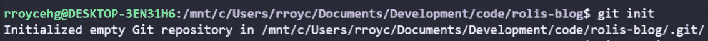
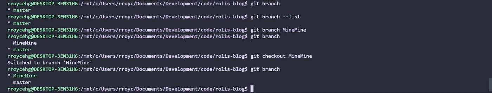
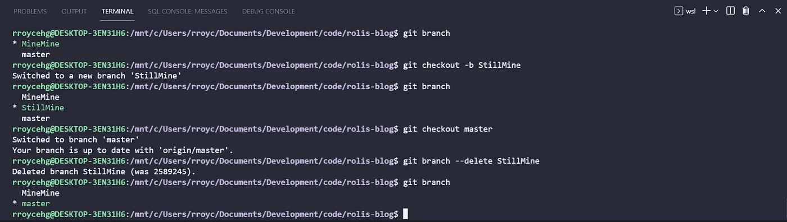
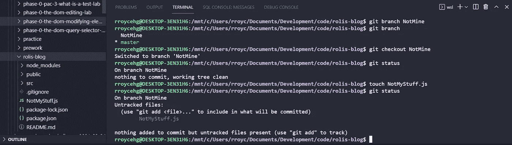
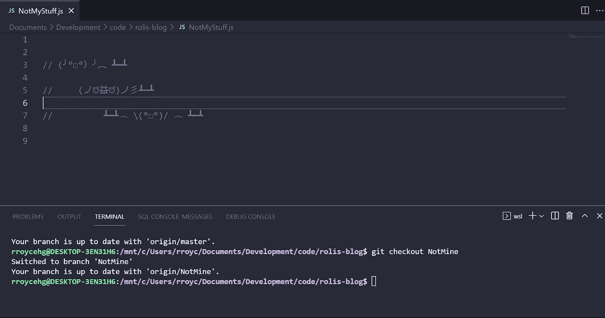
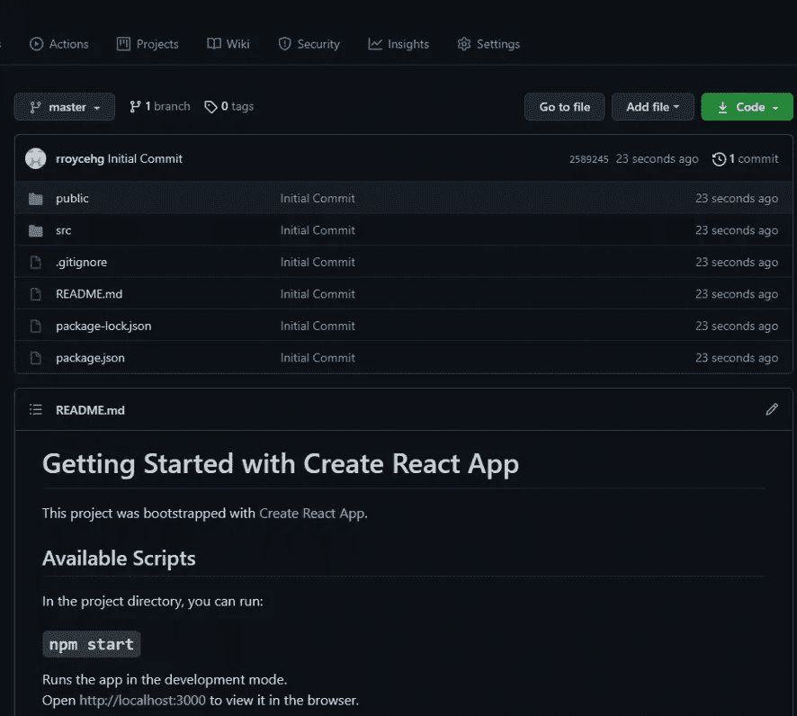
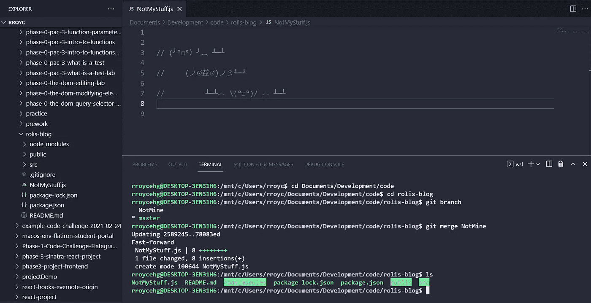

# 如何获得一个分支:工作安全

> 原文：<https://medium.com/codex/how-to-git-a-branch-work-safety-421a8320b93c?source=collection_archive---------15----------------------->

[罗曼·辛克维奇](https://unsplash.com/@synkevych?utm_source=unsplash&utm_medium=referral&utm_content=creditCopyText)在 [Unsplash](https://unsplash.com/s/photos/git?utm_source=unsplash&utm_medium=referral&utm_content=creditCopyText) 上的照片

总有一天，你会和一个处理代码块的团队一起工作，缩小任务范围并委派给他们各自的开发人员将变得至关重要。众所周知，计算机在不断进步，其计算能力给世界留下了深刻印象。换句话说，计算机变得越来越聪明，但它的“聪明”程度取决于人类告诉它做什么。人类在进化，虽然很慢，但不会改变的是我们容易犯错误，有时这些错误会造成可怕的后果。这就是软件开发人员在任何学习阶段的生活，无论是学生、初级员工还是经验丰富的程序员。共享文件中的一个错误可能会让整个团队付出项目的代价，并从根本上迫使项目重新开始。

输入:Github 创建分支的能力。这可能不言自明，但这是 Github 如此强大的另一个原因。开发精细代码的团队可以通过创建目录副本和其中的数据容器来输入，几乎不用担心完全破坏根文件。继续一步一步的指导，快速为下一个即将到来的团队项目做准备。

首先也是最重要的是，你需要进入你的代码编辑器，创建一个目录或文件夹来保存你的新代码，比如。`mkdir my_new_directory`。一旦你完成了这些，进入浏览器，进入 Github 创建一个新的资源库，你可以通过阅读这里给出的步骤来学习:https://docs . Github . com/en/get-start/quick start/create-a-repo。然后，回到代码编辑器，在终端中运行一个`git init`。

运行“git init”后，运行“git add”然后运行一个`git commit -m “Initialize Git”`——注意，在 git 提交中写什么由你决定，按照惯例，你可以写“初始化 Git ”,这样你就可以看到更新的发生。

提交之后，返回到 Github，在那里创建了一个新的库，复制远程 git 信息链接(SSH ),您可以在顶部找到这个链接，上面写着快速设置。你想点击剪贴板图标，直接复制链接，但要确保 SSH 被切换，而不是 HTTPS。

复制链接后，返回终端并运行`git remote add origin your-copied-remote-repository-url`。然后，从这里我们想把它上传到 github，这样你就可以在网页上看到你在这个目录中的任何文件，也可以看到你从现在开始所做的任何更改。

我们这样做的方法是首先看看你当前的分支机构的名称是什么。我们正在查看我们的分支是“主”还是“主”，我们所要做的就是运行`git branch` 和/或`git branch --show-current`。看完你的分公司是经营什么`git push -u origin master`还是`git push -u origin main`。现在，您的本地存储库应该公开发布到您的 Github 页面上。

现在，我们终于可以将我们的独特分支从主分支或主分支中分离出来，从而保护原始或相互共享的数据免受不必要的更改。如果您已经跳过了之前关于创建本地存储库和上传新代码的内容，那么我们假设您已经开始了一个新项目，并且已经知道如何从 Github 下载存储库。

因此，开始时，你首先要通过键入`git branch`或`git branch --list`来检查你在哪个分支上，即使你知道你在一个新的干净的石板上并且只有一个分支，养成这样的习惯仍然是好的，因为你永远不知道什么时候你会错误地将代码推到错误的分支。你需要经常复查，这是一个很好的心态，尤其是在团队环境中。现在，一旦您知道了您的目录文件夹中有哪些分支，您会想要在您之前的命令行后添加一个名称，如下所示:`git branch yourBranchName`(注意:您不需要使用 camel case 来命名分支)。

您的新分支现在已经创建，但您只是命名了一个分支。您可能希望通过运行下面的行`git checkout yourBranchName`进入您的分支，然后通过运行另一个`git branch`再次检查您是否确实进入了该分支；同样，最好养成这样的习惯，即使这看起来重复或者浪费时间。如果你想得到一些语法上的好处，并想减少打字量，这对你来说是个好消息。运行`git checkout -b yourBranchName`不仅创建并命名您的新分支，而且同时输入它。

现在，假设您在新分支中弄乱了一些代码，在一阵沮丧中，您只想使用主分支中的基本代码重新开始。首先，呼吸并运行`git checkout main`或`git checkout master`取决于你的顶层分支是什么，然后运行`git branch --delete yourBranchName`简单地折断那个分支；同样`git branch -d yourBranchName`也会做同样的事情。

在这篇博客的剩余部分，我只想快速演示一下，在保持主分支中的基本代码不变的情况下，拥有一个单独的分支意味着什么。如果团队中的任何人突然犯了一个粗心的错误，分支对于减轻将来可能发生的问题(可能还有压力)是必不可少的。

假设我们有一个名为 NotMine 的分支，我们签出它并开始编写一些代码。你会发现在这个分支上所做的改变在主分支上是找不到的。我可以就在这里结束我的博客，告诉大家这个事实以及它是如何从这个指南中获得的。这使得它非常强大，也说明了为什么 Github 和它的特性总是值得探索。这使得即使在一个大团队中也可以“独立”工作。你真的可以聚在一起讨论用什么样的设计或方法来生产你想要的东西，不要聊上几天，然后回来和团队讨论，进行比较，选择最好的想法合并到主分支中。

无论如何，这里我们将做`git add .`、`git commit -m "abc"`和`git push`

通过我们当前所在的分支将代码上传到 Github。

现在，如果您返回到您的 Github 库，选择 master 或 main 分支，您会注意到我们创建的新代码并不存在。这意味着，如果你删除了任何数据，或者忘记了文件中缺少什么，你总是可以依靠这个来搜索你需要的。

最后但同样重要的是，如果您和您的团队已经最终决定了将哪些代码与主分支合并，您只需进入主分支并执行`git merge yourBranchName`。然后你可以做一个快速的`ls`来检查你想要合并的文件现在在那个主分支里面。这应该对你的项目有用，但是要注意合并冲突可能会发生，但是要知道这是正常的。深呼吸，读读这些错误，你将会走上取悦老板、主管等等的道路。

当您遇到[合并冲突](https://www.youtube.com/watch?v=QmKdodJU-js)时，这里有一个资源供您使用。

祝你好运，编码快乐！