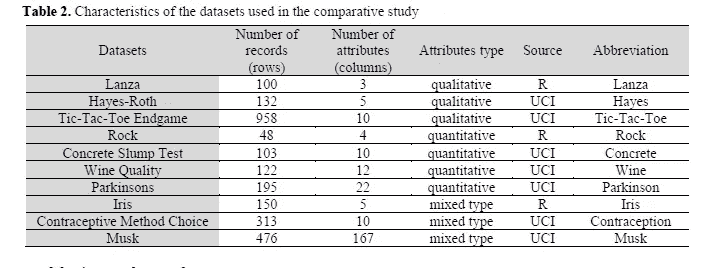
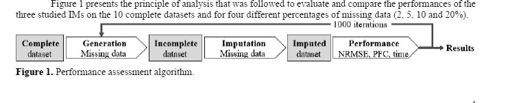
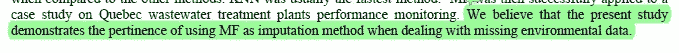
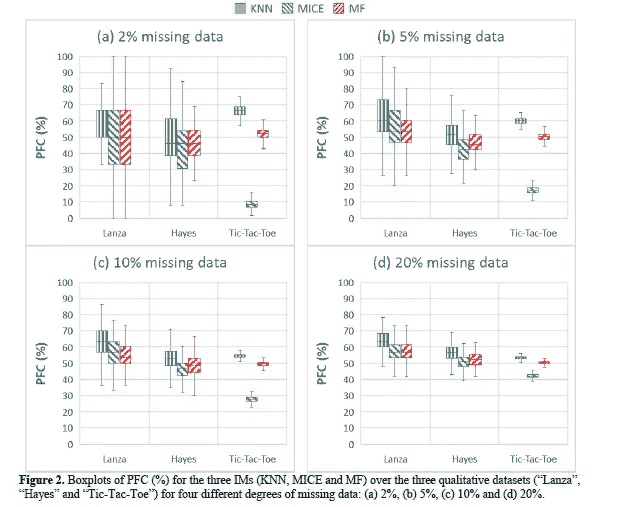
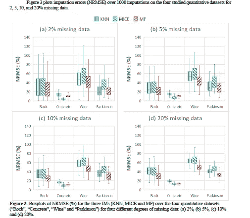
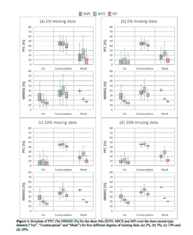
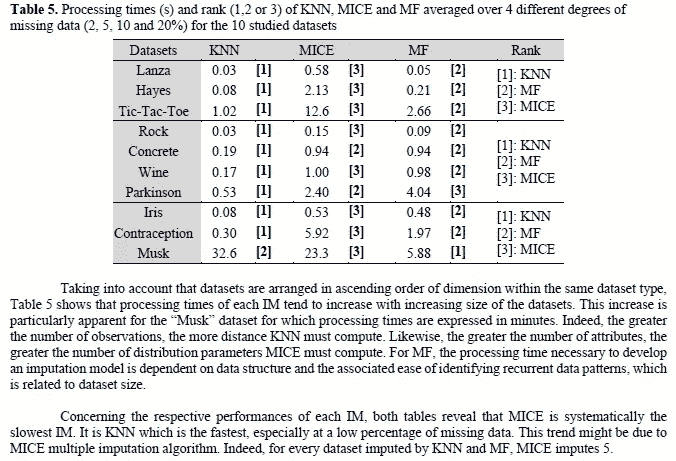

# 如何处理缺失的环境数据

> 原文：<https://medium.com/codex/how-to-handle-missing-environmental-data-ff0354ec013b?source=collection_archive---------7----------------------->

## 他们回顾了一系列插补技术，以找到最好的方法

在现实世界中处理机器学习数据时，缺失数据是一个非常常见的问题。传感器可能会损坏。可能会记录无效数据。调查信息可能没有填写完整。很多事情都会出错。那我们该怎么办？我们可以丢弃不完整的数据。但是如果我们最终只有一个小的数据集呢？如果我们丢失了非常重要的样本呢？当我处理数据时，我几乎从不丢失数据点。在最坏的情况下，这给你的学习增加了一些噪音，从长远来看，这在处理概化模型时可能更好。

使用的数据集。请注意所有 3 种属性类型的使用。

相反，我更喜欢输入缺失的数据。这只是意味着使用一些规则来填充缺失的数据。你具体的指责政策是由很多因素决定的。论文作者“缺失环境数据插补方法的计算研究”研究了 3 种不同的数据插补政策，以找到最佳方案。在这篇文章中，我将谈谈论文中有趣的发现。我还将分享关于实验设置的积极方面，你应该将它们纳入你的机器学习项目。请在下面的评论中让我知道你对哪一点最感兴趣(或通过 DMs)。我很想多了解一下你们的想法。一如既往，带注释的论文将在下面链接。一定要去看看，从报纸上获得我所有的见解。

# 积极的一面

以下是团队做的一些事情，你应该在你的项目/白皮书中做。

## 清楚地定义问题+限制

你可以为你的机器学习项目做的最好的事情之一就是勾画出每一个具有挑战性的方面。提及挑战是什么，为什么会有问题，以及你认为什么是可接受的解决方案。这让你的项目更加清晰。例如，这篇论文很好地解释了处理环境数据的挑战。用作者的话说:

> “在结构良好的数据库中组织环境数据是一项具有挑战性的任务(Blair 等人，2019)。一方面，自然环境受到人类活动的影响，这需要跨学科的研究和分析。另一方面，自然现象覆盖不同的时间和空间尺度，并且通常是相互关联的，这使得数据集成变得困难。这通常会导致异构数据源，并且通常会产生具有定性和定量条目的混合性质的数据库。”

找出绊脚石有助于设计解决方案。或者，你可以做一些简化的假设，只是记下复杂性(在我的供应链工作中，我们经常这样做)。无论你选择哪条路线，明确定义的挑战都有助于你找到解决方案。

清楚地定义限制/挑战也有助于其他人理解你在团队工作时的思维过程。这使得协作更加有效。

## 差异会计

数据集可能有很多差异。包括丢失百分比和被跟踪特征的性质/分布。这篇论文的作者承认这一点，并解释了这两个问题。在描述论文的第 1 阶段时，他们这样描述实验设置，“*我们从文献中的各种来源选择了 10 个数据集，并通过随机删除一些条目，人工获得了不同程度的缺失数据。这组选定的数据库被选来代表在分析环境数据时发现的典型特征，例如不同的维度以及不同的数据类型和结构特征。*

请注意，它们考虑了遗漏程度(丢弃不同数量的数据)和性质(使用不同的数据库)的差异。这对于您自己的项目来说是非常好的实践。**请记住，他们是从完整的数据集中删除数据。**这使得他们能够准确地比较结果。

良好的表现

# 关注性能

现在来回答你点击这篇文章的问题。你该怎么办？总的来说，论文显示 missForest 是最好的数据插补政策(就误差而言)。他们使用的其他方法是通过链式方程(MICE)(由 Buuren 和 Oudshoorn，1999 年)和 K-最近邻法(KNN)(由 Troyanskaya 等人，2001 年)进行多元*插补。*本节的其余部分将通过不同的实验来研究结果。

直截了当

## 定性数据集

对于定性数据集，我们看到缺失的增加会增加误差(PFC)。这并不令人震惊。井字游戏是这种游戏的一个例外，应该对它进行研究，因为它的行为很有趣。

作者是这样说的:

> “即使 KNN 是系统性表现最差的即时通讯，但无论是 MICE 还是 MF 都没有在其他即时通讯中脱颖而出。在 1000 次模拟中，平均而言，MF 在“Lanza”上的表现最好，而 MICE 在“Hayes”和“Tic-Tac-Toe”上的表现优于 MF。然而，由于“井字游戏”中鼠标错误的显著增加，随着丢失数据百分比的增加，它失去了优势。

## 定量数据集

以上是使用 NRMSE 作为定量数据的度量标准的误差计算。总体而言，MF 在几乎所有情况下都优于其他政策。作者对共线性和趋势有有趣的评论。我建议您阅读一节来获得它们。为了保持文章简洁，我在这里不提及它们。

## 混合数据

对于混合数据，PFC 和 NRMSE 的组合用于不同的遗漏百分比。我们认为 MF 脱颖而出，成为明显的赢家。引用这些论文，“*在图 4 的图表上，三个 im 各自的性能之间的比较表明，MF 在每种情况下都优于 MICE 和 KNN。”*

简而言之，使用 missForest 来估算缺失的环境数据几乎不会出错。

# 关于加工时间的一个注记

该团队还研究了代码的处理时间。虽然这通常不是一个问题(插补只需要做一次)，但它仍然是一个重要的方面。如果您的成本非常有限，他们会发现:

TL；老鼠博士很慢。

# 关闭

作为一名森林至上主义者，我显然对结果感到满意。更严肃地说，这篇论文有很多值得教授的内容。我挣扎着写什么，因为我可以在这里写 3 篇不同的文章。最后，这个特殊的主题似乎是最有价值的。但是，请务必阅读论文(尤其是案例研究)。作者做了非常酷的工作。如果你想跟进这件事，请在下面的评论中告诉我。

这篇论文的一个有趣的扩展可能是评估正在使用的政策的复杂性。下面是一个解释贝叶斯信息标准的视频，作为时间的替代，它可能是一个有用的基础。

请喜欢并订阅！！！

如果你们喜欢这篇文章，请与他人分享，并在 Medium 上鼓掌。它帮助我们的社区成长。下面是可下载的带注释的论文。

# 向我伸出手

如果那篇文章让你对联系我感兴趣，那么这一部分就是为你准备的。你可以在任何平台上联系我，或者查看我的其他内容。如果你想讨论家教，发短信给我。如果你想支持我的工作，使用我的免费罗宾汉推荐链接。我们都有免费的股票，对你没有风险。**所以不使用它只是失去免费的钱。**

查看我在 Medium 上的其他文章。:【https://rb.gy/zn1aiu 

我的 YouTube:[https://rb.gy/88iwdd](https://rb.gy/88iwdd)

在 LinkedIn 上联系我。我们来连线:[https://rb.gy/m5ok2y](https://rb.gy/f7ltuj)

我的 insta gram:[https://rb.gy/gmvuy9](https://rb.gy/gmvuy9)

我的推特:[https://twitter.com/Machine01776819](https://twitter.com/Machine01776819)

我的子栈:【https://codinginterviewsmadesimple.substack.com/】T2

twitch 现场对话:【https://rb.gy/zlhk9y 