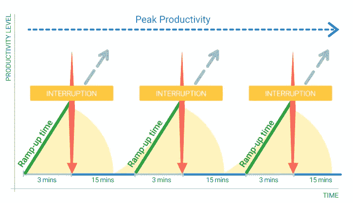
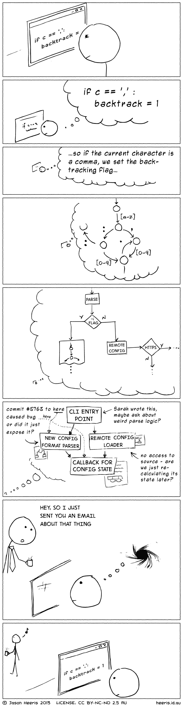
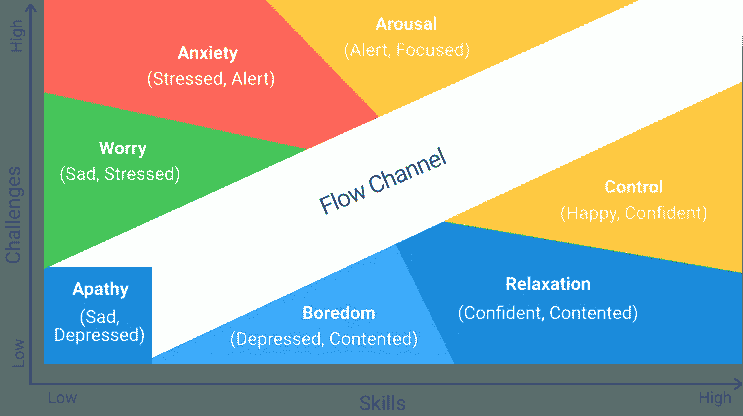
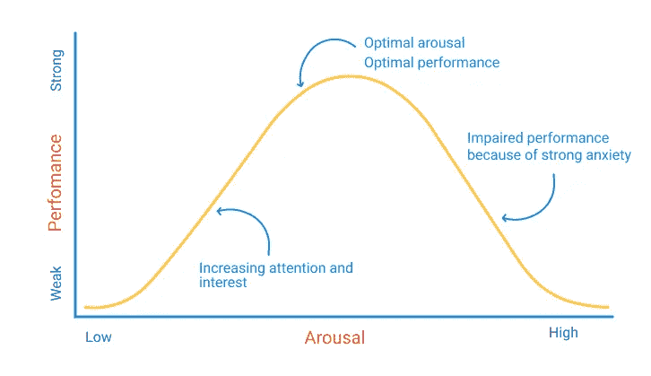
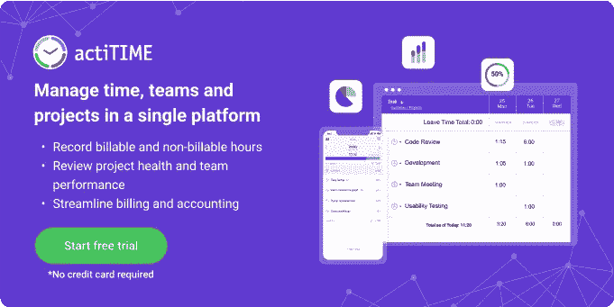

# 如何帮助开发人员在流程中工作

> 原文：<https://medium.com/codex/how-to-help-developers-work-in-the-flow-1d2bdeabb163?source=collection_archive---------7----------------------->

费尔南多·埃尔南德斯在 [Unsplash](https://unsplash.com/) 上的照片

开发人员的工作是对脑力要求最高的工作之一。开发人员使用复杂的算法，在他们的短期记忆中处理多种事情，并做许多其他脑力操作来编写代码，任何中断都可能导致这些细节崩溃。为了有效地运作，他们需要每一秒都集中注意力，或者，如果足够幸运的话，在心流状态下工作。

也被称为“地带”，心流是一种精神状态，在这种状态下，一个人完全沉浸在手头的活动中，同时体验到一种充满活力的专注和享受的感觉。当你的知识、动机和注意力结合起来产生最大的绩效时，这是一种神奇的感觉。如果您的开发团队很难在流动状态下工作，这意味着您需要审查您的工作场所政策和管理方法。

在本文中，我们将详细讨论流状态现象，回顾阻止您的团队成员在流中工作的工作场所趋势，并提供一系列关于如何帮助开发人员交付最大成果的建议。

# 心流状态心理学

“心流状态”是由积极心理学家米哈里·契克森米哈提出并推广的，他是里程碑式的著作《心流:最佳体验心理学》的作者。他将心流定义为“意识的最佳状态，在这种状态下，我们感觉最好，表现最好。”它的特点是深度专注的状态，在这种状态下，你会忘记时间，毫不费力地充分利用你的技能。经历过心流[的人描述](https://www.ted.com/talks/mihaly_csikszentmihalyi_flow_the_secret_to_happiness#t-883527)以下感受:

*   集中精力参与活动
*   置身于日常现实之外的狂喜感觉
*   清楚地知道做什么和怎么做
*   对自己技能的信心
*   宁静的感觉
*   时间过得很快
*   交付成果的内在动力。

感谢现代神经科学，我们知道在心流状态下，人类大脑[会产生](https://www.psychologytoday.com/us/blog/the-playing-field/201402/flow-states-and-creativity)诱发快感和提高表现的化学物质，使我们能够更好地处理信息并享受活动。据心流研究集体的执行董事[史蒂文·科特勒](https://bigthink.com/videos/the-neurochemistry-of-flow-states-with-steven-kotler)称，心流基因组项目完成的一项研究显示，心流状态可以增加 500–700%的创造力。

流动状态的好处可以总结如下:

*   **提高学习和技能发展。**只有当活动需要更好的技能、提出积极的挑战并提供成长机会时，才能达到心流状态。
*   **性能增强。一项为期 10 年的研究表明，处于心流状态的人工作效率会提高 500%。**
*   **更有创造力。**根据悉尼大学进行的一项研究，心流状态[会增加解决创造性问题的能力](https://www.mybrainfirst.com/blog/the-neuroscience-of-flow-and-creativity)。
*   **参与度提高**因为处于心流状态的人[更沉浸于](https://www.scielo.br/j/pusf/a/dVCtFXSMRPSfFmjNpxTZxMF/?lang=en)他们的活动中。
*   **更大的享受和成就感。**在心流状态下工作，感觉毫不费力且有收获，这增加了满足感。
*   **增强内在动机。**享受带来内在的动力，为了内在的回报去做事。

现在想象一下，如果你能和你的团队一起实现所有这些好处:这将提高员工的满意度和生产力数倍！但在现实中，现代工作场所和管理方法造成了多重障碍，阻碍了团队的流动工作。

# 工作场所干扰的压抑状态

职场是最大的流量杀手。[研究](https://www.sciencedirect.com/science/article/pii/S0747563213000435)显示，一个普通员工每天会经历大约 87 次干扰，或者在被干扰前只花 3 分钟完成一项任务。在佐治亚理工学院进行的另一项[研究](https://www.ics.uci.edu/~gmark/chi08-mark.pdf)显示，中断后平均需要 25 分钟才能回到原来的任务。如果我们把这些数据放在一起，我们会得到下面的图表，说明一个普通工人的浓度趋势。

如果你问开发人员，对他们来说[最讨厌的事情之一](https://dev.to/actitime/what-are-the-worst-nightmares-for-devs-56m2)就是在一个困难的任务中被打断。Jason Heeris 的著名漫画[展示了一个分心的开发人员的内心世界。](https://heeris.id.au/2013/this-is-why-you-shouldnt-interrupt-a-programmer/)

Stack Overflow 的联合创始人乔尔·斯波尔斯基(Joel Spolsky)曾经说过:“生产力取决于能够一次性处理短期记忆中的许多小细节。任何干扰都会导致这些细节崩溃。当你重新开始工作时，你记不起任何细节(比如你正在使用的局部变量名，或者你在实现那个搜索算法的时候到了哪里)，你必须不断地查找这些东西，这会使你的速度慢下来，直到你恢复速度为止。”

开发人员没有达到心流状态的第二个原因是他们打断了自己。一些研究表明，像任务转换这样的自我干扰比外部干扰更具破坏性。一些消息来源，包括乔尔·斯波尔斯基，声称程序员每天只有一次不受干扰的 2 小时会议。

> 当我看到其他人似乎都很努力地工作时，我感到有点内疚，我一天大概能工作两三个小时，但我仍然是团队中最有效率的成员之一。——[*乔尔·斯波尔斯基*](https://www.joelonsoftware.com/2002/01/06/fire-and-motion/) *，栈溢出的联合创始人*

阻碍开发人员实现流状态的第三个原因是经理和他们的管理方法。但是在我们详细讨论给管理者的实际建议之前，让我们看看是什么阻碍了人们进入心流状态。

# 流动状态杀手

心流是一种处于精神唤醒和控制边缘的意识状态。达到这个目标需要 15-25 分钟的全神贯注，但它不会每次都发生，如果发生了，分心的事物会在几秒钟内破坏它。许多开发人员很难达到心流状态，如果他们被下面的反心流情绪分散注意力:焦虑、担心、愤怒、冷漠、无聊、放松。让我们看一些引起这些情绪的事件和环境的例子:

*   不切实际的任务预估和期限导致的担心和焦虑。
*   被个人或职业问题困扰。例如，在一家不提供公平报酬、不了解员工需求的公司工作。
*   对一项任务或项目不感兴趣，因为它不够有挑战性。

这些不平衡的情况会带走能量(这项工作太重复了，我根本不想学任何新东西。我不知道怎么做。)、专注(背景中的闲聊让我无法集中注意力。我无法停止思考我的同事的那个讨厌的评论)或者清晰性(我希望这个看起来像什么？这比看起来更复杂，我真的能完成吗？).因此，它们可以总结如下:

*   清晰杀手:模糊的目标，不明确的期望，粗略的计划，无力的时间规划。
*   **注意力杀手:**压倒性的、内在的和环境的分心、干扰。
*   **能量杀手:**无聊、焦虑、急躁、疲惫。

为了识别阻止您的团队在流程中工作的问题，您可以参考下面的流程模型。根据米哈里·契克森米哈的观点，如果一项任务的挑战性与执行这项任务的人的技能水平大致相当，那么它就会创造出最佳的环境来实现最大的生产率，并从工作中获得最大的享受和满足感。

让你的开发团队找出图表上最能引起他们对工作感受共鸣的点。如果他们把自己的观点放在左上角，说明他们很焦虑或者压力很大，需要提高自己的技能才能回到流道。如果他们的观点在右下角，你需要给他们分配更困难和责任更大的任务，这样他们就可以发挥自己的潜力并成长。

> 通常人们会感到无聊，因为他们的技能增加了。他们向前迈出了一大步，他们学到了很多东西。也许他们只是运送了一些东西或者征服了一个障碍，现在他们并不觉得自己受到了挑战，”——[*辛西娅·麦克斯韦*](https://review.firstround.com/track-and-facilitate-your-engineers-flow-states-in-this-simple-way) *博士，网飞的工程师。*

与每个团队成员举行一对一的会议，讨论他们的流程图结果，并在工作量分配、工作场所政策、时间和团队项目管理方面做出个人和重大改进。定期举行这些访谈，比如说每三个月一次，以回顾趋势并回顾引入的改进的性能。

让我们看看作为一个管理者，你能做些什么来帮助开发人员更经常地在流状态下工作。

# 如何帮助开发人员在流程中工作

许多经理犯了同样的错误:他们推动团队表现得更好，而不是为员工创造最佳表现所需的条件和环境。不要把数字和绩效指标放在第一位，你需要优先考虑员工的需求，质量绩效就会随之而来。高生产率不是目标，而是符合双方利益的明智管理战略的结果。

> *“问题是:如何让你的团队更多地融入他们的工作，而不是让他们做更多的工作”——*[*辛西娅·麦克斯韦*](https://review.firstround.com/track-and-facilitate-your-engineers-flow-states-in-this-simple-way) *博士，网飞大学工程师*

因为我们把所有的流动杀手分成三组，这意味着我们已经确定了流动状态的三个基本组成部分。让我们看看管理人员可以做些什么来防止流状态杀手，并为开发团队提供最大的能量、注意力和清晰度。

# 如何提高清晰度

*   **明确优先级。定期向您的团队更新项目进度和优先级。强调单个开发人员如何为项目开发做出贡献，以及他们在工作范围内的优先事项。**
*   设定现实的目标。经理不是商业演说家:你的任务不是发表鼓舞人心的演讲，而是为你的团队设定现实的期望。使用以前的绩效数据更准确地计划他们的工作量。

> 人们想为事业而工作，而不是为了生活—[*Cal Newport*](https://positivepsychology.com/flow-at-work/)

*   确保可见性和透明度。促进紧密协作和无限的知识共享，以避免孤岛、障碍和项目延迟。实施[时间和项目管理系统](https://www.actitime.com/)，团队中的每个成员都可以回顾项目进展并进行协作。
*   **用足够的个人技能应对挑战。**根据心流理论，如果挑战和能力之间的差距太大，人们就会变得焦虑和有压力。如果长时间处于压力之下，员工往往会筋疲力尽。因此，将具有挑战性的任务分配给那些技能与挑战的复杂性相匹配或略低于要求的开发人员。
*   **创建** [**知识共享知识库**](https://www.monterail.com/blog/knowledge-sharing-software-development-company) **。**建立一个基于社区的知识库，开发者可以在这里分享他们的知识并回答常见问题。这将减少工作场所干扰的数量，并提供一种在不中断流程的情况下获取信息的方法。
*   把工作分成小块。对你的团队成员来说，持续一周又一周的太大的任务可能会让他们感到难以承受，因为他们觉得自己没有取得任何进展。相反，把它们分成易于管理的子任务。

# 如何增强专注度

*   考虑 Scrum 方法论。在实现流程状态方面，Scrum 比敏捷开发有几个[优势](https://www.guru99.com/agile-vs-scrum.html)。它通过每日站立会议培养自组织团队和即时反馈。
*   召开每日站立会议。站立会议提供了透明度，并涉及社会风险，这是一个积极的压力源，推动个人开发人员的绩效极限。
*   **建立协作。允许开发人员分享令人烦恼或引起焦虑的问题。鼓励协作和知识共享，以消除知识差距，促进沟通。**
*   **介绍** [**积极压力**](https://positivepsychology.com/what-is-eustress/)——以积极的方式感受压力的情况:开发人员感觉他们可以应付，尽管感觉受到挑战。这些压力应该是短期的、充满活力的，并且在我们的应对能力之内。例如，每日站立会议上的社会压力:连续几次会议都没有任务更新，这感觉很糟糕，但却能激励人们取得成果。

耶基斯-多德森定律图说明了最佳唤醒状态和最佳表现之间的关系

*   **不要使用 KPI。**KPI 是开发人员[最讨厌的事情之一](https://twitter.com/coffeestasia/status/1406247122664628231)。这并不奇怪，因为 KPI 会导致长期压力，从而导致负面压力并对绩效产生负面影响。
*   **没有开会的日子。**每周设定一天不开会，以保证开发人员有不受干扰的时间集中精力。
*   **支持群体多样性。**不同想法的团队带来了积极的挑战，产生了更广泛的解决问题的方法并培养了创新思维。
*   **设计更好的工作环境。**制定准则，规定办公室里分心和防分心的时间。
*   鼓励开发人员在被打断后记录他们的思路或记录他们的代码。
*   **照顾感觉不安全或被评判的开发者。感觉不受欢迎或不受重视的少数群体成员将难以集中注意力，无法达到心流状态。**
*   提供灵活性，但要设定界限。尊重员工的个人节奏，鼓励他们控制自己的时间和精力。提供灵活的工作时间、个性化的工作空间等等，但要设定界限。

# 如何增加能量

*   **减少微观管理。微观管理会打击士气，引入不必要的干扰，扼杀积极主动的态度。相反，给开发者空间来管理他们的资源和展示他们的技能。**
*   鼓励自我领导。创造一个环境，让每个人都可以在任何时候贡献自己的专长，以鼓励团队流动。

> 员工的决策权越大，他对自己角色的承诺就越大。这将转化为更高的绩效和工作满意度。

*   整合即时反馈。持续的反馈确保开发人员在正确的轨道上，并给他们特定的方法来扩展他们的极限——这种平衡可以产生一种流动状态。
*   **提供有意义的、个性化的认可。**写个人笔记，表达口头认可，用财务激励激励开发者。
*   **允许员工创新和探索，而不用担心犯错。错误不是失败，而是学习和创新的机会。尽可能允许这种风险。**
*   鼓励平等参与。当团队成员扮演平等的角色并具有可比的技能水平时，更有可能发生团队流动。如果一个团队成员表现出支配或傲慢，团队流动就会受阻。

# 如何在不打断团队流程的情况下管理团队？

总之，鼓励个人和团队流动的有效项目管理包括信任，并鼓励开发人员积极主动，采取主动并提供解决方案。它包括知识共享、反馈、协作，并排除自我、支配、傲慢、微观管理和关键绩效指标。有效的项目经理创造一种环境，在这种环境中，开发人员和利益相关者的目标和需求以平衡的方式得到满足，并使用工具来跟踪他们团队中正在发生的事情。

如果你正在寻找一个流程友好的时间管理解决方案，考虑一下 acti time——一个让效率跟踪变得毫不费力、毫无压力的软件。actiTIME 不会用弹出窗口或烦人的通知来打扰你，并为你提供三种不同的记录工作时间的模式:web 界面、浏览器扩展和移动应用程序。在 actiTIME 中，经理可以构建定制的工作流和复杂的项目，计算工资单和项目成本，管理远程员工和员工的缺勤。通过 30 天免费试用[探索整套功能](https://www.actitime.com/free-online-trial)或请求[产品演示](https://www.actitime.com/demo-request)以获得产品之旅，并找出它是否适合您的需求。

