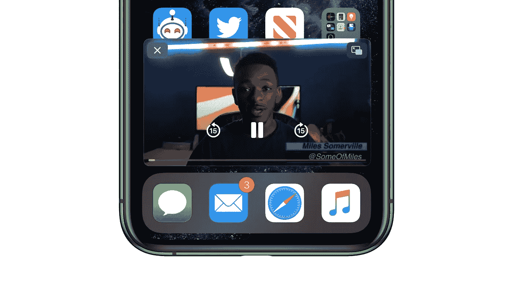

# 如何在 iOS 上非正式地启用 YouTube 画中画模式

> 原文：<https://medium.com/codex/how-to-illegally-enable-youtube-picture-in-picture-mode-on-ios-bab46233cffa?source=collection_archive---------11----------------------->

## 我想到的最简单的方法

图片由 [9to5Mac](https://9to5mac.com/2020/09/17/how-to-picture-in-picture-video-iphone-ios-14/) 提供

你记得吗？YouTube 一直只为付费用户提供画中画模式。

但当苹果推出 iOS 15 时，它意外地允许每个 iPhone 用户在 Safari 上的 YouTube 上播放 PiP，不管他们付费与否。