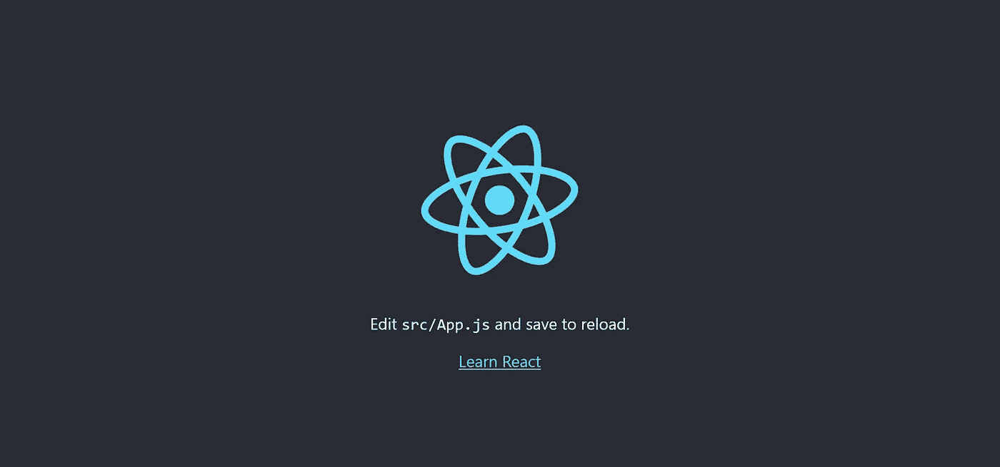
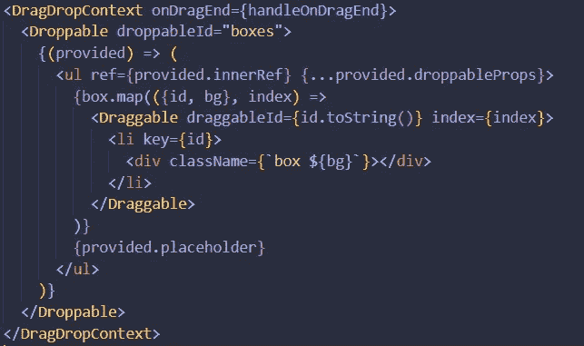

# 如何用 Create-React-App 和 react-beautiful-dnd 实现一个简单的拖拽？

> 原文：<https://medium.com/codex/how-to-implement-a-simple-drag-and-drop-using-create-react-app-and-react-beautiful-dnd-4e6e57a2299f?source=collection_archive---------4----------------------->

今天，我在做一个个人项目，我必须实现一个拖放功能，以允许在我的应用程序中进行更多的定制。我在文章、官方文件和 YouTube 视频上花了很多时间。经过一个漫长的研究和尝试实现的过程，我终于让它工作了。但是怎么做呢？在我们开始之前，让我们创建一个 React 应用程序！

```
npx create-react-app dnd-example
cd dnd-example
npm start
```

恭喜你！现在我们有了一个 React 应用程序。



然而这仅仅是开始。让我们安装今天要用的软件包。

`npm i react-beautiful-dnd`

如果你不知道 react-beautiful-dnd 是什么，那完全没问题。这是一个由吉拉背后的公司 Atlassian 的一个了不起的团队开发的图书馆。它也是完全开源的，这个项目可以在这里访问[。接下来，我们需要在一个`DragDropContext`组件之间包装我们的应用程序。记住，你只能有一个`DragDropContext`,所以把你的整个应用包在里面是个好主意，这也是官方文件建议你使用它的方式。这是我的`App.js`文件目前的样子。](https://github.com/atlassian/react-beautiful-dnd)


`DragDropContext`使用拖拽功能需要 react-beautiful-dnd 报价。我们使用的库不支持嵌套的 DragDropContexts。然而，`DragDropContext`需要一个`onDragEnd`回调。一旦你完成了元素的拖动，这个回调就会被调用。为了简单起见，我将使用一个函数。我不会给出可复制粘贴格式的代码，因为我认为实践很重要。以下是我们的应用目前的情况:


让我们一个一个的分解。

我们定义了一个函数，我们称之为 handleOnDragEnd，它接受一个参数，我们称之为 result。这个参数现在并不重要，我们稍后再讨论。为了让我们的拖放功能工作，它需要被包装在一个`DragDropContext`组件之间。它有许多可用的道具和回调，但除了 onDragEnd 之外，它们都不是必需的。因此，我们将处理函数作为道具添加到 DragDropContext 组件中。让我们在网站上添加一个红框列表，这样我们就有东西可以拖放了。对于 HTML 和 CSS 代码，我将继续给你代码，因为这不是一个 HTML 或 CSS 教程。在我们的`App.js`文件中，我们需要 DragDropContext 标签中的可拖动内容。因此，我将继续这样做:


```
<ul><li><div className="box red"></div></li><li><div className="box green"></div></li></ul>
```

在我们的`App.css`文件中，我将这样做:


```
ul {list-style: none;padding-left: 5px;}.box {width: 200px;height: 50px;margin-bottom: 5px;}.red {background: red;}.green {background: green;}
```

这些我就不细说了。你会注意到我们仍然不能拖放我们的盒子。让我们先把重点放在放弃它们上。为此，我们需要导入另一个名为`Droppable`的组件。Droppable 帮助您定义可以放置元素的区域。对于我当前的用例，我希望我的整个`ul`元素是一个可放置的区域。让我们开始吧。


好吧，很简单，对吧？嗯，我们的可丢弃组件也需要一个名为`droppableId`的属性。你可能会问为什么。嗯，你的整个 HTML 页面可以有不止一个可拖放的区域，并且 react-beautiful-dnd 需要识别你将元素放在哪个区域。好吧，我们加个身份。这可以是任何东西，只要它是一个**字符串**。我把它叫做“盒子”


还有更多类似 type、isDropDisabled 等属性，但这将是一个简单的拖放操作。如果你想深入了解，你可以在这里查看他们的官方文件。现在，我们的可删除组件也需要一个带有两个参数的函数。这些论点是:提供和快照。对于这个例子，我们将只使用 provided，这是唯一需要的参数。我们得到了 3 样重要的东西:`provided.innerRef provided.placeholder`和`provided.droppableProps`。简而言之，您需要将`provided.innerRef`绑定到最高可能的 DOM 节点。这有助于在不使用 ReactDOM 的情况下查找 DOM 节点。当你拖动一个元素时，创建一个占位符空间。将占位符放在绑定了`provided.innerRef`的组件中很重要。您可能已经注意到，我们的最后一个道具`provided.droppableProps`是一个 spread 操作符。它包含了 react-beautiful-dnd 所需的所有数据和样式。请记住，您需要将所有这些道具放在同一个元素中。如果你有一个内嵌样式，你需要先打出这些道具，因为`provided.droppableProps`也包含样式，它会覆盖你的内嵌样式。让我们将所有这些付诸实践:


如果你现在检查你的网站，什么都不会改变。但是为什么呢？嗯，我们的元素仍然不能拖动！我们现在就开始努力吧。首先我们需要导入`Draggable`。在许多情况下，Draggable 类似于 Droppable，它只是使我们的元素可以拖动。与 DragDropContext 相反，可以有多个 Droppable 和 Draggable。Draggable 总是需要包含在 drop table 中，而 drop table 总是需要包含在 DragDropContext 中。与`Droppable`类似，`Draggable`也需要一个 ID，因为在同一个文档中可以有多个 ID。然而，在我们继续之前，我想重构我的一些代码，因为你最有可能使用数组而不是手写的 div。我还会解释它背后的逻辑，所以即使你用它与手写的 div，你会没事的。如果您正在跟进，我将在我们的应用程序组件中定义一个简单的对象数组，如下所示:


不言自明。现在，让我们重构显示 div 的方式:


本文假设您至少对 React 有基本的了解，所以我不会详细介绍`map`是做什么的。我析构了我们的数组，并给列表项分配了一个键值。对于这个类，我使用了所谓的模板文字。如果你不知道那是什么，你可以在这里阅读我的文章。如果你刷新页面，绝对不会有任何改变。现在让我们开始添加拖动功能到我们的网站。首先，我需要在我们的`Draggable`组件之间包装我希望可拖动的内容。在我的例子中，这是我们的`li`元素。


`Draggable`需要索引和 ID。ID 需要再次成为字符串。我们将使用从`map`函数中得到的索引。嗯，问题是我们的 ID 是一个数字……这就是为什么我们要使用传统的`toString()`函数。我们开始吧！



好吧，现在我们有进展了。与`Droppable`类似，我们的`Draggable`组件也需要一个带有两个参数的函数。这些争论是我们的老朋友`provided`和`snapshot`。同样，我们将只使用 provided，这是唯一必需的参数。类似于`Droppable`，我们得到 3 样重要的东西；`provided.innerRef`、`provided.draggableProps`、`provided.dragHandleProps`。同样，这些需要绑定到同一个元素。他们做的和`Droppable`差不多。我们将这些添加到列表元素中，因为我们希望它是可拖动的。


然而，会有一点小调整。我们将把关键道具移到我们的`Draggable`组件中。每个可拖动元素都需要一个键。


好吧，太神奇了！现在，如果你刷新页面，你应该能够拖放你的元素，哇！


好吧，很好，但这毫无意义。当我拖放元素时，它甚至不能保存。为此，我们将使用**状态**。我们来定义一个状态。一、导入`useState`。


接下来，我们定义一个状态。我把它叫做盒子，我也会在开始的时候去掉我们的数组，把它赋给我们的状态。


好吧，如果你刷新页面…绝对什么都不会改变！那是因为我们没有处理拖动结束时发生的事情。这就是我们定义`handleonDragEnd`的原因，对吧？好吧，让我们开始吧！我将从简单的控制台开始，记录结果。


好的，这是一个有很多我们可以使用的新奇事物的对象，但是我们现在只对`destination`和`source`感兴趣。Source 有关于我们拖动的元素的信息，destination 有关于我们把它拖动到哪里的信息，你猜对了。有了这些知识，我将从我们的盒子数组中创建一个新数组。


太好了。接下来，我想删除从我的新数组中拖动的任何元素，并将其添加到它被移动的位置。为此，我需要使用源和目标的索引，如下所示:


好吧，但这本身并不意味着什么，对吧？我们只是创建一个新的数组。嗯，我们必须将我们的状态设置为新数组，如下所示:


现在，让我们再次检查我们的网站！


嗯，有效！但是有一个小问题。如果我把我们的盒子拖放到一个没有定义的地方会怎么样？让我们试试:


不出所料，我的盒子回到了原来的位置，我得到了这个错误。解决办法很简单。如果目的地为空，只需返回，如下所示:


现在你有一个完美的工作简单的拖放功能使用反应-美丽-dnd 由 Atlassian！我将在下面添加一个 GitHub repo 链接，供人们检查我为本文编写的代码。

和往常一样，如果您对这段代码有任何改进或者有任何问题，请在下面留下您的评论。如果你想看更多我日常学习中的文章，也可以考虑关注我。说到这里，我会在我的下一篇文章中看到你！

[Github 回购](https://github.com/Arintia/medium-dragndrop)