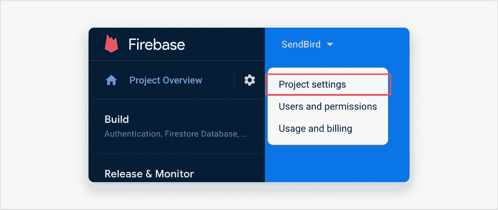

# 如何用 Sendbird 聊天和 Firebase 实现 Android 推送通知

> 原文：<https://medium.com/codex/how-to-implement-android-push-notifications-with-sendbird-chat-firebase-c7eb77aee027?source=collection_archive---------10----------------------->


仙鸟 2022

## 关于如何使用 Sendbird Chat 为 Android 应用程序发送及时推送通知的分步教程

由塔哈·萨吉尔
解决方案工程师| [Sendbird](https://www.sendbird.com/)

*我们建议您查看 Android* [*示例 app*](https://github.com/sendbird/SendBird-SDK-Android) *获取您需要的代码。如果您需要更多指导，请访问我们的* [*文档*](https://sendbird.com/docs/chat/v3/android/guides/push-notifications#1-push-notifications) *。不要忘记查看应用内聊天的* [*演示*](https://sendbird.com/demos/in-app-chat) *，并访问我们的* [*网站*](https://sendbird.com/features/chat-messaging) *了解更多关于 Sendbird Chat 可以提供的服务。*

> *为了第一个了解新教程、开发者相关聊天/电话发布以及其他重要更新，* [*注册*](https://get.sendbird.com/dev-newsletter-subscription.html) *获取我们的开发者简讯。*

# 简介:什么是推送通知，为什么它们很重要？

推送通知是当设备空闲或在后台运行客户端应用程序时，立即发送到用户设备的消息。推送通知很重要，因为它们提供重要的信息、更新和增加用户参与度。此外，推送通知是一个强大的营销渠道，通过它您可以锁定正确的用户，提供有意义的内容，提高转化率，并增强您的客户关怀战略。事实上，根据 [**RubyGarage**](https://rubygarage.org/blog/benefits-of-push-notifications) 的数据，实施推送通知的组织比不实施推送通知的企业拥有高 3 倍的客户保持率和 88%的参与度！

本教程提供了实现 Android 推送通知的分步说明。

# 先决条件

1.  创建一个 [**仙鸟账号**](https://dashboard.sendbird.com/auth/signup)
2.  确保 [**Sendbird Chat**](https://sendbird.com/features/chat-messaging) 在你的安卓应用中运行良好。你可能想看看关于用 UIKit 构建一个 Android 聊天应用的 [**Kotlin 实现指南**](https://sendbird.com/developer/tutorials/kotlin-chat-tutorial-part-1) 或者这个 [**教程**](https://sendbird.com/developer/tutorials/build-chat-uikit-android) 。 [**文档**](https://sendbird.com/docs/chat/v3/android/quickstart/send-first-message) 包含在您的 Android 应用中实现实时聊天的附加指南。

了解 Android 客户端应用上的推送通知是使用 Firebase 云消息(FCM)或华为移动服务(HMS)发送的，这一点很重要，其中包含您的应用响应通知所需的自定义数据。当一条消息从一个应用程序(通过 Android 的 Chat SDK)发送到 Sendbird 服务器时，服务器会与 FCM 或 HMS 进行通信，然后 FCM 或 HMS 会向 Android 设备发送推送通知。本文主要讨论用 FCM 设置推送通知。

Sendbird 为推送通知提供了两个选项:普通推送通知和支持多设备的推送通知。

一般推送通知支持单设备和多设备用户，并且仅在用户与所有设备完全离线(与服务器断开连接)时发送。换句话说，如果用户在一个或多个设备上在线，通知不会被发送，因此不会在任何设备上显示。另一方面，具有多设备支持的推送通知被传送到所有离线设备，即使当用户在一个或多个设备上在线时。

# Android 推送通知:FCM

[**FCM 报文**](https://firebase.google.com/docs/cloud-messaging/concept-options) 有两种:通知报文和数据报文。根据 [**Firebase 文档**](https://firebase.google.com/docs/cloud-messaging/concept-options) ，“通知消息有一组预定义的用户可见的键和一个可选的自定义键-值对的数据负载。”相比之下，数据消息只包含用户定义的键值对。Sendbird 使用数据消息，允许客户端应用程序创建由这些自定义键值对组成的自定义消息有效负载。

按照以下步骤为 FCM 设置推送通知。开始之前，请确保您可以访问 [**Firebase 控制台**](https://console.firebase.google.com/) 。

让我们开始吧！💻

# 步骤 1:获取 FCM 的服务器密钥

Sendbird 服务器需要 FCM 服务器密钥来代表您向 FCM 发送通知请求。您可以按如下方式查看 FCM 服务器密钥:

1.  登录 [**Firebase 控制台**](https://console.firebase.google.com/) 。创建一个新的 Firebase 项目，或者使用已有的项目。


2.打开您的项目并导航到“项目设置”,如屏幕截图所示。



3.请转到“云消息>项目凭据”并复制您的服务器密钥以备后用。


# 步骤 2:向 Sendbird 仪表板注册 FCM 服务器密钥

通过仪表板将您的服务器密钥注册到 Sendbird 服务器，如下所示。注意，也可以使用聊天平台 API 的 [**添加 FCM 推送配置**](https://sendbird.com/docs/chat/v3/platform-api/guides/application#2-add-a-fcm-push-configuration) 动作来注册服务器密钥。

1.  登录 [**Sendbird 仪表盘**](https://dashboard.sendbird.com/auth/signin) 并导航至“设置>聊天>通知”。


2.打开“通知”并选择“全部脱机时发送到设备”选项。


3.单击 FCM 凭据旁边的“添加凭据”按钮。输入在步骤 1 中复制的 FCM 服务器密钥。


# 步骤 3:在你的 Android 项目中设置一个 FCM 客户端应用程序

现在我们将把 FCM 配置和依赖项添加到您的 Android 项目中。

1.  在 FCM 控制台中返回到您的项目。点击“添加应用”并选择 Android 平台。


2.在添加应用程序向导中，输入您的软件包名称。提示:您的包名通常是应用程序级“build.gradle”文件中的“applicationId”。

3.下载“google-services.json”文件，并将其放在您的 Android 应用程序模块根目录中。


4.将云消息 Android 库的依赖项添加到 build.gradle 文件中，如下:
*注意:firebase-messaging 版本应为 19.0.1 或更高版本。*

```
dependencies {    ...

    implementation 'com.google.firebase:firebase-messaging:20.1.0'

}
```

# 步骤 4:向 Sendbird 服务器注册推送令牌

要向 Android 设备上的特定客户端应用程序发送通知消息，FCM 需要一个应用程序实例的注册令牌，该令牌由客户端应用程序颁发。因此，Sendbird 服务器还需要每个客户端应用程序实例的注册令牌来代表您向 FCM 发送通知请求。

在应用初始化时，FCM SDK 会为用户设备上的客户端应用实例生成一个唯一的、特定于应用的注册令牌。FCM 使用这个注册令牌来确定需要向哪个设备发送通知消息。您可以通过扩展“com . sendbird . Android . sendbirdpushandler”并重写“onNewToken”来访问此令牌。“SendBirdPushHandler”在内部将此令牌注册到 Sendbird 服务器。

下面是示例实现:

注册的推送令牌出现在仪表板中的“用户>用户 id >聊天”下:


# 步骤 5:添加推送事件处理程序

若要从 Sendbird 服务器接收有关当前用户的推送通知事件的信息，请将“MyFireBaseMessagingService”实例注册到“SendBirdPushHelper”作为事件处理程序。在“Application”实例的“onCreate()”方法中执行此操作，如下所示:

另外，当用户连接到 Sendbird 服务器时，注册一个“MyFireBaseMessagingService”实例，如下所示:

此外，在断开用户与 Sendbird 服务器的连接之前，取消注册所有推送令牌，以便它们不会收到任何通知。

# 步骤 6:处理 FCM 消息有效负载

如前所述，Sendbird 服务器将推送通知有效负载作为 FCM 数据消息发送。有效负载由两个属性组成:message 和 sendbird。消息属性是根据您在 Sendbird 仪表板上定义的通知模板生成的字符串。sendbird 属性是一个 JSON 对象，它包含用户发送的消息的所有信息。

如示例实现中所示，在步骤 4 中，您可以使用自定义的“sendNotification()”方法将解析后的消息作为通知显示给用户。

# 推送通知的故障排除提示

推送通知的故障排除可能很复杂；这里有一些做这件事的技巧。

1.  为了让开发人员更容易调试和排除推送通知的故障，我们构建了一个测试工具，您可能会发现它很有用。请参见本 [**教程**](https://sendbird.com/developer/tutorials/mobile-push-notifications-tester) 以了解如何使用该工具，您可以通过 [**Sendbird 仪表盘**](https://dashboard.sendbird.com/) 访问该工具。
2.  查看这份全面的 [**指南**](https://sendbird.com/developer/tutorials/troubleshooting-android-chat-push-notifications) 来排除 Android 聊天推送通知的故障。
3.  如果要调试故障条件，请参考 [**FCM 错误代码。**](https://firebase.google.com/docs/reference/fcm/rest/v1/ErrorCode)

# 结论

就这样结束了！您现在知道如何使用 Sendbird Chat 为 Android 应用程序发送推送通知了。有了本教程和 [**文档**](https://sendbird.com/docs/chat/v3/android/quickstart/send-first-message) 的指导，你马上就可以发送及时、相关、吸引人的推送通知了！

我们总是在这里提供帮助； [**联系我们**](https://sendbird.com/contact-us) 如果您有任何问题、意见或顾虑。

快乐推送通知大厦！💻我们迫不及待地想看看你的作品！