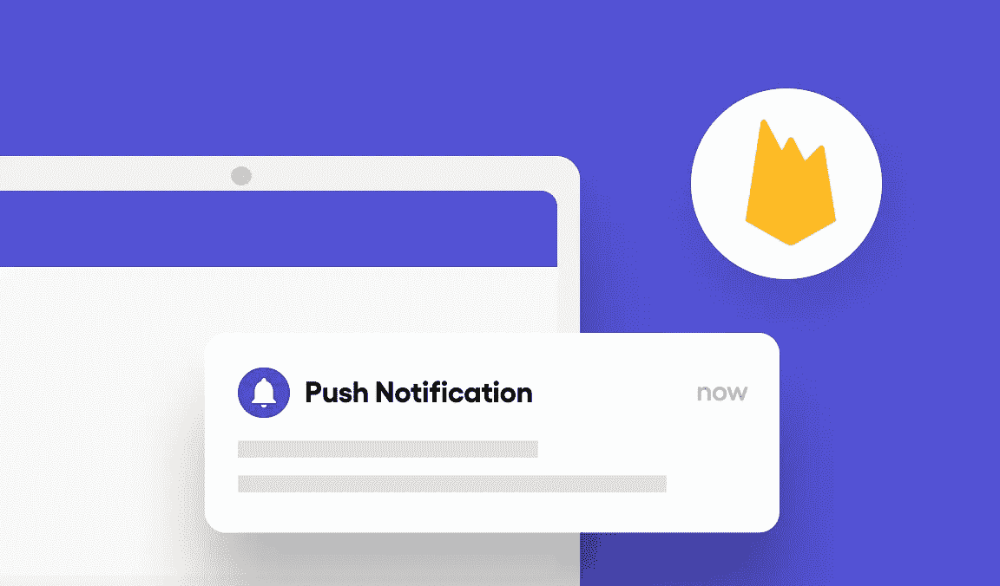
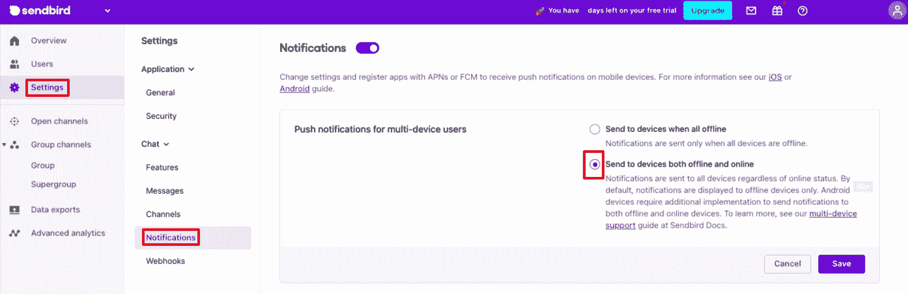
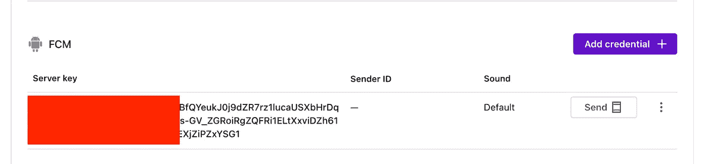
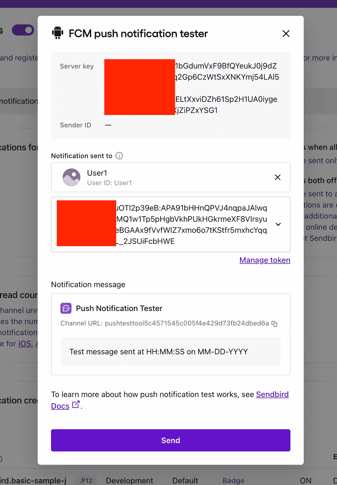
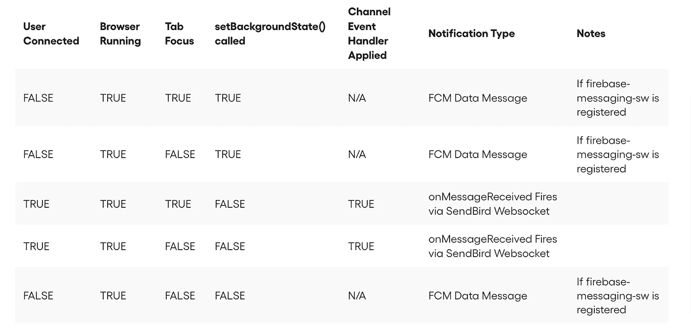
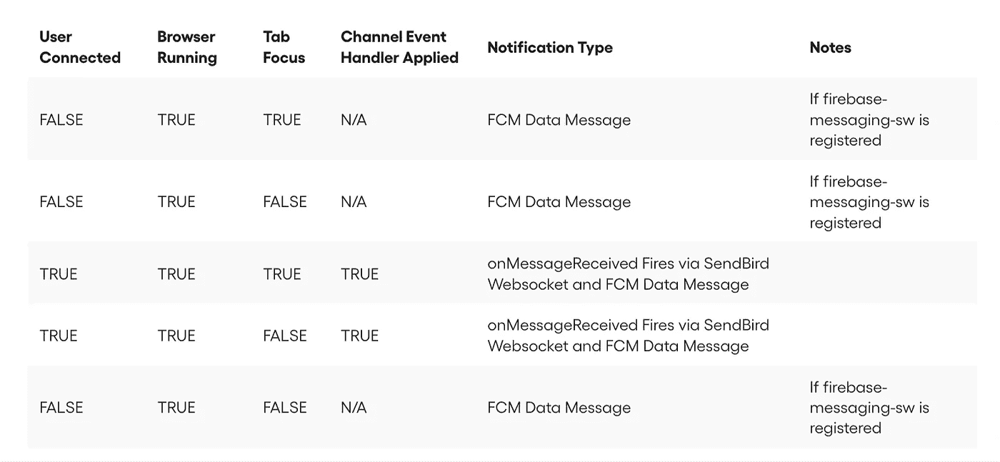

# 如何使用 Firebase 在 web 应用程序上实现聊天推送通知

> 原文：<https://medium.com/codex/how-to-implement-chat-push-notifications-on-a-web-application-using-firebase-f6a8b52bce31?source=collection_archive---------7----------------------->



仙鸟 2022

## 推送通知仅适用于移动设备吗？不再是了！以下是如何在您的 web 应用程序中实现它们

杰森·奥尔肖恩
解决方案工程师| [仙鸟](https://www.sendbird.com/)

*我们建议您查看* [*示例应用*](https://github.com/SendbirdCommunity/sendbird-pwa-push-example) *获取您可能需要的代码。如需更多指导，请访问我们的* [*文档*](https://sendbird.com/docs/chat/v4/javascript/guides/push-notifications) *。别忘了查看应用内聊天的* [*演示*](https://sendbird.com/demos/in-app-chat) *，并访问我们的* [*网站*](https://sendbird.com/features/chat-messaging) *了解更多关于 Sendbird Chat 可以提供的服务。*

> *为了第一个了解新教程、开发者相关聊天/电话发布以及其他重要更新，* [*注册*](https://get.sendbird.com/dev-newsletter-subscription.html) *获取我们的开发者简讯。*

# 介绍

如果你的网络应用可以像你的移动应用一样接收推送通知，那不是很好吗？当您想到推送通知时，您可能只会想到您的移动设备；幸运的是，您还可以在桌面和移动设备上使用 web 应用程序的推送通知。事实上，现在许多网络应用程序都是 PWAs(渐进式网络应用程序)，允许在桌面和移动设备上进行离线访问和推送通知等功能。

在本教程中，我们将讨论如何使用 Firebase 为您的 web 应用程序实现推送通知。在奠定了一些 PWA 概念的基础之后，我们将解释如何设置 Firebase、接收推送通知以及测试您的推送通知实现。本教程结束时，您将知道如何使用 Sendbird Chat 和 Firebase 发送 web 推送通知。

对于本教程，我们将使用 Mozilla 的:

1.  [通知 API](https://developer.mozilla.org/en-US/docs/Web/API/notification)
2.  [推送 API](https://developer.mozilla.org/en-US/docs/Web/API/Push_API)

为了从本教程中获得最大收益，你可能想下载这个非常简单的[应用](https://github.com/SendbirdCommunity/sendbird-pwa-push-example)。

请注意，您需要运行“npm 安装”和“npm 启动”。您还需要更改:

*   火基配置
*   乏味的
*   Sendbird 凭据

让我们开始吧！

# 什么是 PWA？

[**渐进式 web 应用**](https://web.dev/progressive-web-apps/) 是一种外观和行为都像本地应用的 web 应用。例如，如果您的 PWA 在移动设备上访问，它可以在离线时安装和使用，也可以在后台接收推送通知。

## 我需要 PWA 吗？

要从 Sendbird 服务器接收推送通知，您的 web 应用程序必须是 PWA。如今，大多数网络应用程序都可以在桌面和移动浏览器上访问；然而，即使你的应用只打算在桌面浏览器中使用，桌面 PWA 仍然有 [**个好处**](https://developers.google.com/web/progressive-web-apps/desktop) 。

如果您不喜欢 PWAs，您仍然可以使用 [**通知 API**](https://developer.mozilla.org/en-US/docs/Web/API/notification) 在应用程序打开并调用 Sendbird 事件处理程序时向用户显示通知，但这些不是真正的推送通知。

现在让我们来讨论一下推送通知在 web 应用程序上的实现细节。我们要做的第一件事是设置一个服务人员。

# 设置您的服务人员

无论您的应用程序是用普通 JavaScript 编写的，还是使用 React、Angular、Vue 或其他特定框架，您都应该能够创建 PWA。但是，如果使用框架，您可能需要将一些代码移动到稍微不同的位置。如果你使用 React Native，参考我们的 [**文档**](https://docs.sendbird.com/javascript/push_notifications) 。

记住你的 PWA 的关键是服务人员。这个 worker 在后台运行，允许您接收推送通知，以及本教程中没有介绍的其他 PWA 功能。

首先，在项目根目录下创建一个名为 firebase-messaging-sw.js 的空文件。

在 index.js 中，注册 firebase-messaging-sw.js 文件。这将确保浏览器在注册之前支持服务人员。如果已经有了，就省略第一行。

# 设置 Firebase

现在，我们将 [**通过创建一个新的 Firebase 应用程序来配置 Firebase**](https://firebase.google.com/docs/web/setup) ，然后向 Firebase 注册您的 web 应用程序，添加您将使用的 Firebase SDKs，并在您的应用程序中初始化 Firebase。

在使用 [**Firebase 控制台**](https://console.firebase.google.com/) 创建您的 Firebase 应用程序后，通过单击 Firebase 控制台中的 web 图标向 Firebase 注册您的应用程序。输入应用程序的名称，然后单击注册按钮。

有几个选项可以将 Firebase SDK 添加到您的应用程序中。在本指南中，我们将使用 npm 将 Firebase SDKs 添加到 index.js 文件和服务工作器中。

要在我们的 index.js 文件中导入 Firebase 的 SDK，请安装 Firebase 包 NPM install–save Firebase。

要在应用程序中初始化 Firebase，请使用在 Firebase 控制台中注册应用程序时提供的详细信息。确保使用您自己的配置详细信息。

将以下内容添加到 index.js 文件中。

接下来，将以下内容添加到您的根文件夹中的 firebase-messaging-sw.js 中，以便在 service worker 中配置 firebase。这将允许我们稍后配置后台通知。确保从 Firebase 控制台使用 messagingSenderId。

另外，一定要更新下面的代码片段，以使用最新的 [**Firebase JS 版本**](https://firebase.google.com/docs/web/setup#additional_setup_options) 。

# 设置 Firebase 消息传递

接下来，我们将 [**配置我们的应用**](https://firebase.google.com/docs/cloud-messaging/js/client#configure_web_credentials_in_your_app) 来使用 Firebase 云消息传递。

如果没有，在根目录下创建一个 manifest.json 文件，并添加以下内容。不要更改 gcm_sender_id。

```
{
 "gcm_sender_id": "103953800507"
}
```

在你的 Firebase 控制台中生成一个 [**乏味的密钥对**](https://firebase.google.com/docs/cloud-messaging/js/client#generate_a_new_key_pair) 。在 index.js 文件中，在 Firebase 初始化下面添加以下内容。这可以在 Firebase 控制台中找到:

Firebase__console →项目概述→项目设置→云消息传递→ Web 推送证书

*   连接到 Sendbird。
*   请求向用户显示通知的权限。
*   获取设备推送令牌。
*   向 Sendbird 注册设备推送令牌。
*   在 [**Sendbird 仪表板**](https://dashboard.sendbird.com/auth/signin) 中检查令牌是否已经为当前用户注册。

> 转到:Sendbird 仪表板→用户→查找目标用户→推送令牌→ Android

*   不要忘记在 Sendbird 仪表板中打开推送通知，并注册您的 FCM 凭据。

> 转到:Sendbird 仪表板→设置→通知→ FCM →添加凭据

[**关于检查令牌变化，FCM 推荐以下**](https://firebase.google.com/docs/cloud-messaging/manage-tokens#update-tokens-on-a-regular-basis) :

“无论您遵循什么样的计时模式，都要确保定期更新令牌。每月一次的更新频率可能会在电池影响与检测非活动注册令牌之间取得良好的平衡。通过进行刷新，您还可以确保任何变为非活动状态的设备在再次变为活动状态时都会刷新其注册。比每周更新更频繁没有任何好处。”

# 接收推送通知

默认情况下，Sendbird 只会向离线用户发送推送通知，并在群组频道中接收消息。浏览器必须打开才能接收推送通知，但您的应用程序不必处于活动状态或前台。

当用户在线时，有两种方式接收通知。如果您希望在用户连接时发送通知，最好使用 channelEventListener 的[**on message received**](https://docs.sendbird.com/javascript/event_handler#2_event_handler)事件。

可以在实例化新的 Sendbird 实例后立即添加处理程序。从 onMessageReceived 回调中，考虑您可以通过浏览器推送服务使用的相同的 [**通知**](https://developer.mozilla.org/en-US/docs/Web/API/notification) 方法显示新消息的指示。

或者，在 Sendbird 仪表板中:

进入设置→通知→选中“发送到离线和在线设备”。这意味着无论用户的在线状态如何，每条消息都将发送推送通知。



代价是，如果用户碰巧在线，将有两条相同的消息到达设备。也就是说，经由 FCM 的一个推送通知将到达，并且经由 websocket 的一个实时消息也将到达。

# Sendbird Dashboard 的推送通知工具

推送通知工具内置在 Sendbird 仪表板中，将向专用通道发送消息。

1.  如果尚未添加，请添加您的 FCM 服务器密钥。



2.选择您的目标用户并发送推送通知。



3.点击“发送”

4.Sendbird 仪表板上的通知将指示推送通知是否被正确发送。

# 监听 FCM 数据消息(推送通知)

要设置我们的消息处理程序来处理推送通知的 FCM 数据消息，请将以下内容添加到 firebase-messaging-sw.js 文件中。

就是这样！现在，您应该能够在应用程序处于后台和/或前台时接收推送通知，这取决于您的 Sendbird 仪表板首选项。

# 可选项:不使用 Sendbird 进行测试

您可以检查推送通知设置是否在没有 Sendbird 的情况下工作。

*   Firebase 团队还没有开发出向你的设备发送数据信息的用户界面。Sendbird 只使用 FCM 数据消息。这意味着，毫无例外，没有办法使用 Firebase 控制台来测试与 Sendbird 相关的 PWA 推送通知。
*   要测试 FCM 数据消息，请使用 Postman 并关闭应用程序中的所有选项卡:

**a)**POST→[FCM](https://firebase.google.com/docs/cloud-messaging/http-server-ref)

**b)** 标题:

i) **键**:内容类型，**值**:应用/json

ii) **Key** :授权，**Value**:**Key =**<your-FCM-server-Key>

-> Your-FCM-Server-key→[**Firebase Console**](https://console.firebase.google.com/)→您的项目→项目概述 Cog →项目设置→云消息传递→服务器 Key

收集设备令牌。

I)查看上面的 index.js 代码以获取设备令牌的日志，或者检查您是否已经从仪表板获取了设备令牌。

**d)** 身体

# 图表:发送推送通知

请参考下表，查看根据连接状态、后台状态以及应用程序的选项卡是否处于活动状态而生成的通知类型:

默认:当所有设备脱机时发送。



发送到所有在线和离线设备:(仪表板→设置→通知)



# 结论

您的 web 应用程序现在可以使用 Firebase 从 Sendbird 发送聊天通知了！现在，您知道了如何向 PWA 发送推送通知来吸引用户。如有任何疑问，在 Sendbird [**社区**](http://community.sendbird.com/) 找我们。

万事如意！还有快乐的 app 搭建！💻 🚀