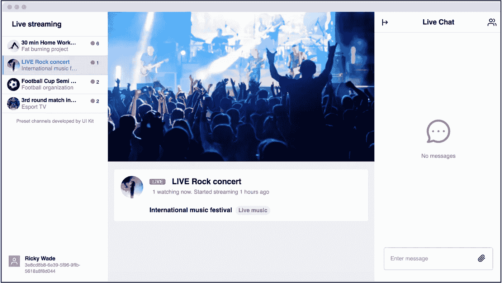

# 如何实现流媒体和直播活动的实时聊天

> 原文：<https://medium.com/codex/how-to-implement-live-chat-for-streaming-and-live-events-4002cce3e47f?source=collection_archive---------17----------------------->


仙鸟 2022

构建公共开放渠道和调节:为成千上万用户的直播活动带来无缝、安全的互动

杰森·奥尔肖恩和迦娜·麦克劳克林
解决方案工程师| [仙鸟](https://www.sendbird.com/)

*你可能会发现查看一下* [*iOS*](https://github.com/sendbird/SendBird-iOS#Swift-Basic-Sample) *，*[*Android*](https://github.com/sendbird/SendBird-Android)*，&*[*JavaScript*](https://github.com/sendbird/sendbird-javascript-samples/tree/master/javascript/javascript-live-chat)*示例应用程序很有用。有关本教程中材料的其他指导，请参见* [*文档*](https://sendbird.com/docs/chat/v3/platform-api/channel/channel-overview#2-channel-types-3-open-channel) *。您也可以查看 Sendbird Chat 的* [*演示*](https://sendbird.com/demos/in-app-chat) *并访问我们的* [*网站*](https://sendbird.com/features/chat-messaging) *以了解更多关于 Sendbird Chat 可以提供的内容。*

# 介绍

实时活动吸引了许多想要参与实时聊天流体验的用户。为此，您可以利用 Sendbird 为您的直播活动带来无缝和积极的互动。

本指南解释了如何与成千上万参加现场活动的用户一起工作。我们将首先讨论如何使用 iOS、Android 和 JavaScript。然后，我们将讨论频道大小和可扩展性，然后再了解更多可以实施的调节类型，这是现场活动的必备条件。

*注*:为了充分利用本指南，我们建议您 [**用**](https://dashboard.sendbird.com/auth/signup) **[**Sendbird**](https://www.sendbird.com/) 创建一个账户** 。



[**直播演示**](https://sendbird.com/demos/live-stream-chat) :直播活动中聊天的例子。

让我们开始吧！

# 实施快速入门

使用 Sendbird 现有的示例应用程序，很容易快速启动并运行。运行示例之前，请查看下面的“频道概述”部分，提前创建用户可以快速加入的聊天。

**JavaScript Web 实时聊天示例**

1.  [**下载样本**](https://github.com/sendbird/sendbird-javascript-samples/tree/master/javascript/javascript-live-chat) 。
2.  遵循回购的 [**Read.me**](https://github.com/sendbird/sendbird-javascript-samples/blob/master/README.md#sendbird-javascript-samples) 中的安装指南

**iOS 聊天示例**

1.  [**下载基本样本**](https://github.com/sendbird/SendBird-iOS#Swift-Basic-Sample) 。
2.  在 Xcode 中打开示例。在 Main.storyboard 中，删除“组通道场景”和“组通道视图控制器场景”。任何群组频道代码都可以从样本中删除，因为直播聊天不需要这些代码。
3.  运行示例以添加用户，并显示您的频道的“开放频道”列表。

**安卓聊天示例**

1.  [**下载**](https://github.com/sendbird/SendBird-Android) 基本样本。
2.  在 Android Studio 中打开示例。在 android_main.xml 中，删除 linear layout“linear _ layout _ group _ channels”。在 MainActivity.java 中，移除此方法调用:

```
findViewById(R.id.linear_layout_group_channels).setOnClickListener(new View.OnClickListener()
```

3.运行示例以添加用户，并显示您的频道的“开放频道”列表。

# 渠道概述

一个 [**公开频道**](https://docs.sendbird.com/javascript/open_channel#2_open_channel) 本质上是一个可以处理大量在线用户的公共聊天。单个开放频道可以在一个 Twitch 风格的公共聊天中容纳数千个同时进行的用户，任何人都可以在未经允许的情况下轻松参与。参与者的最大数量可以根据请求而增加 [**动态划分的开放信道**](https://sendbird.com/docs/chat/v3/platform-api/guides/open-channel#2-classic-vs-dynamic-partitioning) 被设计为使用设定数量的子信道来容纳甚至更多数量的用户，共享区域从 2000 到 20000 个参与者开始，专用区域最多 60000 个参与者。如果需要扩展容量，请联系 Sendbird 的销售团队，因为在适用的情况下，某些权衡允许进一步的容量。在适用的情况下， ***Super Groups*** 也可以为直播活动或直播流媒体提供解决方案。

## 通道大小和可扩展性

*   **准备:**考虑提前通知 SendBird 你的活动规模。
    SendBird 能够自动扩展以满足您的需求。但是，提前通知您的预计用户规模将有助于确保您的活动顺利进行，而不会达到我们可扩展性的任何上限。
*   提前创建**动态分区的开放通道**。
    ***注意:请向 SendBird(通过 support@sendbird.com 或您现有的客户经理)提交请求，通过提供您想要启用的 application_id 来启用动态分区频道。另外，请通过提及“直播”来描述您的动态分区频道使用案例。***

通道创建可以通过 [**平台 API**](https://sendbird.com/docs/chat/v3/platform-api/guides/open-channel#1-open-channel) 编程实现。或者，如果只创建几个频道，在 [**Sendbird 仪表板**](https://dashboard.sendbird.com/auth/signup) 上创建这些开放频道。

考虑计算你需要多少通道，以及创建它们需要多长时间。当通过 API 创建时，您应该将通道创建限制在每秒 30 个以下。

要通过 API 创建动态分区通道，您需要创建一个开放通道，同时传入参数 is_dynamic_partitioned = True。请参见 [**文档**](https://sendbird.com/docs/chat/v3/platform-api/guides/open-channel#1-open-channel) 获取通过 API 创建开放通道的指导。

卷曲命令

```
curl -X POST \
  https://api-<APP_ID>.sendbird.com/v3/open_channels \
  -H 'Api-Token: <APP_TOKEN>' \
  -H 'Content-Type: application/json' \
  -F is_dynamic_partitioned=True
```

请验证 API 调用的响应应该包括**is _ dynamic _ partitioned = True**，以确认您的通道是动态分区的。

```
{
    "name": "open channel",
    "participant_count": 0,
    "custom_type": "",
    "is_ephemeral": false,
    "channel_url": "sendbird_open_channel_101_2e90b7dc3736e4c0e8864de2d077e9306d7f7c80",
    "created_at": 1569285995,
    "cover_url": "https://sendbird.com/main/img/cover/cover_05.jpg",
    "freeze": false,
    **"is_dynamic_partitioned": true,
**    "max_length_message": -1,
    "data": "",
    "operators": []
}
```

*   **动态分区**是一个开放的频道功能，用户被分成虚拟组，以维持每个组的负载，并控制频道内的聊天体验。当用户向频道发送消息时，他们的消息仅被插入到他们的虚拟组中。当频道操作员(管理员)向频道发送消息时，所有组都将看到他们的消息。

**它是如何工作的？**
入局用户——正在加入频道的用户——总是被插入到最小的可用“碎片”中。每个碎片都被用户填满，直到某个阈值，称为**分配比例**(默认:50%用户容量)。

如果所有的碎片都已经填充到分配比例，那么将创建一个新的碎片。如果信道达到了可能的最大分片数，那么现有分片将被填充超过分配比率的阈值，并且用户将以“循环”方式被添加到所有现有分片中。

通过这个系统，没有将一个碎片的用户分割成多个碎片。每个成员都应该在他们开始所在的碎片中，除非该碎片在一定时间内低于**解除分配比率**(默认值:5%的碎片占用率)。在这些条件下，最小的碎片将把它的所有用户移动到下一个最小的碎片。

如果新用户是运营商，他们将访问频道，就像它没有被分片一样，即他们将听到每个分片中所说的一切，并且运营商的消息将在每个分片中可见。

# 适度

*   当成千上万的用户参与到现场活动中时，考虑他们发送的消息和采取的行动将如何影响用户的整体体验。
*   建议多考虑为现场活动提供几个人类主持人。Sendbird 的经验表明，1:1000 的版主与渠道成员比例为实时聊天体验带来了价值。
*   为了帮助审核，SendBird 提供了大量的自动和手动审核工具。

## 仪表板审核工具

SendBird Dashboard moderation 在聊天中提供了许多审核功能。

*   查看聊天用户
*   静音用户
*   禁止用户
*   查看消息
*   删除邮件


## 进一步审核选项

## 脏话过滤

*   通过 [**脏话过滤器，内置消息文本审核功能。**](https://sendbird.com/docs/chat/v3/platform-api/guides/filter-and-moderation#2-profanity-filter)
*   Sendbird 的经验表明，并非所有对话都需要过滤脏话。然而，强烈建议对现场事件用例应用亵渎过滤。
*   可以将脏话过滤指向特定的[**send bird 频道 custom_type**](https://sendbird.com/docs/chat/v3/platform-api/guides/filter-and-moderation#2-profanity-filter-3-parameters) 。
*   仙鸟还提供了一个自动的，所谓的三振出局功能( [**脏话过滤适度**](https://sendbird.com/docs/chat/v3/platform-api/guides/filter-and-moderation#2-profanity-triggered-moderation) )。
*   使用此功能，可以根据聊天频道成员触发亵渎过滤器的次数来设置禁止、踢出或静音的参数。
*   Sendbird 还提供了一个 web-hook，用于在亵渎事件被触发时使用。

## 域过滤

*   [**域过滤器允许**](https://sendbird.com/docs/chat/v3/platform-api/guides/filter-and-moderation#2-domain-filter) 您设置要在包含 URL 的文本和文件消息以及用户的个人资料图像中检测的域。
*   它将根据您的策略和标准过滤检测到的域。
*   该工具在防止不必要的广告和淫秽网站共享方面特别有用。还要考虑使用图像调节来检测和过滤用户共享的图像。
*   Sendbird 还提供了一个 web-hook，用于在触发域仲裁事件时使用。

## 图像调节

*   图像审核 SendBird 有一个内置的全自动 [**图像审核**](https://sendbird.com/docs/chat/v3/platform-api/guides/filter-and-moderation#2-image-moderation) 服务，可以审核 SendBird 中存储的图像和外部存储的图像。
*   该服务还可以检测和阻止邮件中与 URL 共享的图像。这里有一个实施指南 [**。**](https://www.dropbox.com/s/krmwpiba33koecy/SendBird%20Image%20Moderation%20-%20External.pdf?dl=0)

## 频道冻结

*   总之，冻结的信道为信道操作员提供了发送消息的能力，而正常的信道成员不能发送消息。
*   冻结信道在直播事件期间可能是有用的，因为它为实现提供了“暂停”整个信道的能力，同时仍然允许所需的操作。
*   这里 有深度频道冻结常见问题 [**。**](https://www.dropbox.com/s/1o26b46b13w8ei5/%5BSendBird%20%5DChannel%20Freeze%20FAQ%20-%20External.pdf?dl=0)
*   当频道被冻结时，以下逻辑适用:

1.通道的非操作员成员不能用消息更新通道。

2.非操作员成员可以阅读消息。

3.非操作员成员能够执行除发送消息之外的其他通道操作。

4.**频道管理员**仍然可以从仪表盘或通过平台 API 发送消息。

5.渠道运营商也可以通过 SDK 或平台 API 发送消息。

6.渠道可以冻结如下: [**平台 API**](https://sendbird.com/docs/chat/v3/platform-api/guides/open-channel#2-freeze-a-channel)；Via SDK，针对渠道运营商: [**iOS SDK**](https://sendbird.com/docs/chat/v3/ios/guides/open-channel#2-freeze-and-unfreeze-a-channel) ， [**Android SDK**](https://sendbird.com/docs/chat/v3/android/guides/open-channel#2-freeze-and-unfreeze-a-channel) ，[**JavaScript SDK**](https://sendbird.com/docs/chat/v3/javascript/guides/open-channel#2-freeze-and-unfreeze-a-channel)

## 禁止或静音用户

*   渠道运营商以及 sendbird 的平台 API 提供了禁止或静音渠道成员的能力。
*   该服务 [**禁止用户**](https://sendbird.com/docs/chat/v3/platform-api/guides/open-channel#2-ban-a-user) 进入开放频道。被禁止的用户立即被逐出频道，并在设定的时间段后被允许再次加入该频道。
*   如果用户 A 阻止了用户 B，用户 B 的消息将自动对用户 A 隐藏。想象一下，如果用户 B 是一个不良行为者或垃圾邮件发送者，如果所有好用户都主动阻止了用户 B，好用户的聊天体验不会受到负面影响，坏用户也不会受到任何关注。
*   还有一种服务是 [**将频道中的用户**](https://sendbird.com/docs/chat/v3/platform-api/guides/open-channel#2-mute-a-user) 静音。被静音的用户仍保留在频道中，并被允许查看信息，但在取消静音之前不能发送任何信息。用户可以在 sendbird 的 Dashboard moderation 视图内静音或者跟随: [**平台 API**](https://sendbird.com/docs/chat/v3/platform-api/guides/open-channel#2-mute-a-user)；针对渠道运营商: [**iOS SDK**](https://sendbird.com/docs/chat/v3/ios/guides/open-channel#2-mute-and-unmute-a-user) ， [**Android SDK**](https://sendbird.com/docs/chat/v3/android/guides/open-channel#2-mute-and-unmute-a-user) ，[**JavaScript SDK**](https://sendbird.com/docs/chat/v3/javascript/guides/open-channel#2-mute-and-unmute-a-user)

## 垃圾邮件泛滥防护

*   [**此功能**](https://sendbird.com/docs/chat/v3/android/guides/open-channel-advanced#2-spam-flood-protection) 允许您自定义一个参与者每秒可以在开放频道中发送的消息数量。通过这样做，来自参与者的所有多余消息都将被删除，并且只传递每个参与者每秒允许发送的消息数。此功能可保护您的应用程序，防止一些参与者在频道中向其他人发送相同的垃圾邮件。
*   注意:我们的默认系统设置是每秒 5 条消息。这个限制只能从我方手动调整。关于此设置，您可以联系我们的工程团队。这是 Sendbird 的高级功能之一，请首先联系我们的销售团队以获得进一步的帮助。

## 活动前网页挂钩

*   有了预事件 webhooks，版主或其他服务能够在将传入消息转发给频道的所有成员之前捕获、处理和审查该消息。
*   这意味着不适当的信息可以被删除或修改。

## 报告 API:

*   Sendbird 提供了一个报告平台，它既可以作为 [**平台 API**](https://sendbird.com/docs/chat/v3/platform-api/guides/report-content-and-subject#2-report-content-and-subject) 的一部分，也可以作为 SDK API 的一部分。详见 [**安卓**](https://sendbird.com/docs/chat/v3/android/guides/group-channel#2-report-a-message-a-user-or-a-channel)[**iOS**](https://sendbird.com/docs/chat/v3/ios/guides/open-channel#2-report-a-message-a-user-or-a-channel)[**JavaScript**](https://sendbird.com/docs/chat/v3/javascript/guides/open-channel#2-report-a-message-a-user-or-a-channel)**文档！**
*   **在 [**Sendbird 的社区网站**](https://community.sendbird.com/t/reporting-api-faq/442) 上阅读更多关于报告 API 的信息。**
*   ***注意*:如果您的应用将被部署到苹果的应用商店，那么我们的报告 API 是必需的。**

# **问与答:问我任何事件**

*   **在这种情况下,“询问我的任何事情”涉及名人、有影响力的人或知名人士可以在 Sendbird 中找到实时聊天体验的情况**
*   **这些建议可能也适用于现场电子商务活动，在这些活动中，主持人会回答在线购物者的问题。**

## **问题格式**

*   **考虑你的名人/主持人会如何回答他们的问题。如果一个频道中有 10，000 名成员，自由提问将导致一长串流媒体消息，从而很难看到问题。因此，考虑减少可以提问的成员数量。**
*   **考虑在通道成员前面提供一个门，这样成员就不能随意提问。**
*   **大门可以是付费墙的形式，通过点数、金钱、状态或推荐来付费。**
*   **门可以是基于时间的墙，用户能够在特定的时间段内提交他们的问题，或者在事件开始之前，或者在事件期间的短时间内。**
*   **该墙也可以是为每个用户提供他们可以问的有限数量的问题的形式，并且是先来先服务的形式。**

# **消息锁定队列**

*   **考虑为名人和频道主持人(在 sendbird 的说法中称为频道操作员)提供锁定消息的能力。**
*   **默认情况下，Sendbird 频道运营商能够更新任何频道成员的消息。**
*   **因此，考虑让通道操作者能够更新消息的数据字段，以包含一个标记来固定消息。**
*   **然后，可以将锁定的消息添加到名人和所有其他渠道成员都可见的问题队列中。**
*   **一旦回答了问题，就可以解除锁定。**

# **结论**

**就这样结束了！我们已经了解了如何为直播活动创建频道和实现审核实践。我们还研究了如何简化“问我任何问题”活动的体验。请记住，如果您需要更多指导，您可以随时查看我们的 [**文档**](https://sendbird.com/docs/chat) ，或者在 [**Sendbird 社区**](https://community.sendbird.com/) 中发布问题。我们相信，实时聊天将丰富您的直播活动。快乐直播和现场活动聊天建设！✌️**