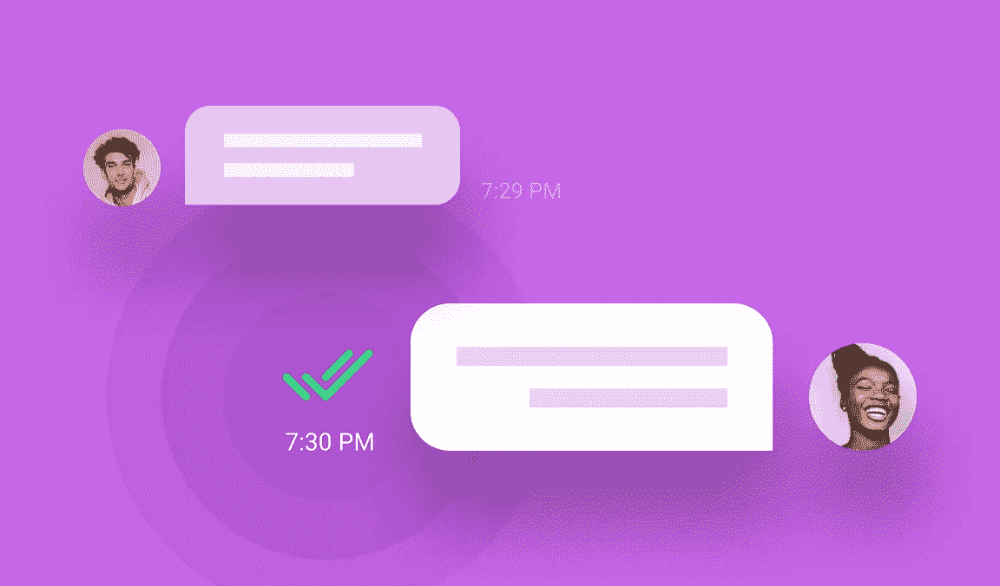
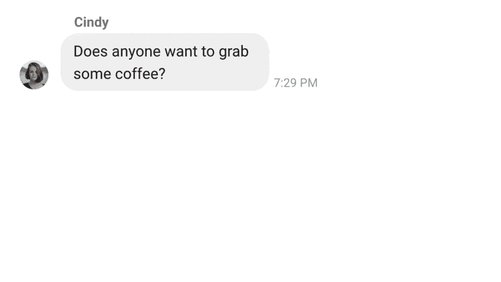

# 如何在您的 Android 聊天应用程序中实现消息送达回执通知

> 原文：<https://medium.com/codex/how-to-implement-message-delivery-receipts-notifications-in-your-android-chat-app-fc95822f2089?source=collection_archive---------11----------------------->

仙鸟 2022

## 关于使用 Sendbird Chat SDK 实现消息传递生命周期的分步教程

解决方案工程师| [Sendbird](https://www.sendbird.com)

*如果您需要额外的指导，请参见我们的* [*文档*](https://sendbird.com/docs/chat/v3/platform-api/message/delivery-receipts/delivery-receipts-overview) *。别忘了查看应用内聊天的* [*演示*](https://sendbird.com/demos/in-app-chat) *，并访问我们的* [*网站*](https://sendbird.com/features/chat-messaging) *了解更多关于仙鸟聊天可以提供的服务。*

> *成为第一个了解新教程、开发者相关聊天/电话发布以及其他重要更新的人，* [*注册*](https://get.sendbird.com/dev-newsletter-subscription.html) *我们的开发者简讯。*

# 介绍

Sendbird Chat 是一个丰富的高级 API，与其他解决方案不同，它支持**交货收据**。

有了**送达回执，**用户就可以完全确信他们的消息已经送达了预定的收件人。作为开发人员，您现在可以更加灵活地选择消息交付后要做的事情。无论是简单到显示一个图标来显示消息已经发送，还是复杂到在消息发送后处理应用程序中的其他事件。**交付收据**的可用性是一个特性，使您作为开发人员能够继续为您的用户提供世界一流的聊天体验，而您只需付出很少的努力。

在本教程中，我们将讨论 Sendbird 中存在的消息生命周期，并为您提供一些如何在聊天中实现它的背景知识。

# 什么是消息传递生命周期？

简单地说，信息生命周期是一条信息的旅程，从思想被输入文字，到接收者自己阅读信息。如果没有**送达回执**，从发送者的角度来看，消息传递的生命周期将如下所示:

1.  发送者键入信息并发送它
2.  消息被发送到服务器(使用内置的离线消息处理连接不良或无连接的情况)
3.  邮件由收件人阅读

虽然这确实涵盖了大多数基础，但在第 2 步和第 3 步之间可能存在很多不确定性。直到接收者实际检查了该聊天并将消息标记为已读，发送者才知道消息是否被接收者成功接收。发送者可能会想，他们看不到回复的原因是因为连接不良，还是仅仅是因为接收者还没有检查他们的聊天记录。当生命周期看起来像这样时，所有这些担心都消失了:

1.  发送者键入信息并发送它
2.  消息被发送到服务器(使用内置的离线消息处理连接不良或无连接的情况)
3.  该消息被传送到接收者的设备
4.  邮件由收件人阅读

随着之前的 2 和 3 之间的关键步骤的引入，生命周期现在给出了一个完整的画面。以前，在阅读回执更新之前，发件人不知道收件人是否收到了邮件，而现在，发件人可以在瞬间自信地看到邮件已经送达，并继续他们的一天。

很好，现在我们已经讨论了为什么**送达回执**对完成消息生命周期如此重要，让我们继续从技术角度看一下 Sendbird 提供的一些功能，以及如何轻松地将它们实现到您的应用程序中。

# 第一步。发件人键入信息

消息生命周期的第一部分相当简单。在这一阶段，我们应该强调几个功能，这些功能将占用消息的生命周期，并使其更清楚地适应您的应用程序。在发送方，我们有发送消息的功能。下面你可以看到发送不同类型的信息是多么容易。

Sendbird 允许发送 3 种类型的消息:用户消息，或文本消息，文件消息，或二进制文件消息，以及管理员消息，或由管理员发送的文本消息。有了这三种类型的消息，你可以发送任何东西，从简单的文本消息到有趣的视频和图片到 [**位置消息**](https://sendbird.com/map-preview-and-location-sharing-on-android/) 。有了 Sendbird 的自动缩略图生成等功能，发送这些消息就变得简单多了。

在接收者方面，良好的聊天体验让用户能够看到发送者何时输入消息。Sendbird 为您提供了事件处理程序，让您知道用户何时输入。键入指示器是在聊天中提供更多自然对话的绝佳方式。

# 第二步。消息已发送

好了，现在你的发送者决定按发送，信息就可以发送了…对吗？不幸的是，并非总是如此。有很多原因可以解释为什么这个信息不能被发送出去，其中一个主要的原因是没有联系，我相信我们都有同感。谢天谢地，Sendbird 也有这方面的功能。马上，我们在 send 函数上有一个回调函数，如果消息无法传送到服务器，它会通知您。

Sendbird 更进一步，为你提供了离线体验的能力。按照惯例，为了创建离线聊天体验，您必须在设备上创建一个本地数据库，用于下载消息/频道，并使它们与服务器保持同步。对于编辑消息或删除消息之类的事情，您必须确保编写的代码既能处理服务器上的数据，又能确保本地更改得到传播。维护这一点可能是乏味的、耗时的，并且使您的应用程序容易出现许多故障点。通过 [**同步管理器**](https://sendbird.com/docs/syncmanager) ，Sendbird 自动处理上述所有问题。显示消息和以前一样容易，但是传统上维护离线体验的困难部分由 Sendbird 本机处理，因此在建立到服务器的连接时，您只需调用 resumeSync()来维护服务器和本地缓存之间的同步。

在设置 SyncManager 时，甚至能够在用户连接不良或没有连接的情况下指定重试策略，因此作为开发人员，您不必担心以编程方式处理重试。这将让你和你的用户都有信心点击发送，并相信连接或没有连接，当连接稳定时，消息将通过。

# 第三步。消息已发送

我们已经讨论了 Sendbird 如何确保发送者的基地被覆盖，但是接收者呢？到目前为止，我们已经知道消息通过了 Sendbird 服务器，但是我如何知道它是否被发送到了接收者的设备上呢？多亏了新的**送达回执**功能，你的用户现在可以立即知道收件人是否真的收到了信息。这是通过简单地在接收者方将消息标记为已传递来完成的。

当这个动作完成时，一个事件处理程序将在发送者端触发，让他们知道消息已经到达预定接收者的设备。

在这里，您有很多种选择，您可以简单地显示复选标记，指示消息已成功传递，或者根据您的用例，您可以实现一些客户端响应来成功传递。

# 第四步。邮件已阅读

所以信息被打印，发送，投递现在呢？邮件生命周期的最后阶段是收件人阅读邮件。Sendbird 有已读回执已经有一段时间了，这个功能允许邮件的发送者很容易地看到他们的邮件是什么时候被接收者阅读的。在接收器端，您需要做的就是将通道标记为已读。

完成后，发件人端的事件处理程序将会触发，并向您更新消息被读取的时间戳。

从这里开始，收件人现在可以成为发件人，这个生命周期可以重新开始。

# 结论

就是这样！恭喜您，您现在知道了您需要做的一切，并快速将消息生命周期通知构建到您当前的工作流中！有了**交付收据**，Sendbird 又增加了一项功能，让您可以更轻松地为客户提供现代化的、引人入胜的聊天体验。