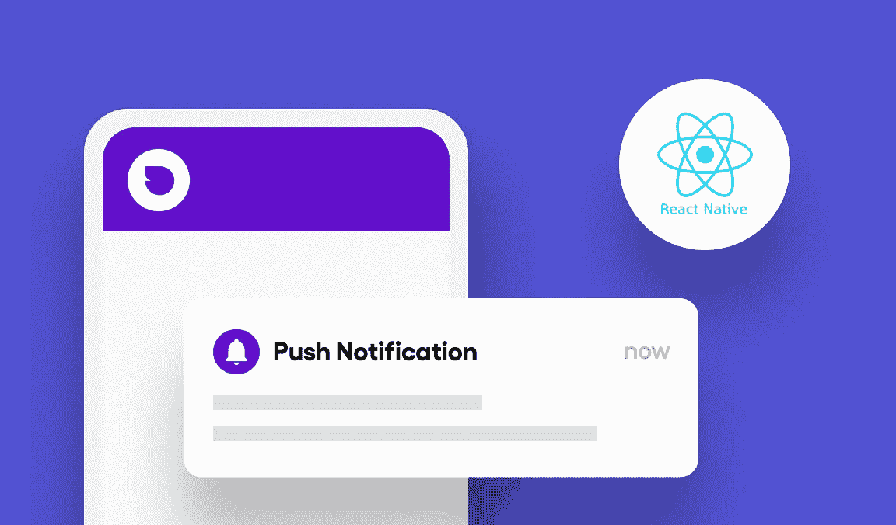
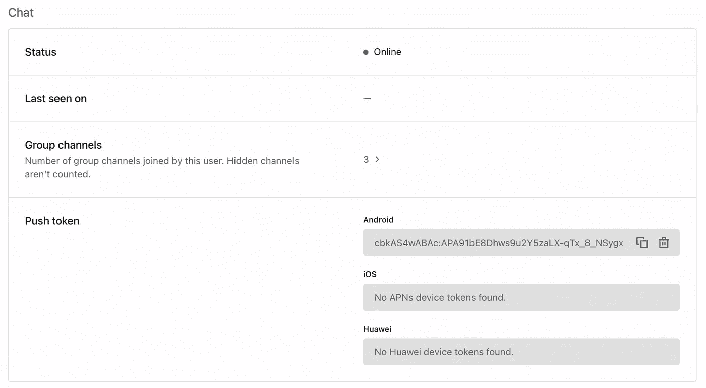

# 如何使用 Sendbird Chat 在 React 本机应用程序中实现推送通知

> 原文：<https://medium.com/codex/how-to-implement-push-notifications-in-a-react-native-app-using-sendbird-chat-a828f0aaca6f?source=collection_archive---------2----------------------->

仙鸟 2022

## 关于如何使用 React Native for Android 和 iOS 及时发送推送通知的分步教程

由塔哈·萨吉尔
解决方案工程师| [Sendbird](https://www.sendbird.com/)

*我们建议您查看* [*样本 app*](https://github.com/sendbird/sendbird-chat-sdk-javascript) *获取您可能需要的代码。如果您需要更多指导，请访问我们的* [*文档*](https://sendbird.com/docs/chat/v4/javascript/guides/push-notifications#1-push-notifications) *。不要忘记查看应用内聊天的* [*演示*](https://sendbird.com/demos/in-app-chat) *，并访问我们的* [*网站*](https://sendbird.com/features/chat-messaging) *了解更多关于 Sendbird Chat 可以提供的服务。*

> *为了第一个了解新教程、开发者相关聊天/电话发布以及其他重要更新，* [*注册*](https://get.sendbird.com/dev-newsletter-subscription.html) *获取我们的开发者简讯。*

# 简介:什么是推送通知，为什么它们很重要？

推送通知是由应用程序向其用户发送的自动、可点击的弹出消息。当设备空闲或在后台运行应用程序时，消息会立即发送到设备。推送通知非常重要，因为它们:

*   传递与用户活动或兴趣相关的重要信息、提醒和新闻
*   鼓励用户参与你的应用
*   展示特色内容
*   推动有针对性的相关流量，提高转化率
*   使用个性化、适时、相关的内容创建无缝的用户体验

值得注意的是，美国智能手机用户平均每天会收到 [**45 条推送通知**](https://www.businessofapps.com/marketplace/push-notifications/research/push-notifications-statistics/) ！根据 [**RubyGarage**](https://rubygarage.org/blog/benefits-of-push-notifications) 的数据，实施推送通知的组织比没有实施的组织拥有高 3 倍的客户保持率和 88%的参与度。虽然基于行业、位置、**类型和许多其他因素，推送通知选择加入和点击率存在 [**变化**](https://www.businessofapps.com/marketplace/push-notifications/research/push-notifications-statistics/) ，但显然实现推送通知的理由很充分。**

**本教程提供了实现 React 本机推送通知的分步说明。但首先，让我们来看看一些先决条件。**

# **先决条件**

1.  **创建一个 [**Sendbird 账号**](https://dashboard.sendbird.com/auth/signup) 。**
2.  **确保 [**仙鸟聊天**](https://sendbird.com/features/chat-messaging) 在你的 React 原生应用中运行良好。**

**请记住，当从应用程序向 Sendbird 服务器发送消息时(通过 JavaScript 的 [**聊天 SDK**](https://github.com/sendbird/sendbird-chat-sdk-javascript)),服务器与 FCM 进行通信。然后，FCM 向 Android 设备发送推送通知，或者与 APN 通信，向 iOS 设备发送推送通知。**

# **React 本机应用程序的推送通知**

**可以使用用于 JavaScript 的[**Sendbird Chat SDK**](https://github.com/sendbird/sendbird-chat-sdk-javascript)向混合移动应用用户(Android 和 iOS)发送推送通知。目前，JavaScript SDK 的推送通知功能仅与 React Native 兼容。本教程提供了使用 Firebase Cloud Messaging (FCM)和 Sendbird Chat SDK 在 React 本机应用程序中启用推送通知的详细信息。**

**在深入实现细节之前，我们先来谈谈 [**FCM 消息**](https://firebase.google.com/docs/cloud-messaging/concept-options) 。有两种类型的 FCM 消息:通知消息和数据消息。根据 [**Firebase 文档**](https://firebase.google.com/docs/cloud-messaging/concept-options) ，“通知消息有一组预定义的用户可见的键和一个可选的自定义键-值对的数据负载。”数据消息只包含用户定义的键值对。Sendbird 使用数据消息，允许客户端应用程序创建由这些自定义键值对组成的自定义消息有效负载。**

**web 应用程序不支持推送通知。如果您需要为 web 应用程序实现推送通知，我们建议使用 webhook 事件来为 web 应用程序实现推送通知。**

**开始之前，请确保您可以访问 [**Firebase 控制台**](https://console.firebase.google.com/) 。让我们开始吧！💻**

# **步骤 1:向 Sendbird 仪表板注册 FCM 凭证和 APNs 证书**

**Sendbird 服务器需要用于 Android 的 FCM 服务器密钥和用于 iOS 的 APNs 证书来传送推送通知。**

**按照本 [**教程**](https://sendbird.com/developer/tutorials/implement-android-push-notifications) 中的步骤 1 和 2 注册 FCM 凭证，并按照 [**文档**](https://sendbird.com/docs/chat/v3/ios/guides/push-notifications#2-how-to-register-push-notification-credentials) 中的说明将 APNs 证书注册到 Sendbird 仪表板。**

# **步骤 2:安装 React Native Firebase 模块并添加配置文件**

**[**React Native Firebase**](https://rnfirebase.io/)是官方推荐的软件包集合，为 Android 和 iOS 应用程序上的所有 Firebase 服务带来 React 原生支持。按照 [**官方文档**](https://rnfirebase.io/) 中的说明，在 React 原生项目中为 Android 配置 FCM，为 iOS 配置 APNs。到这一步结束时，您应该已经将 Android 和 iOS 应用程序添加到 Firebase 项目中，并将各自的配置文件添加到 React 原生项目中。**

**请参考 React Native Firebase [**通知**](https://rnfirebase.io/messaging/notifications) 页面，了解有关显示和处理来自 FCM 的通知的更多信息。**

# **步骤 3:向 Sendbird 服务器注册推送令牌**

**要向特定的客户端应用程序发送通知消息，FCM 需要由客户端应用程序实例颁发的用于 Android 设备的 FCM 注册令牌和用于 iOS 设备的 APNs 设备令牌。因此，Sendbird 服务器还需要每个客户端应用程序实例的注册令牌来代表您向 FCM 发送通知请求。Chat SDK 提供了一个接口，用于向 Sendbird 服务器注册和注销这两种类型的令牌。**

**下面的代码片段显示了设备令牌注册。**

**注册的推送令牌出现在仪表板中的“用户>用户 id >聊天”下:**

****

# **步骤 4:接收推送通知消息**

**一旦注册了设备令牌，客户端应用程序实例就可以接收和处理 FCM 通知消息，而不管是 iOS 还是 Android 平台。参考 React Native Firebase 文档的 [**用法**](https://rnfirebase.io/messaging/usage#usage) 页面，了解更多关于实现的信息。**

**Sendbird Chat SDK for JavaScript 不会自动检测应用程序的状态，因此需要显式调用 Sendbird SDK 提供的 **setForegroundState** ()和 **setBackgroundState** ()方法。**

**查看 React Native Firebase 文档，了解 [**接收消息**](https://rnfirebase.io/messaging/usage#receiving-messages) 的可用事件处理程序。下面的代码片段显示了接收到的 FCM 消息的解析。**

**注意:频道是 Android 独有的概念，用于分类并允许用户控制如何在他们的设备上处理通知。**

**从 FCM 数据消息解析的数据对象包含一组键值项目，如下面的 JSON 代码所示。**

# **推送通知的故障排除提示**

**推送通知的故障排除可能很复杂；这里有一些做这件事的技巧。**

1.  **为了让开发人员更容易调试和排除推送通知的故障，我们构建了一个测试工具，您可能会发现它很有用。请参见本 [**教程**](https://sendbird.com/developer/tutorials/mobile-push-notifications-tester) 以了解如何使用该工具，您可以通过 [**Sendbird 仪表盘**](https://dashboard.sendbird.com/) 访问该工具。**
2.  **查看这份全面的 [**指南**](https://sendbird.com/developer/tutorials/troubleshooting-android-chat-push-notifications) 对 Android 聊天推送通知进行故障诊断。**
3.  **如果要调试故障条件，请参考[中的 **FCM 错误代码。**](https://firebase.google.com/docs/reference/fcm/rest/v1/ErrorCode)**

# **结论**

**就这样结束了！现在，您已经知道如何使用 Sendbird Chat 为 React 本地应用程序发送推送通知。有了本教程和 [**文档**](https://sendbird.com/docs/chat/v3/android/quickstart/send-first-message) 的指导，你马上就可以发送及时、相关、吸引人的推送通知了！**

**我们总是在这里提供帮助； [**如果您有任何问题、意见或顾虑，请联系我们**](https://sendbird.com/contact-us) 。**

**快乐推送通知大厦！💻**