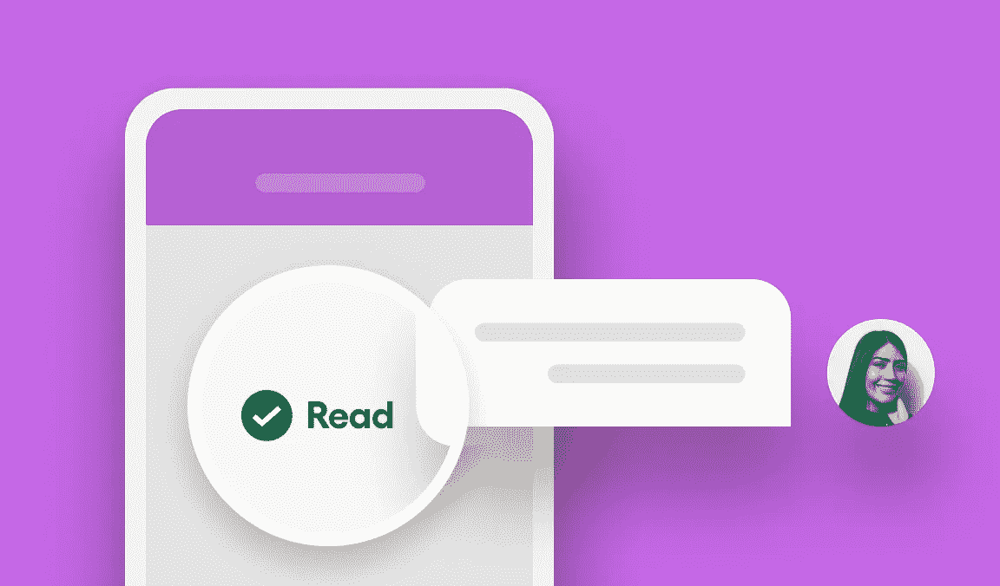
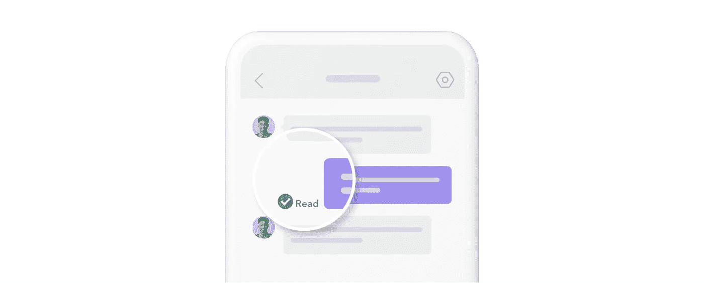
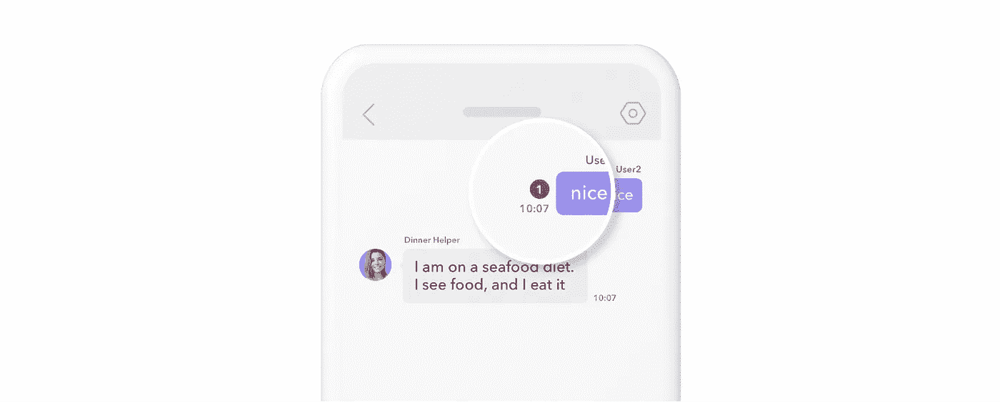

# 如何在 Sendbird 聊天中实现阅读回执

> 原文：<https://medium.com/codex/how-to-implement-read-receipts-in-sendbird-chat-300eb1e53ad6?source=collection_archive---------14----------------------->

仙鸟 2022

## 关于如何在聊天应用程序中实现阅读回执的分步指南

杰森·奥尔肖恩
解决方案工程师| [森伯德](https://www.sendbird.com)

*关于本教程的其他指导，请参考* [*文档*](https://sendbird.com/docs/chat/v3/javascript/guides/group-channel-advanced#2-mark-messages-as-read) *。不要忘记查看我们的应用内聊天的* [*演示*](https://sendbird.com/demos/in-app-chat) *，以获得完全构建的* [*仙鸟聊天*](https://sendbird.com/features/chat-messaging) *的示例。*

> *成为第一个了解新教程、开发者相关聊天/电话发布以及其他重要更新的人，* [*注册*](https://get.sendbird.com/dev-newsletter-subscription.html) *订阅我们的开发者简讯。*

# 介绍

在本教程中，您将学习如何实现 Sendbird Chat 的一项高级功能——实现阅读回执。在深入实现细节之前，我们将首先理解已读回执的技术概念，并探索相关的用例。

本教程结束时，您将:

1.  了解什么是已读回执以及它们在 Sendbird 中如何工作
2.  在聊天应用程序中实现已读回执

请注意，本教程假设您事先了解如何通过 Sendbird 的 SDK 发送和接收消息。为了从本教程中获得最大收益，您还应该熟悉基本的 JavaScript。

我们开始吧！💻

# Sendbird 中的已读回执是什么？

简而言之，已读回执让用户知道另一个用户何时跟上了对话。

**阅读回执**被定义为每个用户最后一次阅读群组信道(即一对一或群组对话)中的任何消息的时间戳。已读回执通常显示在邮件列表视图中的单个邮件旁边。

已读回执的时间戳来自为单个通道成员调用`GroupChannel.markAsRead()`时的最后一条消息`created_at’` 时间戳。调用`GroupChannel.markAsRead()`有一个事件处理程序，当消息被读取时，所有通道成员都可以实时知道。

# Sendbird 中的未读邮件是什么？

在`GroupChannel.markAsRead()`通话之间的频道中存在的所有消息被定义为未读消息。未读消息计数的正确实现可以让用户轻松导航到自上次交互以来错过的消息。

# Sendbird 中的已读消息是什么？

当调用`markAsRead()`方法时，消息被标记为已读。通常，每当一个成员通过从频道列表中进入频道或者将打开的频道的消息视图带到前台来阅读消息时，应用程序就调用`markAsRead()`。使用消息创建时间和调用`markAsRead()`的时间计算正在读取的消息。

请注意，单封邮件不会保留阅读时间的信息。

# 已读回执的使用案例

已读回执对于渠道成员数量较少的案例具有特殊价值。例如:

*   具有用户对用户消息传递功能的应用，如游戏应用
*   通过专家或顾问直接与用户沟通的企业，如保健服务人员、财务顾问、客户支持代理、顾问或其他专家
*   按需服务或任何需要及时交付服务或商品的应用程序
*   同行市场，在这里交流是买卖的必要条件

既然我们已经理解了阅读回执的基础，让我们继续讨论实现细节。

# 实施:读取状态

单个消息的已读状态是一个标记，它可以指示有多少群信道成员没有读过单个消息。

示例:

下图中的红色数字 1 表示至少有一个频道成员没有阅读当前用户的消息。

## 步骤 1:何时将邮件标记为已读

假设用户 a 向用户 b 发送了一条消息。在这里，我们将遍历 UserB，将 UserA 的消息标记为已读。

*   当用户 b 打开或刷新单个频道时，调用`markAsRead()`。

注意:这并不能保证 UserB 真的看到了所有的消息，就像大多数消息应用的惯例一样。

[**抓取通道**](https://sendbird.com/docs/chat/v3/javascript/guides/group-channel#2-retrieve-a-channel-by-url)

[**刷新频道**](https://sendbird.com/docs/chat/v3/javascript/guides/group-channel#2-refresh-all-data-related-to-a-channel) —即从后台返回频道视图。

*   `Call markAsRead()`当用户返回到消息视图的底部时。
*   `Call markAsRead()`当新消息到达且以下两个条件为真时:

1.  用户在消息视图中
2.  用户靠近消息视图的底部，并且/或者当收到新消息时，您将它们显示为弹出消息

`[**onMessageReceived()**](https://sendbird.com/docs/chat/v3/javascript/guides/event-handler#4-list-of-group-channel-events)`事件处理器。

*   用户发消息时调用`markAsRead()`。

[**发送消息**](https://sendbird.com/docs/chat/v3/javascript/guides/group-channel#2-send-a-message)

注意:在消息视图中向上滚动时，不要调用`markAsRead()`。这是一个常见的错误，会导致速率限制。单封邮件不需要标记为已读。相反，Sendbird 会自动将以前的邮件标记为已读。

## 步骤 2:接收消息已被阅读的 websocket 事件:UserB

Sendbird 提供了一个通道事件监听器，它为除了调用`markAsRead()`的用户之外的所有通道成员触发。这个事件就是`onReadReceiptUpdated()`。UserB 可以侦听该事件，然后确定有多少通道成员读取了该消息。`onReadReceiptUpdated()`处理程序传递一个通道参数，而不是一条消息。

将消息传递到`[**getReadMembers()**](https://sendbird.com/docs/chat/v3/javascript/guides/group-channel-advanced#2-retrieve-members-who-have-read-a-message)`中，让其他通道成员阅读该消息。

对于传递给`getReadMembers()`的每条消息，都会创建一个用户对象数组，其中包含所有阅读过该消息的通道成员。

阅读消息的成员列表可用后，考虑在消息视图中更新消息对象 UI。常见的例子包括:

*   显示递减数字(总通道成员数减去读取成员数)→卡考
*   将灰色勾号转换为蓝色勾号→ WhatsApp
*   添加带有“查看者”详细信息的小用户图标→脸书信使

## 步骤 3:当用户 b 返回到消息视图时，检查消息是否已被阅读

简而言之，将消息提取到视图中，然后通过`groupChannel.getReadMembers(MESSAGE)`迭代它们。

[**加载以前的消息**](https://sendbird.com/docs/chat/v3/javascript/guides/group-channel#2-load-previous-messages) —获取新消息时:

# 结论

在本教程中，我们探讨了阅读回执及其用途。我们已经看到了如何在聊天应用程序中实现阅读回执，以及相关的代码示例。

要深入了解这个话题，请查看我们的博客。你可以阅读 [JavaScript](https://sendbird.com/docs/chat/v3/javascript/guides/group-channel-advanced#2-mark-messages-as-read) 、 [Android](https://sendbird.com/docs/chat/v3/android/guides/group-channel-advanced#2-mark-messages-as-read) 、 [iOS](https://sendbird.com/docs/chat/v3/ios/guides/group-channel-advanced#2-mark-messages-as-read) 的进一步实现细节。

您现在是在聊天应用程序中实现已读回执的专家了！恭喜恭喜，聊楼愉快！✌