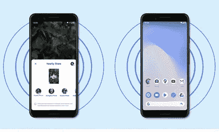

# 如何在 Android 中实现与 Nearby 的共享功能

> 原文：<https://medium.com/codex/how-to-implement-sharing-functionality-with-nearby-on-android-85ca3457b2a6?source=collection_archive---------5----------------------->

Android 上的附近分享

> 在本帖中，我们将讨论附近共享以及如何在你的 Android 应用中实现它。

在 Android 的历史上，如果我们想分享照片、音乐或其他文件等信息，我们需要使用蓝牙或某种云或消息服务。