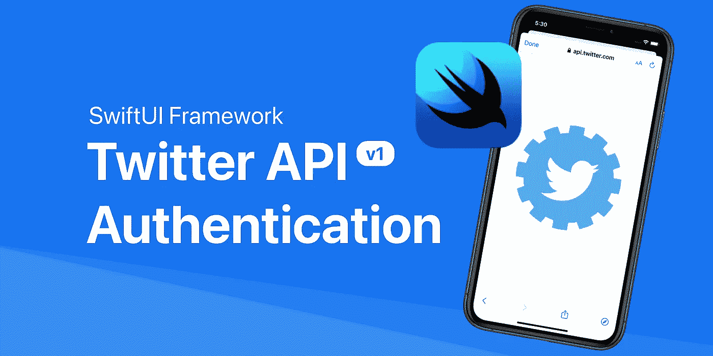

# 如何在 SwiftUI 中实现 Twitter API(v1)认证

> 原文：<https://medium.com/codex/how-to-implement-twitter-api-v1-authentication-in-swiftui-2dc4e93f7a82?source=collection_archive---------3----------------------->

本教程使用 Xcode 12.4、Swift 5、iOS 14.4 和 TwitterAPI 1.0 编写。

# 介绍

在 [Twitter 开发者平台](https://developer.twitter.com/en)上的许多终端需要用户使用 [OAuth 1.0a](https://developer.twitter.com/en/docs/authentication/oauth-1-0a) 认证流程对你的应用进行认证，这样你就可以代表他们采取行动或发出 API 请求。

这个故事的目的是向您展示如何在 SwiftUI 中实现这个认证流程。