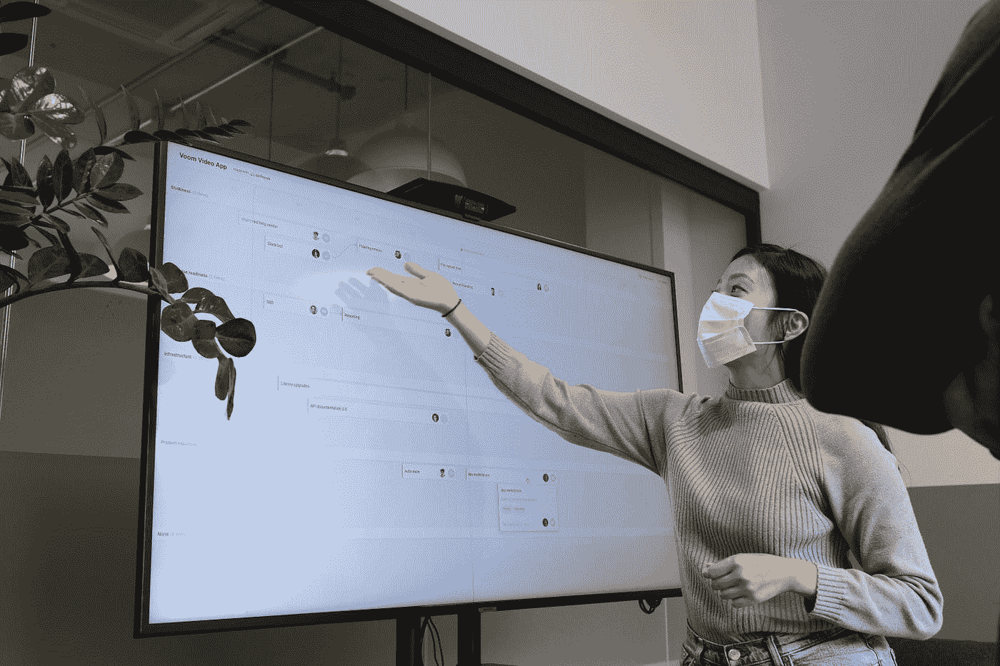

# 作为一名软件开发人员，如何提高自己的演示技巧？

> 原文：<https://medium.com/codex/how-to-improve-your-presentation-skills-as-a-software-developer-71ac0bcdba72?source=collection_archive---------18----------------------->

  S 在人前达到顶峰是最常见的恐惧之一。但不一定非要这样。多年来，我一直在公众演讲或发表演讲中苦苦挣扎。如果你和我一样，那么停下来一会儿，看看这篇文章。它不仅对你的工作有益，而且对你的生活也有益。

照片由[空气焦点](https://unsplash.com/@airfocus?utm_source=medium&utm_medium=referral)在[未溅射](https://unsplash.com?utm_source=medium&utm_medium=referral)上拍摄