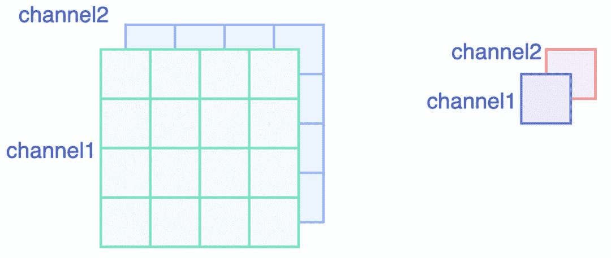
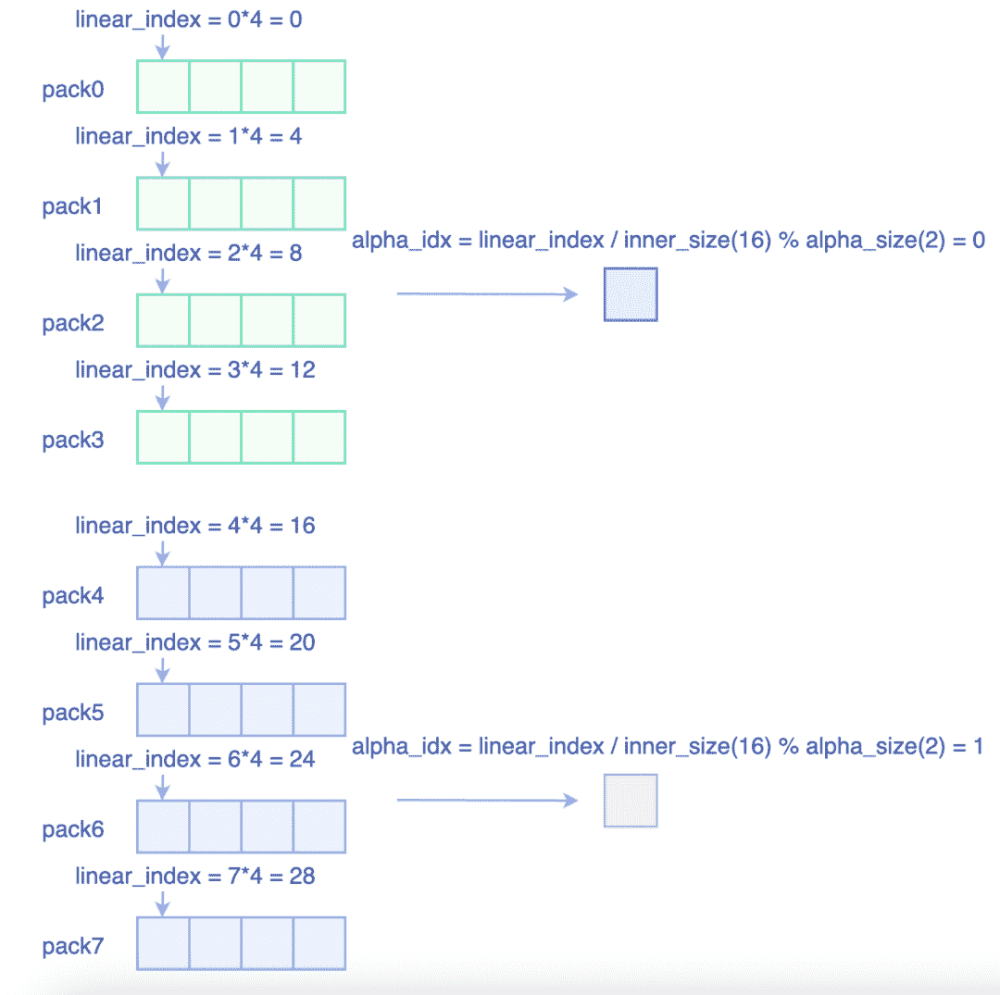
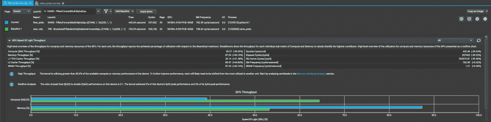
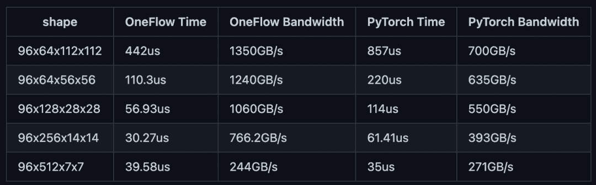

# 如何提高 CUDA 中 PReLU 的计算效率——one flow 性能优化

> 原文：<https://medium.com/codex/how-to-increase-computational-efficiency-for-prelu-in-cuda-oneflow-performance-optimization-20e6e336b8b8?source=collection_archive---------7----------------------->

***出自郑；胡译，沈佳丽译***

> PReLU 是 InsightFace 中经常使用的激活功能。它有两种操作模式:PReLU(1)和 PReLU(通道)。对于后者，PReLU 相当于二进制广播操作。在本文中，我们将讨论如何优化 CUDA 中的广播操作。

PReLU 是 InsightFace 中经常使用的激活功能。它有两种操作模式:

1.  PReLU(1)。权重α的形状为(1，)。在这种情况下，PReLU 相当于 elementwise 操作。
2.  预路(通道)。权重α的形状为(channels，)，其大小与输入张量的(N，C，H，W)中的“C”的大小相同。在这种情况下，PReLU 相当于二进制广播操作。

InsightFace 采用 PReLU 的第二种模式。我们之前写过[如何优化 CUDA 元素式操作](https://oneflow2020.medium.com/oneflows-optimization-of-cuda-elementwise-template-library-practical-efficient-and-extensible-b375c3bd15c6)。今天，我们将讨论如何优化 CUDA 中的广播操作。

# 1 个简单的实现

这是一个简单的实现。首先，获取循环中当前元素“x”的索引。其次，推断出对应阿尔法权重的指数。第三，通过查看“x”> 0 返回结果:如果“x”> 0，则返回“x”；如果在 CUDA 中“x”<0, return “alpha*x”. The code is as follows:

Note:

*   【 refers to the product of the values of the dimensions following the channel dimension. Take the 【 format as an example: 【 .
*   【 refers to the size of the channel dimension.

[整数除法伴随着很高的计算成本。](https://docs.nvidia.com/cuda/cuda-c-programming-guide/index.html#maximize-instruction-throughput)您可以在 CUDA 工具包文档中找到(第 5.4.1 章算术指令):

> *整数除法和模运算的成本很高，因为它们要编译多达 20 条指令。*

计算α的指数涉及一个整数除法和一个模运算。这些计算代表了内核工作负载的一半。因此，在接下来的内容中，我们将告诉您如何减少整数除法和模运算，同时使用矢量化方法增加读/写带宽。

# 2 通过打包类型矢量化进行优化

这里有一个简单的情况:如果输入的张量形状是(1，2，4，4)，那么它的操作模式将是 PReLU(2)。

显而易见的是，H 和 W 维度上的输入是连续的。在这种情况下，如果`inner_size`可被包装尺寸整除，则包装中的元素将被应用于相同的 alpha 权重，如下图所示:

这样，矢量化操作有助于提高读/写带宽利用率。并且每个包中的元素只需要计算一次，这减少了大量的计算，因为我们不再需要一个接一个地计算元素。代码如下:

让我们比较一下 Nsight Compute 提供的优化操作前后的结果。在 A100–40GB GPU 上测试数据(96、64、112、112)后，我们得到了下图所示的两个内核的性能结果:蓝色的内核通过向量化进行了优化，而绿色的内核则被天真地实现了。很明显，优化操作有效地减少了 20%-30%的计算，并将吞吐量提高了 30%。此外，优化后的内核带宽高达 1350GB/s，非常接近 A100 的理论极限。

但是，并非所有张量形状都支持矢量化操作。如果`inner_size`不能被它对应的`pack_size`整除，这个形状只能满足于一个简单的实现。

# 3 基准

在 NVIDIA A100–40GB GPU 上进行基准测试时，我们比较了 OneFlow 和 PyTorch 在 InsightFace 库中处理不同张量形状时的性能。测试结果如下:

我们可以看到， [OneFlow](https://github.com/Oneflow-Inc/oneflow) ，由优化的激活函数-PReLU 授权，在大多数情况下比 PyTorch 提供了近 200%的性能。至于最后一个测试示例，张量形状非常特殊，以至于矢量化优化不起作用，因此 OneFlow 的性能与 PyTorch 相当。

***相关文章:***

1.  [***OneFlow v0.7.0 出来了！***](https://oneflow2020.medium.com/oneflow-v0-7-0-came-out-4ac0653339d5)
2.  [***深度学习框架中张量的执行过程***](https://oneflow2020.medium.com/the-execution-process-of-a-tensor-in-a-deep-learning-framework-a4d853645d5b)

*欢迎访问 one flow on**[***GitHub***](https://github.com/Oneflow-Inc/oneflow)**并关注我们 on**[***Twitter***](https://twitter.com/home)**和* ****

**还有，欢迎加入我们的 [***不和谐群***](https://discord.gg/4kpjGA5bZY)*讨论和提问 OneFlow 相关问题，与 OneFlow 的贡献者和全世界的用户联系。***