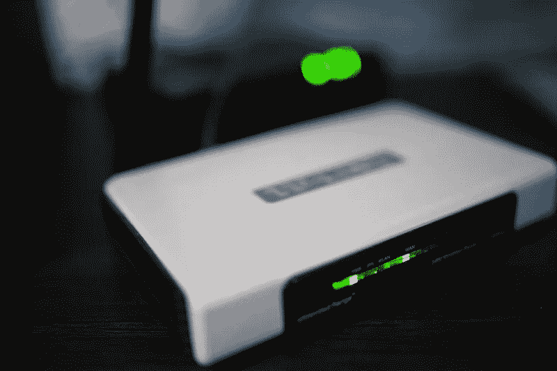

# 如何在 Windows 10/11 中提高上网速度

> 原文：<https://medium.com/codex/how-to-increase-the-internet-speed-in-windows-10-11-424d475cddd3?source=collection_archive---------5----------------------->

在你的 Windows 设备上，网速很慢的情况随时可能发生。阅读这里，看看你如何轻松恢复网速。

**来源** : [维基媒体](https://commons.wikimedia.org/wiki/File:Internet_et_ses_applications.png)

如果你长时间在 Windows PC 设备上工作，那么当你在做重要的事情时，你一定会注意到网速下降。

作为我家附近的“技术人员”，我知道网速慢的问题困扰普通人的频率有多高。

所以，如果你的 Windows 设备也有网速慢的问题，请往下读。

我收集了一些简单可行的解决方案，任何人都可以用来在 Windows 10/11 上恢复网速。

# **为什么你的 Windows 10/11 电脑网速变慢了？**

在讨论解决方案之前，您必须知道 Windows 设备上的互联网速度慢的原因。一些常见的是:

Wi-Fi 信号弱几乎总是最常见的原因。

可能有**多个设备使用你的 Wi-Fi** ，消耗你的带宽(从而降低网速)。

来源:[今日佩恩](https://penntoday.upenn.edu/news/multi-layered-challenges-broadband-expansion)

您的设备和路由器之间存在某种物理干扰。

您的**互联网服务提供商正在更新网络**，这就是您的互联网暂时变慢的原因

您的设备上有后台运行的应用程序。

可能还有许多其他复杂的问题，但几乎在每种情况下，上述原因都是导致您的 Windows 互联网速度突然下降的原因。

# **如何在 Windows 10/11 中提高上网速度？**

如果你正在经历一些令人沮丧的网速慢，尽管你的 ISP 提供了一个很好的计划。

你可以这样做:

## 1.关闭/打开无线网络

如果你在任何设备上突然遇到网速慢的问题，只要试着关掉 Wi-Fi 就行了。等待 10 秒钟，然后重新打开。

## 2.重启路由器

在大多数情况下，只需关闭路由器，等待 30 秒(直到所有灯熄灭)，然后再次打开路由器。这种方法几乎总是有效的，因为它清除了内部任何堵塞的静电。

**来源** : [rawpixel](https://www.rawpixel.com/image/5917436/router-free-public-domain-cc0-photo)

## 3.更改您的凭据

有时，一些不需要的设备可能会不知不觉地从你的 Wi-Fi 中吸走能量。首先，也是最重要的，改变你的证书，下面是如何做的。之后，你可能想找出水蛭的来源。

## **4。为您的路由器寻找新的位置**

错误放置的路由器经常会导致你的网络连接和速度不稳定。尽量将路由器放在家中合适的位置，远离附近的街道和小巷，放在家中信号可以到达室内任何地方的地方。

此外，确保它高出地面 3 到 4 英尺，并且身体无障碍。

## 5.扫描任何恶意软件

恶意软件尤其因吸走你的网速而臭名昭著。但是有一个简单的方法来解决这个问题。

在您的 windows 10/11 电脑上使用 Defender antivirus，并运行快速或全面扫描。

转到 **Windows >设置>更新和安全>病毒&威胁防护**，然后选择您想要的扫描。

此外，你可以尝试一个最值得信赖品牌之一的免费恶意软件追踪应用程序 [Malwarebytes](https://www.malwarebytes.com/mwb-download) 。

## 6.第三方下载管理器

尝试使用第三方下载管理器，如互联网下载管理器、互联网下载加速器等。而不是用你的网络浏览器下载大文件。

## 7.有线电视

一直都是。一直都是。如果您可以选择，请始终使用您的**局域网/以太网电缆**连接互联网，而不是使用 Wi-Fi。

这样你就能获得更稳定、更快速的连接。

## 8.删除临时文件

您可以尝试删除任何剩余的临时文件。打开**运行** (Windows + R)，输入 **%temp%，**，现在点击 **OK** 。

现在使用传统的 **Ctrl + A** 选择所有的临时文件，并点击**删除**。

如果出现提示，点击**继续**。如果有弹出窗口，只需在**上勾选，对所有当前项目**执行此操作，然后点击**跳过**。

完成了。

## 9。禁用后台应用。

点击 **Windows + I** 然后选择**隐私**。

在左侧菜单中，向下滚动到**后台应用**，然后点击它。

在右边，会有一个主“关闭”按钮和一个所有应用程序的列表，每个应用程序都有单独的“关闭”按钮，让它们停止在后台运行。

如果你是一个临时用户，我建议你点击主关闭按钮。

## **10。卸载 OneNote** 应用程序。

它配有 Windows 10，使用你的互联网带宽来同步文件和文件夹。

卸载它，因为它根本没有必要。只需在任务栏的搜索栏中键入 OneNote，然后单击它下面的卸载选项。

**来源** : [Pinterest](https://www.pinterest.com/pin/359021401528960743/)

## 10.尝试更改到不同的浏览器

这可能有助于更快地加载页面。

这些是任何人都可以在 Windows 10/11 中执行的一些简单的技巧，让他们的网速恢复正常。

然而，如果它们不起作用，如果你愿意，尝试一些更技术性的解决方案，看看是否有效。

## **将您的预留带宽设置为 0%**

默认情况下，您的 windows PC 或笔记本电脑会保留总互联网带宽的 20%用于更新和其他用途。你可以忽略它，从你的网络中得到更多。

-点击 Windows 键+ R 打开**运行**命令

-键入— **gpedit.msc**

——你现在需要走向**电脑配置** > **管理模板** > **网络** > **QoS 数据包调度器。**当你到达那里，然后右击**限制可预留带宽**。

-这将打开一个窗口，在这个窗口中做 3 件事-一。选择**启用**。两个。将**带宽限制设置为 0** 。三个。点击**确定**。

-你做到了！

## **禁用计量连接**

计量连接会限制您的数据速度。试着禁用它。

-打开**设置** (Windows + I)，然后选择**网络&互联网**。

-在**状态**屏幕下，选择您的连接并点击**属性**

-向下滚动一点，你会看到**计量连接**，**关闭，如果不是**。

-就是这样。

## **更改 DNS 地址**

**来源** : [阿拉米](https://www.alamy.com/dns-server-chalk-white-icon-on-black-background-image362714212.html)

如果您的原始服务器已经比任何其他服务器离您更近，则任何差异都不会生效。

但是如果你原来的服务器比谷歌的公共 DNS 或者其他的离你远，那么选择它们可能会有所不同。

-转到**控制面板**。在任务栏的搜索栏中键入 Control，然后选择 Control Panel。

-点击**网络&互联网**

-点击**网络&共享中心**

-然后，点击**更改适配器设置**，您将在下一个屏幕上看到您的网络

右键单击您正在使用的一个并选择**属性**

-双击列表中的**互联网协议版本 4 (TCP/IPv4)**

-在输入您选择的 DNS 服务器之前，请确保选择**使用以下 DNS 服务器地址**！

-点击**确定**。

您可以从[这里](https://www.lifewire.com/free-and-public-dns-servers-2626062)选择您自己的首选 DNS 服务器。

## **禁用点对点更新**

它允许将 windows 更新从您的计算机共享到同一网络上的另一台计算机。这使得你的数据速度有时缓慢。

-按下 **Windows + R** ，键入**控制更新**，点击**进入**。

-点击**高级选项**

-点击**交付优化**，然后转到**允许从其他电脑下载**，关闭**。**

## ****结论****

**希望这些简单的(和一些高级的)建议对你有用。再次享受您的高速互联网。**

**谢了。**