# 如何在树莓派上安装风扇并使其动态运行

> 原文：<https://medium.com/codex/how-to-install-a-fan-onto-a-raspberry-pi-and-make-it-run-dynamically-4ff0e59985fc?source=collection_archive---------3----------------------->

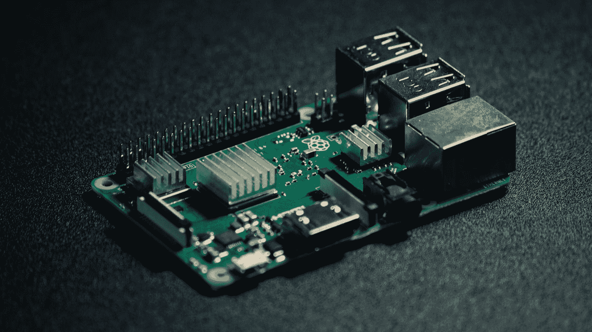

斯蒂芬·科斯马在 [Unsplash](https://unsplash.com?utm_source=medium&utm_medium=referral) 上拍摄的照片

[在我之前的文章中，我写了什么是树莓派，以及为什么你应该考虑买一个](/codex/what-is-the-raspberry-pi-and-why-you-should-buy-one-aaae7f417b63)。当前第四代树莓 Pi 的一个主要问题是它在重负载下会变得非常热。第四代 Raspberry Pi 确实“节流”了 CPU，这意味着它减慢了处理速度，以防止设备过热。这很好，但你真的希望 Pi 表现良好，并得到相应的冷却。所以你真正需要的是一个好的冷却方案。此外，树莓派不附带包装盒，因此我们也可以使用这款产品。

树莓派有两种冷却解决方案；主动冷却和被动冷却。主动冷却涉及使用物理旋转风扇来冷却中央处理器(CPU ),而被动冷却涉及使用散热器；锯齿状的金属片来散热。在降低 CPU 温度方面，主动冷却远比被动冷却有效，这就是我选择风扇来冷却我的树莓派的原因。[(如果你不相信我，可以看看 YouTuber 上克里斯·巴尼特(Chris Barnett)在树莓 Pi 4 上比较冷却解决方案的视频)](https://www.youtube.com/watch?v=AVfvhEJ9XD0)。

因此，一个装有风扇的箱子将是理想的，因此我从亚马逊购买了 6.49 美元(8.96 美元)的' [GeeekPi Raspberry Pi 4 丙烯酸箱子，带风扇的 Raspberry Pi 4 箱子(蓝光)和 Raspberry Pi 4 型号 B 的 Raspberry Pi 4 散热器，与 Raspberry Pi 冰塔风扇(黑色和透明)](https://www.amazon.co.uk/gp/product/B07Y8DQ5ST/ref=ppx_yo_dt_b_asin_title_o04_s00?ie=UTF8&psc=1)兼容。

当它到达时，我把它连接到我的 Pi 上，瞧，它启动了，风扇旋转起来，不停地冷却 Pi。但是我想更进一步，考虑根据 CPU 温度动态控制风扇。在谷歌了一下之后，我发现了以下网站:[https://how choo . com/g/ote 2 mjkzzta/control-raspberry-pi-fan-temperature-python](https://howchoo.com/g/ote2mjkzzta/control-raspberry-pi-fan-temperature-python)。“蜜蜂的膝盖”我一直在想，直到我读到第 3 部分——建立测试电路。这就是陷入僵局的地方。我面临的问题是没有试验板和电路，我也不是电子工程师，所以知道如何制作这个对我来说有点太复杂了。

在谷歌搜索了一些之后，我发现了这个网站:[https://www . tindie . com/products/jeremycook/ez-fan 2-tiny-Raspberry-Pi-fan-controller/](https://www.tindie.com/products/jeremycook/ez-fan2-tiny-raspberry-pi-fan-controller/)一位名叫 Jeremy Cook 的工程师制作了一个微型印刷电路板(PCB ),位于 Raspberry Pi 的风扇连接器和 GPIO 连接器之间。所以我买了它，加上以下附件:透明热收缩，8 厘米母接头电线，总共 9.95 美元，加上运到英国的费用 15 美元(比这个项目多，但我认为它是值得的)，总费用为 23.99 美元。(请注意，如果你在英国，请查看一下在 thePiHut 上仅售 4.20 英镑的[树莓派风扇控制器](https://thepihut.com/collections/raspberry-pi-cooling/products/fan-controller-for-raspberry-pi)

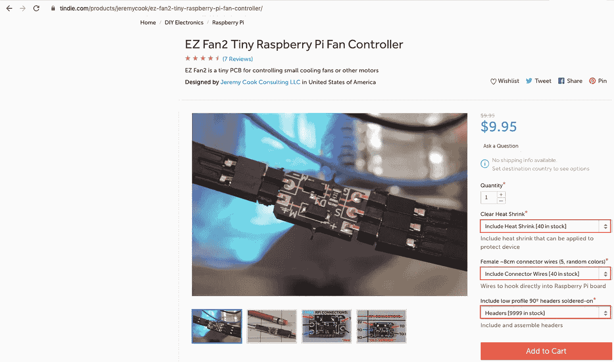

如果您还没有额外的选项，请务必购买

看看杰里米·库克的 YouTube 视频，看看他是如何制作和安装的；[https://www.youtube.com/watch?v=AdjU_AVcZTA](https://www.youtube.com/watch?v=AdjU_AVcZTA)。5 点 59 分，Jeremy 展示了如何将电线连接到 EZ 风扇 2 的 GPIO 示意图。

这是我安装的 EZ 风扇 2 连接器:

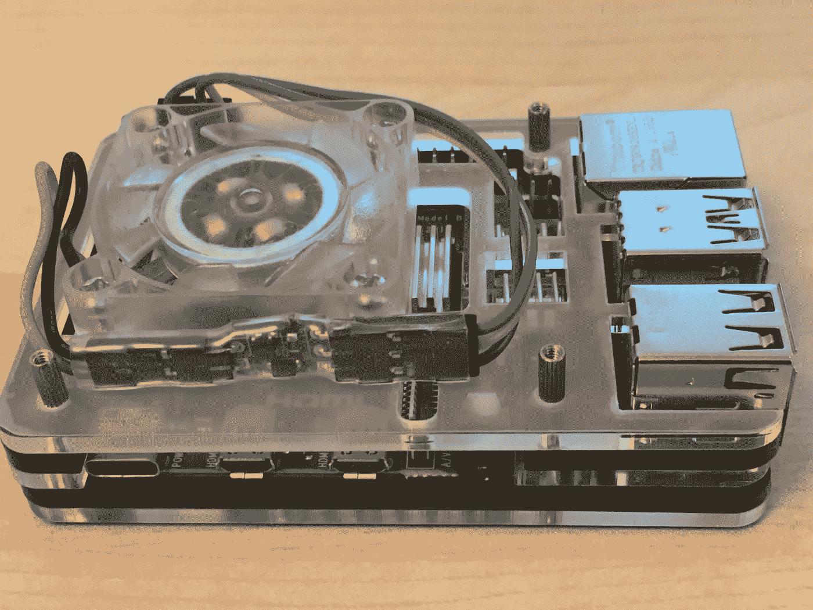

记得在加热热缩膜之前测试风扇和微芯片

注意，绿线在顶部，黄色在中间，蓝色在底部。

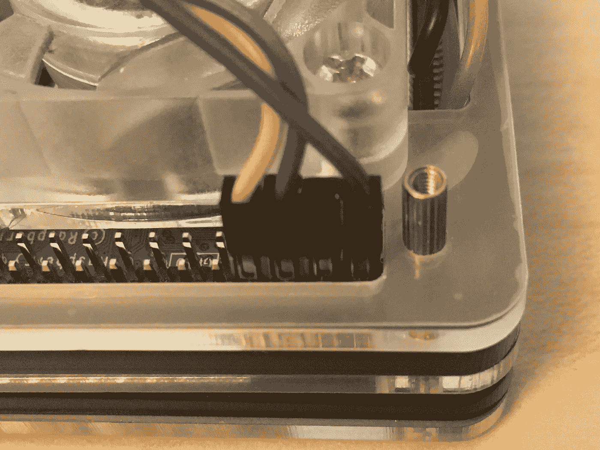

我折断了备用线的一个连接器，并将其用作 GPIO 端口 4 的垫片

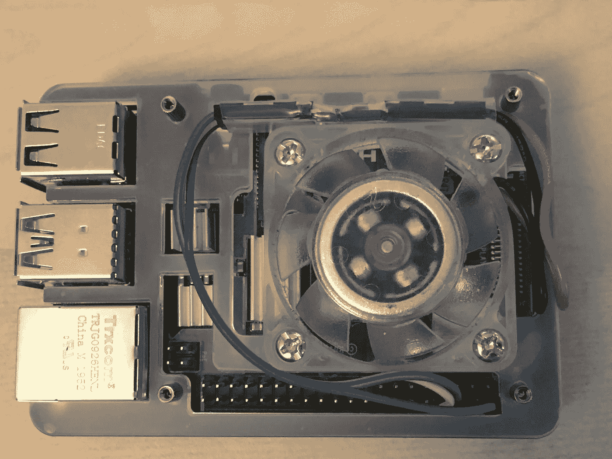

根据原理图使用 GPIO 端口 2、6 和 8:


蓝线—端口 2；5V 电源

连接器垫片—端口 4；5V 电源

绿线—端口 6；地面

黄线—端口 8；GPIO 14 (TXD)

**现在让 shell 脚本动态工作**

访问以下链接:[https://how choo . com/g/ote 2 mjkzzta/control-Raspberry-Pi-fan-temperature-python](https://howchoo.com/g/ote2mjkzzta/control-raspberry-pi-fan-temperature-python)向下滚动到第 4 部分——使用安装脚本并一字不差地按照步骤操作(前提条件:给你的 Raspberry Pi 一个静态 IP 地址，通过以太网(首选)或 WiFi 将其连接到你的路由器。您还需要在 Raspberry Pi 上启用安全外壳(SSH ),并在其中使用 SSH。

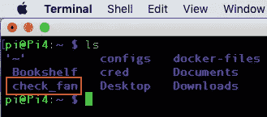

我在主目录中创建了一个名为 check_fan 的目录，并将 fancontrol.sh 脚本放在那里

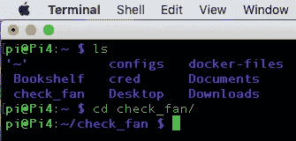

使用 cd 命令访问 check_fan 目录

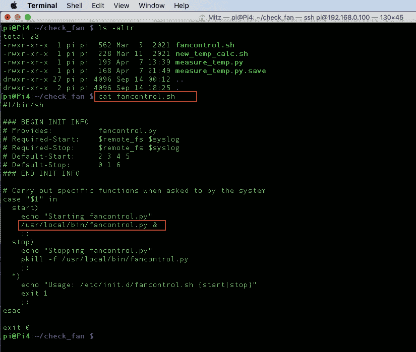

列出 check_fan 目录(ls -altr)的内容表明存在 fancontrol.sh，因此使用 cat 命令检查 fancontrol.sh 的内容。这表明访问了/usr/local/bin 目录中的 fancontrol.py

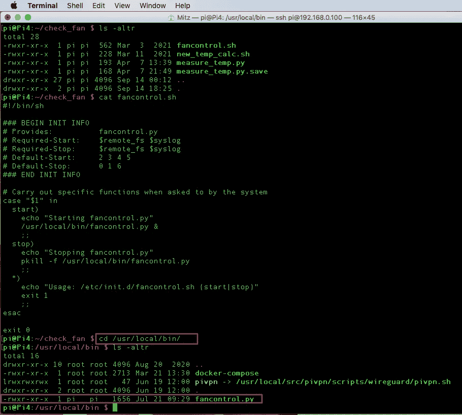

使用 cd 命令将目录切换到/usr/local/bin 目录，并使用 ls -altr 列出内容，这表明存在 fancontrol.py 文件

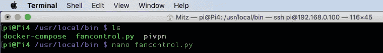

输入 nano fancontrol.py 编辑该文件

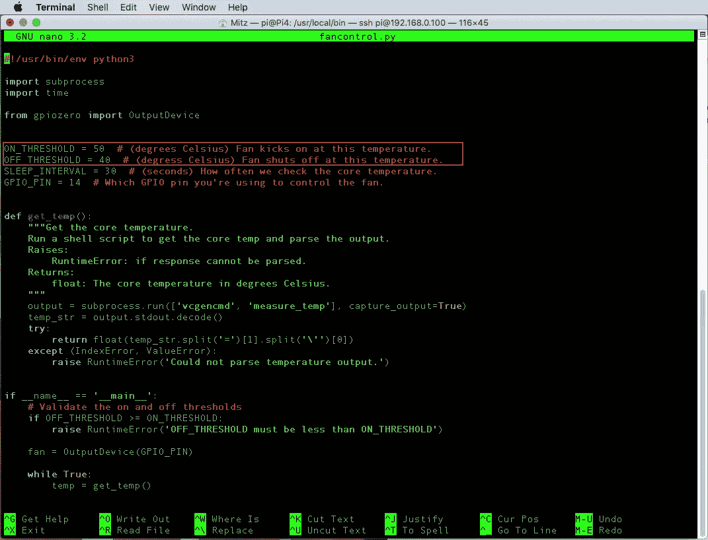

您需要更改的值以红色突出显示。我将 ON_THRESHOLD 设置为 50，OFF_THRESHOLD 设置为 40。保存您的更改并退出该文件

就是这样！完成了。由于我们已经在[的步骤 4 中使用了安装程序脚本 https://how choo . com/g/ote 2 mjkzzta/control-raspberry-pi-fan-temperature-python](https://howchoo.com/g/ote2mjkzzta/control-raspberry-pi-fan-temperature-python)它已经被注册为在引导时运行。

使用以下命令重新启动 Raspberry Pi:

```
sudo reboot
```

这将重新启动您的 Pi 和您的风扇应该动态运行。

是时候测试它了…

1.  访问 check_fan 目录，并在 nano 中创建一个名为 measure_temp.py 的文件
2.  将此复制/粘贴到文件中:

```
#!/bin/bashwhile [ true ]domyTemp=`/opt/vc/bin/vcgencmd measure_temp | egrep -o '[0-9]*\.[0-9]*'`myDate=`date '+%Y/%m/%d %H:%M:%S'`echo $myTemp $myDatesleep 3done
```

3.使用 ctrl+z 键保存文件并退出

4.通过键入以下命令给出文件的可执行属性:

```
chmod +x measure_temp.py
```

5.运行以上脚本:

```
./measure_temp.py
```

当温度上升到 51 度以上时，风扇启动，温度下降到 40 度，之后风扇关闭。

这样你就有了一个便宜的风扇和一个脚本来动态控制你的 Raspberry Pi 的风扇。如果您有任何问题、顾虑或意见，请留下评论。如果你成功地复制了这个，并且对你有效，请鼓掌… :-)