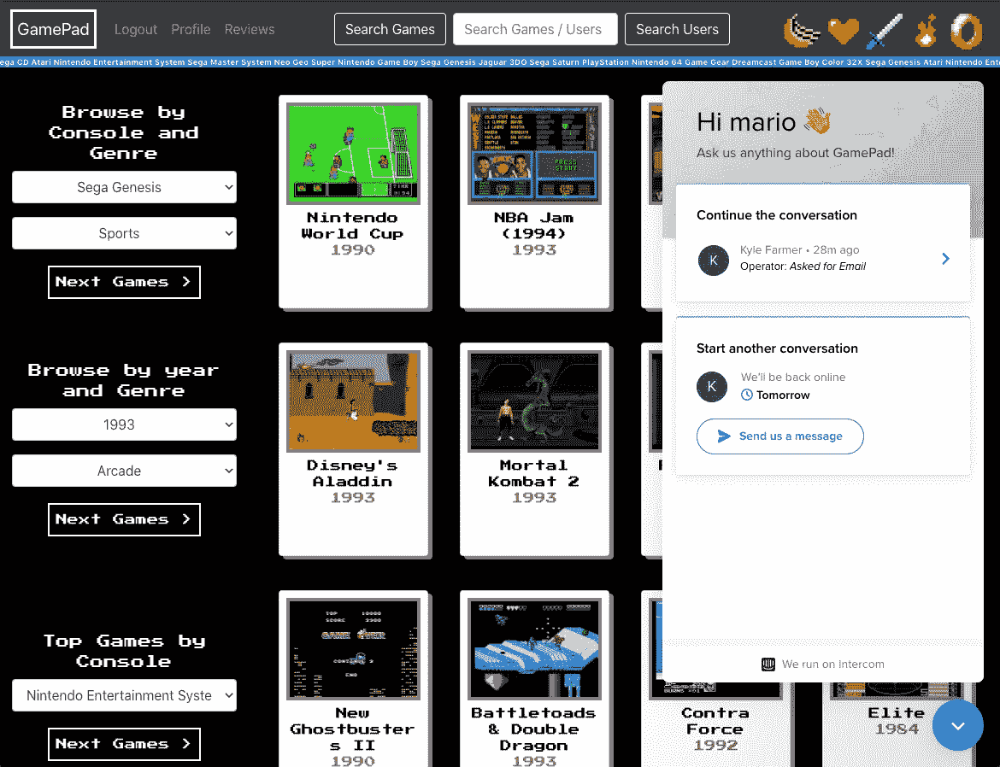

# 如何在 ReactJS 应用程序中安装 Intercom

> 原文：<https://medium.com/codex/how-to-install-intercom-into-a-reactjs-app-98aaf4a83d31?source=collection_archive---------4----------------------->



在我的应用游戏手柄上运行的对讲机

*这篇博客将介绍如何在 ReactJS 应用程序中安装和配置一个基本的* [*对讲机*](http://www.intercom.com) *messenger。我将解释如何实现两个消息传递配置，一个用于登录的用户，另一个用于未登录的访问者。我将使用对讲机的“初级”版本，每月 79 美元。你可以在这里* *注册该服务* [*的 14 天免费试用。*](https://www.intercom.com/pricing?utm_source=google&utm_medium=sem&utm_campaign=9870670686&utm_term=%2Bintercom&utm_ad_collection=99717746865&_bt=434730769584&_bg=99717746865&utm_ad=434730769584&offer=pricingpage&utm_campaign_name=go_evg_acq_trial_b_generic_bld_namer_en&utm_ad_collection_name=gen-p_intercom&utm_ad_name=pricingpage_slink_21q1&gclid=CjwKCAjwjdOIBhA_EiwAHz8xm3rvM8bzTtzTY4D7juNf9wPuH0UkRqFZsMzxEjdmlQEcx0RMej-IBBoCL40QAvD_BwE&tab=1)

## 什么是对讲机？

[Intercom](http://www.intercom.com) 是一个“对话关系平台”,允许企业通过消息与其客户/潜在客户进行实时互动。它提供了一个可以多种方式使用的消息窗口界面。你可能想和第一次来访的人聊天，让他们问问题，了解更多关于服务或产品的信息。还可以通过允许现有客户向企业的员工或代表发送消息来改善客户服务。对讲机也可以配置聊天机器人，可以很容易地设置来回答常见的问题和关注。所有通信都通过位于应用程序之上的独立消息传递接口进行。

## 入门指南

我将解释我是如何在我自己的 ReactJS 应用程序中安装 Intercom 的——你可以在这里查看官方文档。

将以下代码放入 ReactJS 应用程序的`index.html`文件的`<head></head>`元素中。确保将`YOUR_INTERCOM_APP_ID`替换为您唯一的内部通信应用 ID 字符串。

```
<script>var APP_ID = "YOUR_INTERCOM_APP_ID";

(function(){var w=window;var ic=w.Intercom;if(typeof ic==="function"){ic('reattach_activator');ic('update',w.intercomSettings);}else{var d=document;var i=function(){i.c(arguments);};i.q=[];i.c=function(args){i.q.push(args);};w.Intercom=i;var l=function(){var s=d.createElement('script');s.type='text/javascript';s.async=true;s.src='https://widget.intercom.io/widget/' + APP_ID;var x=d.getElementsByTagName('script')[0];x.parentNode.insertBefore(s, x);};if(document.readyState==='complete'){l();}else if(w.attachEvent){w.attachEvent('onload',l);}else{w.addEventListener('load',l,false);}}})();</script>
```

在下一步之前，您将不会在您的应用程序上看到对讲机信使！

## 登录用户的内部通信

我认为，如果我们首先为登录用户实现消息传递系统，这个过程就更容易理解了。当用户登录到您的应用程序时，我们需要向 Intercom messenger 发送一些信息，告诉他们哪个用户已经登录。在我的应用程序中，在从数据库中成功检索到用户数据后，我将这些信息发送给 Intercom。我用从用户信息数据库中收到的对象值填充要发送给 Intercom 的对象:

```
window.Intercom('boot', {
  app_id: 'YOUR_INTERCOM_APP_ID',
  name: data.user.username,
  email: data.user.email,
  user_id: data.user.id,
});
```

这也将通过`'boot'`启动对讲机通讯器。你现在应该可以在你网站的右下角看到 messenger 了！**当登录用户通过 Intercom 向您发送消息时，您将在您的 Intercom hub 收件箱中看到是哪个用户向您发送消息，以及与他们过去的任何对话。**

您可能已经注意到，即使用户注销了您的应用程序，他们仍然会登录到 Intercom messenger。让我们解决这个问题！

## 关闭内部通信信使

当用户从网站注销时，我们希望 Intercom 关闭。这可以通过对`window`对象使用一个简单的函数来实现，类似于`'boot'`的工作方式:

```
window.Intercom('shutdown');
```

在我的应用程序中，当用户从导航栏中选择“注销”时，我运行这个程序。如果我检测到(通过我的应用程序中的 [JWT](https://jwt.io/) )当前访问者没有在页面刷新或新访问时登录，我也会在`useEffect`内的`App.js`中运行它。

## 未登录用户的内部通信

在我的应用程序中，我为登录的用户以及那些没有登录到我的网站的用户运行 Intercom。我们已经为用户登录实现了它，现在让我们看看访问站点的任何人如何使用 Intercom。

我们将以与之前相同的方式启动对讲机信使，只是这次我们仅使用我们的对讲机应用程序 ID:

```
window.Intercom('boot', { 
  app_id: 'YOUR_INTERCOM_APP_ID' 
});
```

我在关闭对讲机后的任何时候都会立即运行它。这将使我们在 messenger 中有一个新的开始，并注销任何以前的用户及其消息。messenger 不知道谁在使用它，因此我们创建了一个短暂的 messenger 会话，它不会像登录用户的对话一样被保存！**当对讲机如此运行时，您将不知道是谁在通过对讲机向您发送消息。**

因此，当用户注销时，或者如果当前访问者不是授权用户(即，他们没有 JWT)，我运行这个:

```
window.Intercom('shutdown');
window.Intercom('boot', {
  app_id: 'YOUR_INTERCOM_APP_ID'
});
```

## 自定义内部通信设置

您可以向`index.html`中的`<head></head>`元素添加一个对讲机设置对象来定制 messenger。您可以更改 messenger 的显示位置，也可以设置一个元素来打开(或启动)messenger。

```
window.intercomSettings = {
  app_id: 'YOUR_INTERCOM_APP_ID',
  alignment: 'left',
  horizontal_padding: 20,
  vertical_padding: 20,
  custom_launcher_selector: '#launcher'
};
```

`custom_launcher_selector`可以是您选择的任何 id 或类名。此设置将在任何时候单击 id 为“launcher”的元素时打开 messenger。如果我们想使用一个类名，并将其更改为“launch-intercom ”,它在对象中看起来应该是这样的:

```
custom_launcher_selector: '.launch-intercom'
```

## 结论

我们只是触及了对讲机功能的皮毛。这是一个快速的教程，帮助您使用 Intercom。我鼓励您接下来探索 Intercom hub 的收件箱和操作员，它们为您提供了各种选项，并让您可以控制如何处理与用户和访客的各种交互。对讲是一个伟大的工具，以促进用户的互动，满意度，并为您的客户提供支持的水平！

[](https://www.intercom.com/) [## 对话关系平台|对讲机

### 借助对讲机，通过基于 messenger 的对话体验建立更好的客户关系。

www.intercom.com](https://www.intercom.com/) [](https://developers.intercom.com/installing-intercom/docs/welcome) [## 客户信息平台|内部通信

### 在这里，您可以找到在以下位置安装对讲机所需的一切:否则，您可以使用我们的…

developers.intercom.com](https://developers.intercom.com/installing-intercom/docs/welcome)