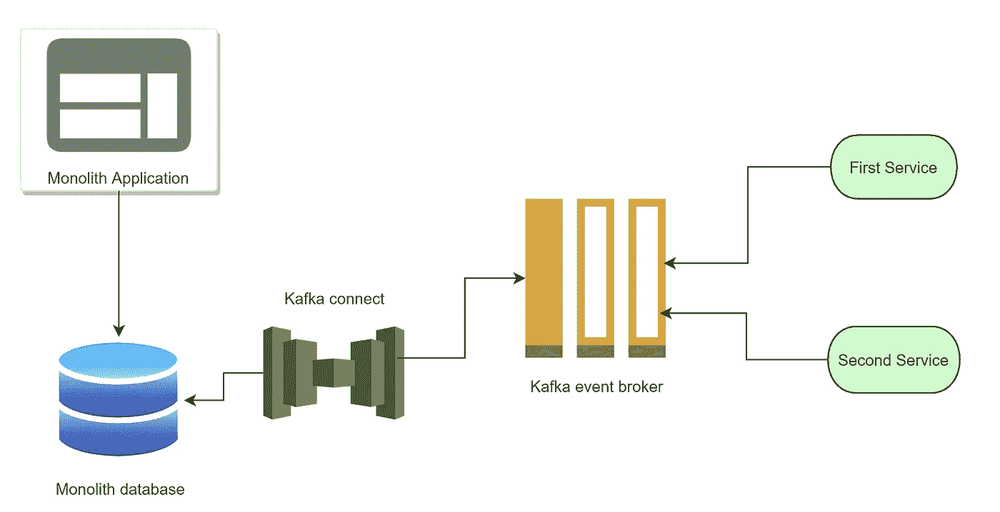
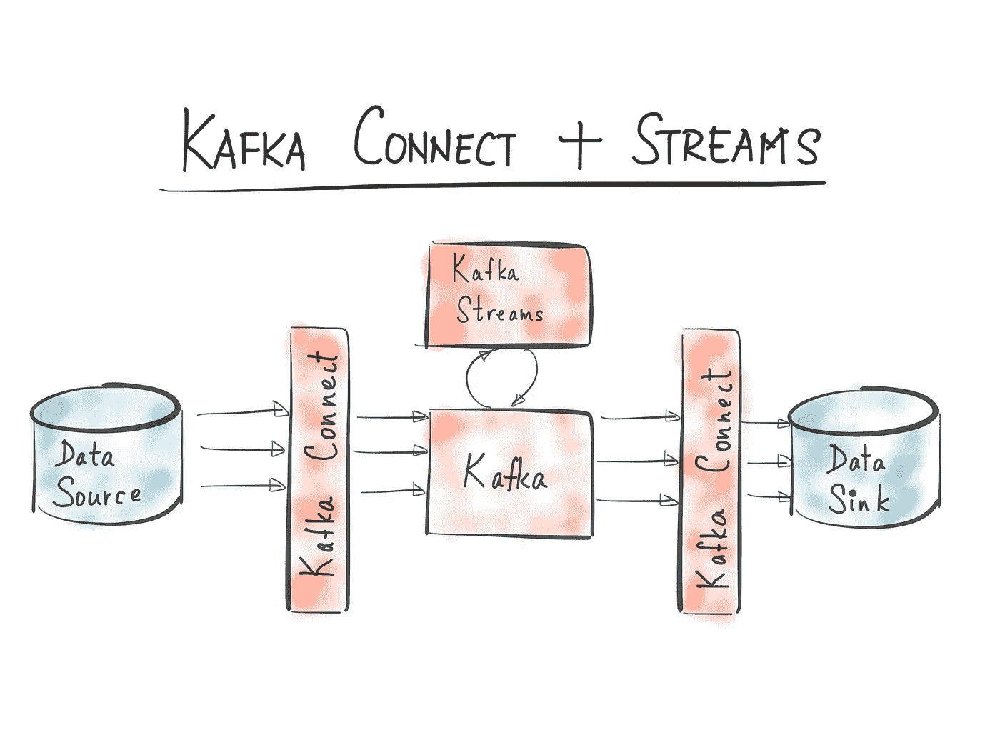
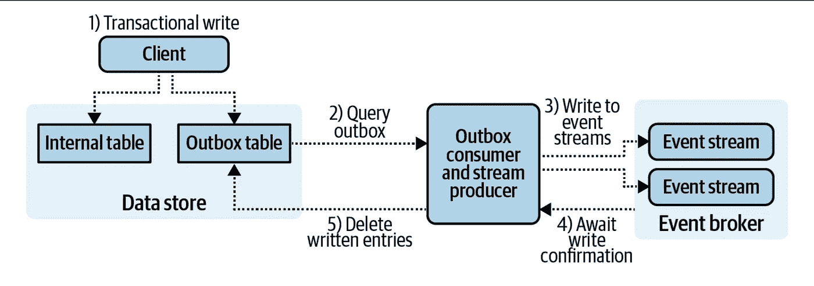

# 如何将遗留系统与事件驱动架构集成？

> 原文：<https://medium.com/codex/how-to-integrate-legacy-systems-with-event-driven-architecture-712cf553500c?source=collection_archive---------3----------------------->

当您设计了一个具有新架构的系统，但是还有其他具有旧架构和结构的系统时，如果需要的话，您有责任设计一种方法来集成这些系统，以便能够继续很好地相互协作。

假设您有一些具有微服务架构的系统，这些系统使用事件驱动的设计来分离服务之间的通信。此外，还有其他具有传统架构和设计的系统，它们的数据用于其他系统，例如基于微服务的新生态系统中的服务。

你手中有哪些可能的方法来决定与新的事件驱动系统的集成策略？

当然，重构到一个干净的 CQRS 模式将是一个很好的解决方案，但是它伴随着成本(时间和金钱)，所以我们能做什么来代替它呢？

在这篇短文中，我将试着简要介绍一些在这种情况下做出正确决定的方法。

**基于查询的方法**

在这种方法中，您使用定期查询从底层数据存储中提取数据。客户端应用程序负责在预定义的时间间隔内使用轮询向底层数据存储(如关系数据库)发送查询请求，然后将其转换为指定的事件，并将其发送给事件代理进行处理。

一种查询方式是大容量加载，它在每个时间间隔从数据存储中加载表中的所有数据。当然，在大型数据集中代价更高，所以最好找到优化的解决方案。

我们不必加载所有数据，而是必须在每个时间间隔内增量加载部分数据，为此，我们可以遵循以下方法之一:

第一种方法是使用时间戳字段，比如表中的 uprate-at 字段。在这种情况下，您必须存储最后的时间戳，并且在每个时间间隔内，您都要加载自最新结果的最高时间戳以来的所有数据。

另一种方法是在表中使用自动递增的 id。所以您可以从您在最新结果中获取的最新 Id 开始获取记录。这比时间戳更好，但是需要有一个自动递增的 id 字段。

**变更-数据捕获日志方法**

变更数据捕获是一个软件过程，用于识别和跟踪源数据库中的数据变更。CDC 通过在新的数据库事件发生时连续移动和处理数据，提供实时或接近实时的数据移动。

在做出时间敏感型决策的高速数据环境中，变更数据捕获非常适合于实现低延迟、可靠且可扩展的数据复制。

基于日志的变更数据捕获是 CDC 的最佳方法。数据库包含存储所有数据库事件的事务日志(也称为重做日志),允许数据库在崩溃时恢复。使用[基于日志的变更数据捕获](https://www.striim.com/log-based-change-data-capture/)，可以从源数据库的本地事务日志中读取新的数据库事务，包括插入、更新和删除。这种只附加的日志包含随着时间的推移跟踪的数据集发生的所有事情的所有信息。实际上，并不是所有的数据存储都实现不可变的更改日志记录，因此与以前的方法相比，使用起来有一些限制。

从变更日志中获取数据有很多选择，Debezium 是关系数据库中最受欢迎的选择之一，因为它支持最常见的数据库。Debezium 可以用现有的实现向 Apache Kafka 和 Apache Pulsar 生成记录。对更多代理的支持当然是可能的，尽管这可能需要一些内部开发工作。Maxwell 是二进制日志阅读器选项的另一个例子，尽管它目前仅限于支持 MySQL 数据库，并且只能为 Apache Kafka 生成数据。

运行 Debezium 连接器的 Kafka Connect 服务正在使用原始的二进制日志。Debezium 解析数据并将其转换成离散事件。接下来，事件路由器将每个事件发送到 Kafka 中的特定事件流，这取决于该事件的源表。下游消费者现在可以通过使用 Kafka 的相关事件流来访问数据库内容。

Kafka Connect 专注于与 Kafka 之间的数据流，使您可以更轻松地编写高质量、可靠和高性能的连接器插件。

Kafka Connect 包括两种类型的连接器:**源连接器** —接收整个数据库，并将表更新流式传输到 Kafka 主题。**接收器连接器** —将数据从 Kafka 主题传递到另一个数据存储中。

**发件箱表方法**

在这种方法中，除了数据库中的每个命令，您还必须在同一个事务中将一些事件数据插入到发件箱表中。像第一种方法一样，需要及时地从发件箱表中读取事件并将它们发送到事件代理。

**结论**

基于查询的方法的可定制性为查询和获取复杂的数据组合提供了极大的灵活性。此外，它还提供了内部数据模型的隔离，这样就可以隐藏不应该暴露在数据存储之外的领域模型信息。但是它也有一些缺点，例如模式改变时查询的维护是一个大问题，查询使用底层系统资源来执行，这会导致生产系统上不可接受的延迟。

另一方面，在 CDC 方法中，对于使用预写和二进制日志的数据存储，可以在不影响数据存储性能的情况下执行更改数据捕获，并且可以在事件写入日志后立即传播更新。此外，CDC 方法也有一些缺点，例如反规范化必须发生在数据存储之外，这可能会导致创建高度规范化的事件流，需要下游微服务来处理外键连接和反规范化。另一件事是，这种方法并不支持每一种数据库技术。

在发件箱表方法中，您可以将其用于任何公开事务功能的客户端或框架。此外，您可以保持内部字段隔离，但这在 CDC 方法中是不可能的，数据可以在写入发件箱表之前根据需要进行反规范化。

当然，它也有一些缺点，例如必须更改应用程序代码才能启用这种模式，对业务工作流的性能影响可能很大，尤其是在通过序列化验证模式时，此外，对数据存储的性能影响可能也很大，尤其是在从发件箱中写入、读取和删除大量记录时。

**资源**

-构建事件驱动的微服务，大规模利用组织数据，Adam Bellemare

-[https://docs . confluent . io/platform/current/connect/index . html](https://docs.confluent.io/platform/current/connect/index.html)

--https://www . striim . com/change-data-capture-CDC-what-it-is-and-how-it-works/

——【https://www.striim.com/log-based-change-data-capture/ 